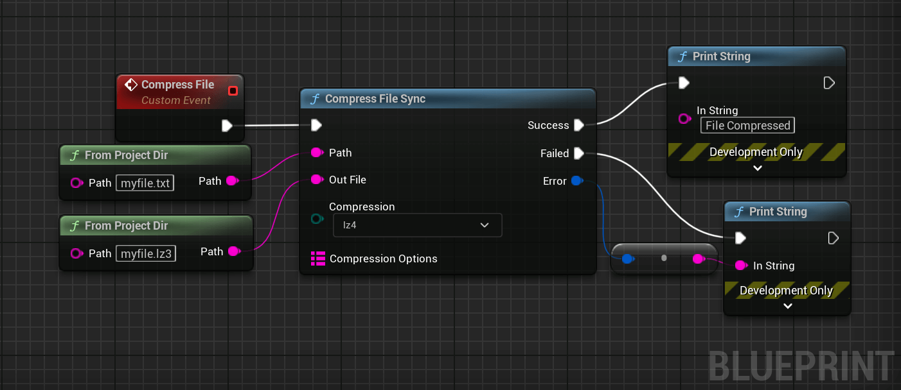

# Compress a File

This section shows how to compress a file with the plugin.

<div class="code-switcher show-cpp-false"><div class="switcher">
<span class="sw-bp" onclick="switchBp()">Blueprints</span><span class="sw-cpp" onclick="switchCpp()">C++</span></div>
<div class="cpp">

```cpp
// C++ example code not available yet.
```

</div>
<div class="bp">
<div class="bpcode">
<textarea readonly>
Begin Object Class=/Script/BlueprintGraph.K2Node_CustomEvent Name="K2Node_CustomEvent_4" ExportPath=/Script/BlueprintGraph.K2Node_CustomEvent'"/Game/DemoActor.DemoActor:EventGraph.K2Node_CustomEvent_4"'
   CustomFunctionName="Compress File"
   NodePosX=-1664
   NodePosY=-1600
   NodeGuid=2359795F4AEFC121ADB4F1B382CF4A13
   CustomProperties Pin (PinId=090B1ECC4EA421393C66B69B053077B8,PinName="OutputDelegate",Direction="EGPD_Output",PinType.PinCategory="delegate",PinType.PinSubCategory="",PinType.PinSubCategoryObject=None,PinType.PinSubCategoryMemberReference=(MemberParent=/Script/Engine.BlueprintGeneratedClass'"/Game/DemoActor.DemoActor_C"',MemberName="Compress File",MemberGuid=2359795F4AEFC121ADB4F1B382CF4A13),PinType.PinValueType=(),PinType.ContainerType=None,PinType.bIsReference=False,PinType.bIsConst=False,PinType.bIsWeakPointer=False,PinType.bIsUObjectWrapper=False,PinType.bSerializeAsSinglePrecisionFloat=False,PersistentGuid=00000000000000000000000000000000,bHidden=False,bNotConnectable=False,bDefaultValueIsReadOnly=False,bDefaultValueIsIgnored=False,bAdvancedView=False,bOrphanedPin=False,)
   CustomProperties Pin (PinId=1BC412E147BC8EA5EF804F8C0AAB355B,PinName="then",Direction="EGPD_Output",PinType.PinCategory="exec",PinType.PinSubCategory="",PinType.PinSubCategoryObject=None,PinType.PinSubCategoryMemberReference=(),PinType.PinValueType=(),PinType.ContainerType=None,PinType.bIsReference=False,PinType.bIsConst=False,PinType.bIsWeakPointer=False,PinType.bIsUObjectWrapper=False,PinType.bSerializeAsSinglePrecisionFloat=False,LinkedTo=(K2Node_CallFunction_36 0FB9AB2F4BACD036D0F84DB871722AD4,),PersistentGuid=00000000000000000000000000000000,bHidden=False,bNotConnectable=False,bDefaultValueIsReadOnly=False,bDefaultValueIsIgnored=False,bAdvancedView=False,bOrphanedPin=False,)
End Object
Begin Object Class=/Script/BlueprintGraph.K2Node_CallFunction Name="K2Node_CallFunction_36" ExportPath=/Script/BlueprintGraph.K2Node_CallFunction'"/Game/DemoActor.DemoActor:EventGraph.K2Node_CallFunction_36"'
   bWantsEnumToExecExpansion=True
   FunctionReference=(MemberParent=/Script/CoreUObject.Class'"/Script/UltimateCompressionLibrary.UCLLibrary"',MemberName="CompressFileSync")
   NodePosX=-1456
   NodePosY=-1584
   NodeGuid=A7FBD22C498770674ECBECB30FFAEF29
   CustomProperties Pin (PinId=D13F4338453181A65DE548BE445A5AAB,PinName="Success",PinToolTip="Success\nExec",Direction="EGPD_Output",PinType.PinCategory="exec",PinType.PinSubCategory="",PinType.PinSubCategoryObject=None,PinType.PinSubCategoryMemberReference=(),PinType.PinValueType=(),PinType.ContainerType=None,PinType.bIsReference=False,PinType.bIsConst=False,PinType.bIsWeakPointer=False,PinType.bIsUObjectWrapper=False,PinType.bSerializeAsSinglePrecisionFloat=False,LinkedTo=(K2Node_CallFunction_56 61DC15E444FC3C5F3070B49C95317BBD,),PersistentGuid=00000000000000000000000000000000,bHidden=False,bNotConnectable=False,bDefaultValueIsReadOnly=False,bDefaultValueIsIgnored=False,bAdvancedView=False,bOrphanedPin=False,)
   CustomProperties Pin (PinId=A710D6D743A35CB6C2AED7A316B4708C,PinName="Failed",PinToolTip="Failed\nExec",Direction="EGPD_Output",PinType.PinCategory="exec",PinType.PinSubCategory="",PinType.PinSubCategoryObject=None,PinType.PinSubCategoryMemberReference=(),PinType.PinValueType=(),PinType.ContainerType=None,PinType.bIsReference=False,PinType.bIsConst=False,PinType.bIsWeakPointer=False,PinType.bIsUObjectWrapper=False,PinType.bSerializeAsSinglePrecisionFloat=False,LinkedTo=(K2Node_CallFunction_57 60D27F6B4501DAC85DCD73946D175847,),PersistentGuid=00000000000000000000000000000000,bHidden=False,bNotConnectable=False,bDefaultValueIsReadOnly=False,bDefaultValueIsIgnored=False,bAdvancedView=False,bOrphanedPin=False,)
   CustomProperties Pin (PinId=0FB9AB2F4BACD036D0F84DB871722AD4,PinName="execute",PinToolTip="\nExec",PinType.PinCategory="exec",PinType.PinSubCategory="",PinType.PinSubCategoryObject=None,PinType.PinSubCategoryMemberReference=(),PinType.PinValueType=(),PinType.ContainerType=None,PinType.bIsReference=False,PinType.bIsConst=False,PinType.bIsWeakPointer=False,PinType.bIsUObjectWrapper=False,PinType.bSerializeAsSinglePrecisionFloat=False,LinkedTo=(K2Node_CustomEvent_4 1BC412E147BC8EA5EF804F8C0AAB355B,),PersistentGuid=00000000000000000000000000000000,bHidden=False,bNotConnectable=False,bDefaultValueIsReadOnly=False,bDefaultValueIsIgnored=False,bAdvancedView=False,bOrphanedPin=False,)
   CustomProperties Pin (PinId=E88B960C4D67AF5AA0F5DCAE7CFEBB53,PinName="self",PinFriendlyName=NSLOCTEXT("K2Node", "Target", "Target"),PinToolTip="Target\nUCLLibrary Object Reference",PinType.PinCategory="object",PinType.PinSubCategory="",PinType.PinSubCategoryObject=/Script/CoreUObject.Class'"/Script/UltimateCompressionLibrary.UCLLibrary"',PinType.PinSubCategoryMemberReference=(),PinType.PinValueType=(),PinType.ContainerType=None,PinType.bIsReference=False,PinType.bIsConst=False,PinType.bIsWeakPointer=False,PinType.bIsUObjectWrapper=False,PinType.bSerializeAsSinglePrecisionFloat=False,DefaultObject="/Script/UltimateCompressionLibrary.Default__UCLLibrary",PersistentGuid=00000000000000000000000000000000,bHidden=True,bNotConnectable=False,bDefaultValueIsReadOnly=False,bDefaultValueIsIgnored=False,bAdvancedView=False,bOrphanedPin=False,)
   CustomProperties Pin (PinId=59362DDD4C30AD0860E0369FBFEB88AC,PinName="Exec",PinToolTip="Exec\nEUCLExecutionPath Enum",Direction="EGPD_Output",PinType.PinCategory="byte",PinType.PinSubCategory="",PinType.PinSubCategoryObject=/Script/CoreUObject.Enum'"/Script/UltimateCompressionLibrary.EUCLExecutionPath"',PinType.PinSubCategoryMemberReference=(),PinType.PinValueType=(),PinType.ContainerType=None,PinType.bIsReference=False,PinType.bIsConst=False,PinType.bIsWeakPointer=False,PinType.bIsUObjectWrapper=False,PinType.bSerializeAsSinglePrecisionFloat=False,DefaultValue="Success",PersistentGuid=00000000000000000000000000000000,bHidden=True,bNotConnectable=False,bDefaultValueIsReadOnly=False,bDefaultValueIsIgnored=False,bAdvancedView=False,bOrphanedPin=False,)
   CustomProperties Pin (PinId=13CC8FEF44CF47EB33FCE2AB25936C99,PinName="Path",PinToolTip="Path\nString\n\nThe path of the file to compress.",PinType.PinCategory="string",PinType.PinSubCategory="",PinType.PinSubCategoryObject=None,PinType.PinSubCategoryMemberReference=(),PinType.PinValueType=(),PinType.ContainerType=None,PinType.bIsReference=False,PinType.bIsConst=False,PinType.bIsWeakPointer=False,PinType.bIsUObjectWrapper=False,PinType.bSerializeAsSinglePrecisionFloat=False,LinkedTo=(K2Node_CallFunction_52 A190B136483AF47013917782A9CDDC62,),PersistentGuid=00000000000000000000000000000000,bHidden=False,bNotConnectable=False,bDefaultValueIsReadOnly=False,bDefaultValueIsIgnored=False,bAdvancedView=False,bOrphanedPin=False,)
   CustomProperties Pin (PinId=77393AE0416CD21693B89986AA9947E7,PinName="OutFile",PinToolTip="Out File\nString\n\nThe path of the resulting file.",PinType.PinCategory="string",PinType.PinSubCategory="",PinType.PinSubCategoryObject=None,PinType.PinSubCategoryMemberReference=(),PinType.PinValueType=(),PinType.ContainerType=None,PinType.bIsReference=False,PinType.bIsConst=False,PinType.bIsWeakPointer=False,PinType.bIsUObjectWrapper=False,PinType.bSerializeAsSinglePrecisionFloat=False,LinkedTo=(K2Node_CallFunction_53 13AB2AA144C73A7F653606BEB6BCCF06,),PersistentGuid=00000000000000000000000000000000,bHidden=False,bNotConnectable=False,bDefaultValueIsReadOnly=False,bDefaultValueIsIgnored=False,bAdvancedView=False,bOrphanedPin=False,)
   CustomProperties Pin (PinId=E32687574373ADE20602AB8E63606E5A,PinName="Compression",PinToolTip="Compression\nEUCLArchiveCompression Enum\n\nThe compression to use.",PinType.PinCategory="byte",PinType.PinSubCategory="",PinType.PinSubCategoryObject=/Script/CoreUObject.Enum'"/Script/UltimateCompressionLibrary.EUCLArchiveCompression"',PinType.PinSubCategoryMemberReference=(),PinType.PinValueType=(),PinType.ContainerType=None,PinType.bIsReference=False,PinType.bIsConst=False,PinType.bIsWeakPointer=False,PinType.bIsUObjectWrapper=False,PinType.bSerializeAsSinglePrecisionFloat=False,DefaultValue="lz4",PersistentGuid=00000000000000000000000000000000,bHidden=False,bNotConnectable=False,bDefaultValueIsReadOnly=False,bDefaultValueIsIgnored=False,bAdvancedView=False,bOrphanedPin=False,)
   CustomProperties Pin (PinId=F6A426E346308E66E120EBA8F2DCEA09,PinName="CompressionOptions",PinToolTip="Compression Options\nMap of Strings to Strings\n\nThe options for the compression.",PinType.PinCategory="string",PinType.PinSubCategory="",PinType.PinSubCategoryObject=None,PinType.PinSubCategoryMemberReference=(),PinType.PinValueType=(TerminalCategory="string"),PinType.ContainerType=Map,PinType.bIsReference=True,PinType.bIsConst=True,PinType.bIsWeakPointer=False,PinType.bIsUObjectWrapper=False,PinType.bSerializeAsSinglePrecisionFloat=False,PersistentGuid=00000000000000000000000000000000,bHidden=False,bNotConnectable=False,bDefaultValueIsReadOnly=False,bDefaultValueIsIgnored=True,bAdvancedView=False,bOrphanedPin=False,)
   CustomProperties Pin (PinId=127073BA4194583E960DF9A7C38702B3,PinName="ReturnValue",PinFriendlyName=NSLOCTEXT("", "D9AFA89B4D588D7DC65B1392C63E1E4D", "Error"),PinToolTip="Error\nUCLError Structure\n\nAn error if any.",Direction="EGPD_Output",PinType.PinCategory="struct",PinType.PinSubCategory="",PinType.PinSubCategoryObject=/Script/CoreUObject.ScriptStruct'"/Script/UltimateCompressionLibrary.UCLError"',PinType.PinSubCategoryMemberReference=(),PinType.PinValueType=(),PinType.ContainerType=None,PinType.bIsReference=False,PinType.bIsConst=False,PinType.bIsWeakPointer=False,PinType.bIsUObjectWrapper=False,PinType.bSerializeAsSinglePrecisionFloat=False,LinkedTo=(K2Node_CallFunction_58 E7B7E6204F4B618497192886D05E2EA9,),PersistentGuid=00000000000000000000000000000000,bHidden=False,bNotConnectable=False,bDefaultValueIsReadOnly=False,bDefaultValueIsIgnored=False,bAdvancedView=False,bOrphanedPin=False,)
End Object
Begin Object Class=/Script/BlueprintGraph.K2Node_CallFunction Name="K2Node_CallFunction_52" ExportPath=/Script/BlueprintGraph.K2Node_CallFunction'"/Game/DemoActor.DemoActor:EventGraph.K2Node_CallFunction_52"'
   bIsPureFunc=True
   FunctionReference=(MemberParent=/Script/CoreUObject.Class'"/Script/UltimateCompressionLibrary.UCLLibrary"',MemberName="FromProjectDir")
   NodePosX=-1728
   NodePosY=-1520
   NodeGuid=3BC02217440850FADA01EF994C8E8EB4
   CustomProperties Pin (PinId=6494A87943051BCB22361CB4D9AF5F4C,PinName="self",PinFriendlyName=NSLOCTEXT("K2Node", "Target", "Target"),PinToolTip="Target\nUCLLibrary Object Reference",PinType.PinCategory="object",PinType.PinSubCategory="",PinType.PinSubCategoryObject=/Script/CoreUObject.Class'"/Script/UltimateCompressionLibrary.UCLLibrary"',PinType.PinSubCategoryMemberReference=(),PinType.PinValueType=(),PinType.ContainerType=None,PinType.bIsReference=False,PinType.bIsConst=False,PinType.bIsWeakPointer=False,PinType.bIsUObjectWrapper=False,PinType.bSerializeAsSinglePrecisionFloat=False,DefaultObject="/Script/UltimateCompressionLibrary.Default__UCLLibrary",PersistentGuid=00000000000000000000000000000000,bHidden=True,bNotConnectable=False,bDefaultValueIsReadOnly=False,bDefaultValueIsIgnored=False,bAdvancedView=False,bOrphanedPin=False,)
   CustomProperties Pin (PinId=DEF76FA54AA7D881FECCFBB75D011CE4,PinName="Path",PinToolTip="Path\nString",PinType.PinCategory="string",PinType.PinSubCategory="",PinType.PinSubCategoryObject=None,PinType.PinSubCategoryMemberReference=(),PinType.PinValueType=(),PinType.ContainerType=None,PinType.bIsReference=False,PinType.bIsConst=False,PinType.bIsWeakPointer=False,PinType.bIsUObjectWrapper=False,PinType.bSerializeAsSinglePrecisionFloat=False,DefaultValue="myfile.txt",PersistentGuid=00000000000000000000000000000000,bHidden=False,bNotConnectable=False,bDefaultValueIsReadOnly=False,bDefaultValueIsIgnored=False,bAdvancedView=False,bOrphanedPin=False,)
   CustomProperties Pin (PinId=A190B136483AF47013917782A9CDDC62,PinName="ReturnValue",PinFriendlyName=NSLOCTEXT("", "F394F9CF41E0C2C6BE8DA6A280610D62", "Path"),PinToolTip="Path\nString\n\nCreates a path starting at the project directory root.",Direction="EGPD_Output",PinType.PinCategory="string",PinType.PinSubCategory="",PinType.PinSubCategoryObject=None,PinType.PinSubCategoryMemberReference=(),PinType.PinValueType=(),PinType.ContainerType=None,PinType.bIsReference=False,PinType.bIsConst=False,PinType.bIsWeakPointer=False,PinType.bIsUObjectWrapper=False,PinType.bSerializeAsSinglePrecisionFloat=False,LinkedTo=(K2Node_CallFunction_36 13CC8FEF44CF47EB33FCE2AB25936C99,),PersistentGuid=00000000000000000000000000000000,bHidden=False,bNotConnectable=False,bDefaultValueIsReadOnly=False,bDefaultValueIsIgnored=False,bAdvancedView=False,bOrphanedPin=False,)
End Object
Begin Object Class=/Script/BlueprintGraph.K2Node_CallFunction Name="K2Node_CallFunction_53" ExportPath=/Script/BlueprintGraph.K2Node_CallFunction'"/Game/DemoActor.DemoActor:EventGraph.K2Node_CallFunction_53"'
   bIsPureFunc=True
   FunctionReference=(MemberParent=/Script/CoreUObject.Class'"/Script/UltimateCompressionLibrary.UCLLibrary"',MemberName="FromProjectDir")
   NodePosX=-1728
   NodePosY=-1440
   NodeGuid=268C0E194694AF3F0D63C1B5BD93D2CA
   CustomProperties Pin (PinId=31FE510A4FC41E4C4B3E77863FBAFC0E,PinName="self",PinFriendlyName=NSLOCTEXT("K2Node", "Target", "Target"),PinToolTip="Target\nUCLLibrary Object Reference",PinType.PinCategory="object",PinType.PinSubCategory="",PinType.PinSubCategoryObject=/Script/CoreUObject.Class'"/Script/UltimateCompressionLibrary.UCLLibrary"',PinType.PinSubCategoryMemberReference=(),PinType.PinValueType=(),PinType.ContainerType=None,PinType.bIsReference=False,PinType.bIsConst=False,PinType.bIsWeakPointer=False,PinType.bIsUObjectWrapper=False,PinType.bSerializeAsSinglePrecisionFloat=False,DefaultObject="/Script/UltimateCompressionLibrary.Default__UCLLibrary",PersistentGuid=00000000000000000000000000000000,bHidden=True,bNotConnectable=False,bDefaultValueIsReadOnly=False,bDefaultValueIsIgnored=False,bAdvancedView=False,bOrphanedPin=False,)
   CustomProperties Pin (PinId=30CCCC3C47EE4A0CC5F04A848BDC8CF0,PinName="Path",PinToolTip="Path\nString",PinType.PinCategory="string",PinType.PinSubCategory="",PinType.PinSubCategoryObject=None,PinType.PinSubCategoryMemberReference=(),PinType.PinValueType=(),PinType.ContainerType=None,PinType.bIsReference=False,PinType.bIsConst=False,PinType.bIsWeakPointer=False,PinType.bIsUObjectWrapper=False,PinType.bSerializeAsSinglePrecisionFloat=False,DefaultValue="myfile.lz3",PersistentGuid=00000000000000000000000000000000,bHidden=False,bNotConnectable=False,bDefaultValueIsReadOnly=False,bDefaultValueIsIgnored=False,bAdvancedView=False,bOrphanedPin=False,)
   CustomProperties Pin (PinId=13AB2AA144C73A7F653606BEB6BCCF06,PinName="ReturnValue",PinFriendlyName=NSLOCTEXT("", "8451A30B4C205AD0A818A39563A9D2AD", "Path"),PinToolTip="Path\nString\n\nCreates a path starting at the project directory root.",Direction="EGPD_Output",PinType.PinCategory="string",PinType.PinSubCategory="",PinType.PinSubCategoryObject=None,PinType.PinSubCategoryMemberReference=(),PinType.PinValueType=(),PinType.ContainerType=None,PinType.bIsReference=False,PinType.bIsConst=False,PinType.bIsWeakPointer=False,PinType.bIsUObjectWrapper=False,PinType.bSerializeAsSinglePrecisionFloat=False,LinkedTo=(K2Node_CallFunction_36 77393AE0416CD21693B89986AA9947E7,),PersistentGuid=00000000000000000000000000000000,bHidden=False,bNotConnectable=False,bDefaultValueIsReadOnly=False,bDefaultValueIsIgnored=False,bAdvancedView=False,bOrphanedPin=False,)
End Object
Begin Object Class=/Script/BlueprintGraph.K2Node_CallFunction Name="K2Node_CallFunction_56" ExportPath=/Script/BlueprintGraph.K2Node_CallFunction'"/Game/DemoActor.DemoActor:EventGraph.K2Node_CallFunction_56"'
   FunctionReference=(MemberParent=/Script/CoreUObject.Class'"/Script/Engine.KismetSystemLibrary"',MemberName="PrintString")
   NodePosX=-1040
   NodePosY=-1632
   AdvancedPinDisplay=Hidden
   EnabledState=DevelopmentOnly
   NodeGuid=DAF1900E427051AFA0E0E6A34530904A
   CustomProperties Pin (PinId=61DC15E444FC3C5F3070B49C95317BBD,PinName="execute",PinToolTip="\nExec",PinType.PinCategory="exec",PinType.PinSubCategory="",PinType.PinSubCategoryObject=None,PinType.PinSubCategoryMemberReference=(),PinType.PinValueType=(),PinType.ContainerType=None,PinType.bIsReference=False,PinType.bIsConst=False,PinType.bIsWeakPointer=False,PinType.bIsUObjectWrapper=False,PinType.bSerializeAsSinglePrecisionFloat=False,LinkedTo=(K2Node_CallFunction_36 D13F4338453181A65DE548BE445A5AAB,),PersistentGuid=00000000000000000000000000000000,bHidden=False,bNotConnectable=False,bDefaultValueIsReadOnly=False,bDefaultValueIsIgnored=False,bAdvancedView=False,bOrphanedPin=False,)
   CustomProperties Pin (PinId=CEE4944F449037EEFE10EE9787D124FE,PinName="then",PinToolTip="\nExec",Direction="EGPD_Output",PinType.PinCategory="exec",PinType.PinSubCategory="",PinType.PinSubCategoryObject=None,PinType.PinSubCategoryMemberReference=(),PinType.PinValueType=(),PinType.ContainerType=None,PinType.bIsReference=False,PinType.bIsConst=False,PinType.bIsWeakPointer=False,PinType.bIsUObjectWrapper=False,PinType.bSerializeAsSinglePrecisionFloat=False,PersistentGuid=00000000000000000000000000000000,bHidden=False,bNotConnectable=False,bDefaultValueIsReadOnly=False,bDefaultValueIsIgnored=False,bAdvancedView=False,bOrphanedPin=False,)
   CustomProperties Pin (PinId=E4F739BF4A8BBA88CAFE5083816D01C9,PinName="self",PinFriendlyName=NSLOCTEXT("K2Node", "Target", "Target"),PinToolTip="Target\nKismet System Library Object Reference",PinType.PinCategory="object",PinType.PinSubCategory="",PinType.PinSubCategoryObject=/Script/CoreUObject.Class'"/Script/Engine.KismetSystemLibrary"',PinType.PinSubCategoryMemberReference=(),PinType.PinValueType=(),PinType.ContainerType=None,PinType.bIsReference=False,PinType.bIsConst=False,PinType.bIsWeakPointer=False,PinType.bIsUObjectWrapper=False,PinType.bSerializeAsSinglePrecisionFloat=False,DefaultObject="/Script/Engine.Default__KismetSystemLibrary",PersistentGuid=00000000000000000000000000000000,bHidden=True,bNotConnectable=False,bDefaultValueIsReadOnly=False,bDefaultValueIsIgnored=False,bAdvancedView=False,bOrphanedPin=False,)
   CustomProperties Pin (PinId=0D8EC8F94573968B2EF5D0B77A21FDCC,PinName="WorldContextObject",PinToolTip="World Context Object\nObject Reference",PinType.PinCategory="object",PinType.PinSubCategory="",PinType.PinSubCategoryObject=/Script/CoreUObject.Class'"/Script/CoreUObject.Object"',PinType.PinSubCategoryMemberReference=(),PinType.PinValueType=(),PinType.ContainerType=None,PinType.bIsReference=False,PinType.bIsConst=True,PinType.bIsWeakPointer=False,PinType.bIsUObjectWrapper=False,PinType.bSerializeAsSinglePrecisionFloat=False,PersistentGuid=00000000000000000000000000000000,bHidden=True,bNotConnectable=False,bDefaultValueIsReadOnly=False,bDefaultValueIsIgnored=False,bAdvancedView=False,bOrphanedPin=False,)
   CustomProperties Pin (PinId=D7A2A40D4A8D230C587154AEB320744D,PinName="InString",PinToolTip="In String\nString\n\nThe string to log out",PinType.PinCategory="string",PinType.PinSubCategory="",PinType.PinSubCategoryObject=None,PinType.PinSubCategoryMemberReference=(),PinType.PinValueType=(),PinType.ContainerType=None,PinType.bIsReference=False,PinType.bIsConst=False,PinType.bIsWeakPointer=False,PinType.bIsUObjectWrapper=False,PinType.bSerializeAsSinglePrecisionFloat=False,DefaultValue="File Compressed",AutogeneratedDefaultValue="Hello",PersistentGuid=00000000000000000000000000000000,bHidden=False,bNotConnectable=False,bDefaultValueIsReadOnly=False,bDefaultValueIsIgnored=False,bAdvancedView=False,bOrphanedPin=False,)
   CustomProperties Pin (PinId=3C96ECA34520A6E899FFE787BA1DA1B2,PinName="bPrintToScreen",PinToolTip="Print to Screen\nBoolean\n\nWhether or not to print the output to the screen",PinType.PinCategory="bool",PinType.PinSubCategory="",PinType.PinSubCategoryObject=None,PinType.PinSubCategoryMemberReference=(),PinType.PinValueType=(),PinType.ContainerType=None,PinType.bIsReference=False,PinType.bIsConst=False,PinType.bIsWeakPointer=False,PinType.bIsUObjectWrapper=False,PinType.bSerializeAsSinglePrecisionFloat=False,DefaultValue="true",AutogeneratedDefaultValue="true",PersistentGuid=00000000000000000000000000000000,bHidden=False,bNotConnectable=False,bDefaultValueIsReadOnly=False,bDefaultValueIsIgnored=False,bAdvancedView=True,bOrphanedPin=False,)
   CustomProperties Pin (PinId=3ED96DE6487AB23C2C0E9F93AC0A42B6,PinName="bPrintToLog",PinToolTip="Print to Log\nBoolean\n\nWhether or not to print the output to the log",PinType.PinCategory="bool",PinType.PinSubCategory="",PinType.PinSubCategoryObject=None,PinType.PinSubCategoryMemberReference=(),PinType.PinValueType=(),PinType.ContainerType=None,PinType.bIsReference=False,PinType.bIsConst=False,PinType.bIsWeakPointer=False,PinType.bIsUObjectWrapper=False,PinType.bSerializeAsSinglePrecisionFloat=False,DefaultValue="true",AutogeneratedDefaultValue="true",PersistentGuid=00000000000000000000000000000000,bHidden=False,bNotConnectable=False,bDefaultValueIsReadOnly=False,bDefaultValueIsIgnored=False,bAdvancedView=True,bOrphanedPin=False,)
   CustomProperties Pin (PinId=18077B8B4BB6722475588A99F2453FCF,PinName="TextColor",PinToolTip="Text Color\nLinear Color Structure\n\nThe color of the text to display",PinType.PinCategory="struct",PinType.PinSubCategory="",PinType.PinSubCategoryObject=/Script/CoreUObject.ScriptStruct'"/Script/CoreUObject.LinearColor"',PinType.PinSubCategoryMemberReference=(),PinType.PinValueType=(),PinType.ContainerType=None,PinType.bIsReference=False,PinType.bIsConst=False,PinType.bIsWeakPointer=False,PinType.bIsUObjectWrapper=False,PinType.bSerializeAsSinglePrecisionFloat=False,DefaultValue="(R=0.000000,G=0.660000,B=1.000000,A=1.000000)",AutogeneratedDefaultValue="(R=0.000000,G=0.660000,B=1.000000,A=1.000000)",PersistentGuid=00000000000000000000000000000000,bHidden=False,bNotConnectable=False,bDefaultValueIsReadOnly=False,bDefaultValueIsIgnored=False,bAdvancedView=True,bOrphanedPin=False,)
   CustomProperties Pin (PinId=F0B56E2F48240514FD8A9FBDD9F9CDD8,PinName="Duration",PinToolTip="Duration\nFloat (single-precision)\n\nThe display duration (if Print to Screen is True). Using negative number will result in loading the duration time from the config.",PinType.PinCategory="real",PinType.PinSubCategory="float",PinType.PinSubCategoryObject=None,PinType.PinSubCategoryMemberReference=(),PinType.PinValueType=(),PinType.ContainerType=None,PinType.bIsReference=False,PinType.bIsConst=False,PinType.bIsWeakPointer=False,PinType.bIsUObjectWrapper=False,PinType.bSerializeAsSinglePrecisionFloat=False,DefaultValue="2.000000",AutogeneratedDefaultValue="2.000000",PersistentGuid=00000000000000000000000000000000,bHidden=False,bNotConnectable=False,bDefaultValueIsReadOnly=False,bDefaultValueIsIgnored=False,bAdvancedView=True,bOrphanedPin=False,)
   CustomProperties Pin (PinId=98062B39442BAFC752DC03B92765D829,PinName="Key",PinToolTip="Key\nName\n\nIf a non-empty key is provided, the message will replace any existing on-screen messages with the same key.",PinType.PinCategory="name",PinType.PinSubCategory="",PinType.PinSubCategoryObject=None,PinType.PinSubCategoryMemberReference=(),PinType.PinValueType=(),PinType.ContainerType=None,PinType.bIsReference=False,PinType.bIsConst=True,PinType.bIsWeakPointer=False,PinType.bIsUObjectWrapper=False,PinType.bSerializeAsSinglePrecisionFloat=False,DefaultValue="None",AutogeneratedDefaultValue="None",PersistentGuid=00000000000000000000000000000000,bHidden=False,bNotConnectable=False,bDefaultValueIsReadOnly=False,bDefaultValueIsIgnored=False,bAdvancedView=True,bOrphanedPin=False,)
End Object
Begin Object Class=/Script/BlueprintGraph.K2Node_CallFunction Name="K2Node_CallFunction_57" ExportPath=/Script/BlueprintGraph.K2Node_CallFunction'"/Game/DemoActor.DemoActor:EventGraph.K2Node_CallFunction_57"'
   FunctionReference=(MemberParent=/Script/CoreUObject.Class'"/Script/Engine.KismetSystemLibrary"',MemberName="PrintString")
   NodePosX=-976
   NodePosY=-1456
   AdvancedPinDisplay=Hidden
   EnabledState=DevelopmentOnly
   NodeGuid=CB8211EB4DE85AEDE9AA5D82F1BC93A4
   CustomProperties Pin (PinId=60D27F6B4501DAC85DCD73946D175847,PinName="execute",PinToolTip="\nExec",PinType.PinCategory="exec",PinType.PinSubCategory="",PinType.PinSubCategoryObject=None,PinType.PinSubCategoryMemberReference=(),PinType.PinValueType=(),PinType.ContainerType=None,PinType.bIsReference=False,PinType.bIsConst=False,PinType.bIsWeakPointer=False,PinType.bIsUObjectWrapper=False,PinType.bSerializeAsSinglePrecisionFloat=False,LinkedTo=(K2Node_CallFunction_36 A710D6D743A35CB6C2AED7A316B4708C,),PersistentGuid=00000000000000000000000000000000,bHidden=False,bNotConnectable=False,bDefaultValueIsReadOnly=False,bDefaultValueIsIgnored=False,bAdvancedView=False,bOrphanedPin=False,)
   CustomProperties Pin (PinId=E6B9B9CA495E3701C17028A92161641B,PinName="then",PinToolTip="\nExec",Direction="EGPD_Output",PinType.PinCategory="exec",PinType.PinSubCategory="",PinType.PinSubCategoryObject=None,PinType.PinSubCategoryMemberReference=(),PinType.PinValueType=(),PinType.ContainerType=None,PinType.bIsReference=False,PinType.bIsConst=False,PinType.bIsWeakPointer=False,PinType.bIsUObjectWrapper=False,PinType.bSerializeAsSinglePrecisionFloat=False,PersistentGuid=00000000000000000000000000000000,bHidden=False,bNotConnectable=False,bDefaultValueIsReadOnly=False,bDefaultValueIsIgnored=False,bAdvancedView=False,bOrphanedPin=False,)
   CustomProperties Pin (PinId=9D859096460CB0DB3DFB569539E2740E,PinName="self",PinFriendlyName=NSLOCTEXT("K2Node", "Target", "Target"),PinToolTip="Target\nKismet System Library Object Reference",PinType.PinCategory="object",PinType.PinSubCategory="",PinType.PinSubCategoryObject=/Script/CoreUObject.Class'"/Script/Engine.KismetSystemLibrary"',PinType.PinSubCategoryMemberReference=(),PinType.PinValueType=(),PinType.ContainerType=None,PinType.bIsReference=False,PinType.bIsConst=False,PinType.bIsWeakPointer=False,PinType.bIsUObjectWrapper=False,PinType.bSerializeAsSinglePrecisionFloat=False,DefaultObject="/Script/Engine.Default__KismetSystemLibrary",PersistentGuid=00000000000000000000000000000000,bHidden=True,bNotConnectable=False,bDefaultValueIsReadOnly=False,bDefaultValueIsIgnored=False,bAdvancedView=False,bOrphanedPin=False,)
   CustomProperties Pin (PinId=032F5DCF49441F837B4AF18989EEDCB7,PinName="WorldContextObject",PinToolTip="World Context Object\nObject Reference",PinType.PinCategory="object",PinType.PinSubCategory="",PinType.PinSubCategoryObject=/Script/CoreUObject.Class'"/Script/CoreUObject.Object"',PinType.PinSubCategoryMemberReference=(),PinType.PinValueType=(),PinType.ContainerType=None,PinType.bIsReference=False,PinType.bIsConst=True,PinType.bIsWeakPointer=False,PinType.bIsUObjectWrapper=False,PinType.bSerializeAsSinglePrecisionFloat=False,PersistentGuid=00000000000000000000000000000000,bHidden=True,bNotConnectable=False,bDefaultValueIsReadOnly=False,bDefaultValueIsIgnored=False,bAdvancedView=False,bOrphanedPin=False,)
   CustomProperties Pin (PinId=20474E6B4965E21DDEBB4086CAF8A9F5,PinName="InString",PinToolTip="In String\nString\n\nThe string to log out",PinType.PinCategory="string",PinType.PinSubCategory="",PinType.PinSubCategoryObject=None,PinType.PinSubCategoryMemberReference=(),PinType.PinValueType=(),PinType.ContainerType=None,PinType.bIsReference=False,PinType.bIsConst=False,PinType.bIsWeakPointer=False,PinType.bIsUObjectWrapper=False,PinType.bSerializeAsSinglePrecisionFloat=False,DefaultValue="Hello",AutogeneratedDefaultValue="Hello",LinkedTo=(K2Node_CallFunction_58 FF0E583441A0BC600DBB33BE45FDB7B2,),PersistentGuid=00000000000000000000000000000000,bHidden=False,bNotConnectable=False,bDefaultValueIsReadOnly=False,bDefaultValueIsIgnored=False,bAdvancedView=False,bOrphanedPin=False,)
   CustomProperties Pin (PinId=7C5897AD48942C270CE2E88F84FFA913,PinName="bPrintToScreen",PinToolTip="Print to Screen\nBoolean\n\nWhether or not to print the output to the screen",PinType.PinCategory="bool",PinType.PinSubCategory="",PinType.PinSubCategoryObject=None,PinType.PinSubCategoryMemberReference=(),PinType.PinValueType=(),PinType.ContainerType=None,PinType.bIsReference=False,PinType.bIsConst=False,PinType.bIsWeakPointer=False,PinType.bIsUObjectWrapper=False,PinType.bSerializeAsSinglePrecisionFloat=False,DefaultValue="true",AutogeneratedDefaultValue="true",PersistentGuid=00000000000000000000000000000000,bHidden=False,bNotConnectable=False,bDefaultValueIsReadOnly=False,bDefaultValueIsIgnored=False,bAdvancedView=True,bOrphanedPin=False,)
   CustomProperties Pin (PinId=F05FD74846BA679359B1BD888F87F378,PinName="bPrintToLog",PinToolTip="Print to Log\nBoolean\n\nWhether or not to print the output to the log",PinType.PinCategory="bool",PinType.PinSubCategory="",PinType.PinSubCategoryObject=None,PinType.PinSubCategoryMemberReference=(),PinType.PinValueType=(),PinType.ContainerType=None,PinType.bIsReference=False,PinType.bIsConst=False,PinType.bIsWeakPointer=False,PinType.bIsUObjectWrapper=False,PinType.bSerializeAsSinglePrecisionFloat=False,DefaultValue="true",AutogeneratedDefaultValue="true",PersistentGuid=00000000000000000000000000000000,bHidden=False,bNotConnectable=False,bDefaultValueIsReadOnly=False,bDefaultValueIsIgnored=False,bAdvancedView=True,bOrphanedPin=False,)
   CustomProperties Pin (PinId=8ED083484E606B7166F5F59D9D22B6DB,PinName="TextColor",PinToolTip="Text Color\nLinear Color Structure\n\nThe color of the text to display",PinType.PinCategory="struct",PinType.PinSubCategory="",PinType.PinSubCategoryObject=/Script/CoreUObject.ScriptStruct'"/Script/CoreUObject.LinearColor"',PinType.PinSubCategoryMemberReference=(),PinType.PinValueType=(),PinType.ContainerType=None,PinType.bIsReference=False,PinType.bIsConst=False,PinType.bIsWeakPointer=False,PinType.bIsUObjectWrapper=False,PinType.bSerializeAsSinglePrecisionFloat=False,DefaultValue="(R=0.000000,G=0.660000,B=1.000000,A=1.000000)",AutogeneratedDefaultValue="(R=0.000000,G=0.660000,B=1.000000,A=1.000000)",PersistentGuid=00000000000000000000000000000000,bHidden=False,bNotConnectable=False,bDefaultValueIsReadOnly=False,bDefaultValueIsIgnored=False,bAdvancedView=True,bOrphanedPin=False,)
   CustomProperties Pin (PinId=F1A0643E4DB96CB9D7FF318C8088E013,PinName="Duration",PinToolTip="Duration\nFloat (single-precision)\n\nThe display duration (if Print to Screen is True). Using negative number will result in loading the duration time from the config.",PinType.PinCategory="real",PinType.PinSubCategory="float",PinType.PinSubCategoryObject=None,PinType.PinSubCategoryMemberReference=(),PinType.PinValueType=(),PinType.ContainerType=None,PinType.bIsReference=False,PinType.bIsConst=False,PinType.bIsWeakPointer=False,PinType.bIsUObjectWrapper=False,PinType.bSerializeAsSinglePrecisionFloat=False,DefaultValue="2.000000",AutogeneratedDefaultValue="2.000000",PersistentGuid=00000000000000000000000000000000,bHidden=False,bNotConnectable=False,bDefaultValueIsReadOnly=False,bDefaultValueIsIgnored=False,bAdvancedView=True,bOrphanedPin=False,)
   CustomProperties Pin (PinId=10AFAAD2405E344EE53F10A31C5925D9,PinName="Key",PinToolTip="Key\nName\n\nIf a non-empty key is provided, the message will replace any existing on-screen messages with the same key.",PinType.PinCategory="name",PinType.PinSubCategory="",PinType.PinSubCategoryObject=None,PinType.PinSubCategoryMemberReference=(),PinType.PinValueType=(),PinType.ContainerType=None,PinType.bIsReference=False,PinType.bIsConst=True,PinType.bIsWeakPointer=False,PinType.bIsUObjectWrapper=False,PinType.bSerializeAsSinglePrecisionFloat=False,DefaultValue="None",AutogeneratedDefaultValue="None",PersistentGuid=00000000000000000000000000000000,bHidden=False,bNotConnectable=False,bDefaultValueIsReadOnly=False,bDefaultValueIsIgnored=False,bAdvancedView=True,bOrphanedPin=False,)
End Object
Begin Object Class=/Script/BlueprintGraph.K2Node_CallFunction Name="K2Node_CallFunction_58" ExportPath=/Script/BlueprintGraph.K2Node_CallFunction'"/Game/DemoActor.DemoActor:EventGraph.K2Node_CallFunction_58"'
   bIsPureFunc=True
   FunctionReference=(MemberParent=/Script/CoreUObject.Class'"/Script/UltimateCompressionLibrary.UCLLibrary"',MemberName="ToString")
   NodePosX=-1104
   NodePosY=-1408
   NodeGuid=92F751B1485F03346CA3C7A3D35B7ED7
   CustomProperties Pin (PinId=58E3515F449900593B69B3AB654130D1,PinName="self",PinFriendlyName=NSLOCTEXT("K2Node", "Target", "Target"),PinToolTip="Target\nUCLLibrary Object Reference",PinType.PinCategory="object",PinType.PinSubCategory="",PinType.PinSubCategoryObject=/Script/CoreUObject.Class'"/Script/UltimateCompressionLibrary.UCLLibrary"',PinType.PinSubCategoryMemberReference=(),PinType.PinValueType=(),PinType.ContainerType=None,PinType.bIsReference=False,PinType.bIsConst=False,PinType.bIsWeakPointer=False,PinType.bIsUObjectWrapper=False,PinType.bSerializeAsSinglePrecisionFloat=False,DefaultObject="/Script/UltimateCompressionLibrary.Default__UCLLibrary",PersistentGuid=00000000000000000000000000000000,bHidden=True,bNotConnectable=False,bDefaultValueIsReadOnly=False,bDefaultValueIsIgnored=False,bAdvancedView=False,bOrphanedPin=False,)
   CustomProperties Pin (PinId=E7B7E6204F4B618497192886D05E2EA9,PinName="Error",PinToolTip="Error\nUCLError Structure",PinType.PinCategory="struct",PinType.PinSubCategory="",PinType.PinSubCategoryObject=/Script/CoreUObject.ScriptStruct'"/Script/UltimateCompressionLibrary.UCLError"',PinType.PinSubCategoryMemberReference=(),PinType.PinValueType=(),PinType.ContainerType=None,PinType.bIsReference=False,PinType.bIsConst=False,PinType.bIsWeakPointer=False,PinType.bIsUObjectWrapper=False,PinType.bSerializeAsSinglePrecisionFloat=False,LinkedTo=(K2Node_CallFunction_36 127073BA4194583E960DF9A7C38702B3,),PersistentGuid=00000000000000000000000000000000,bHidden=False,bNotConnectable=False,bDefaultValueIsReadOnly=False,bDefaultValueIsIgnored=False,bAdvancedView=False,bOrphanedPin=False,)
   CustomProperties Pin (PinId=FF0E583441A0BC600DBB33BE45FDB7B2,PinName="ReturnValue",PinToolTip="Return Value\nString\n\nThe error message of an error.",Direction="EGPD_Output",PinType.PinCategory="string",PinType.PinSubCategory="",PinType.PinSubCategoryObject=None,PinType.PinSubCategoryMemberReference=(),PinType.PinValueType=(),PinType.ContainerType=None,PinType.bIsReference=False,PinType.bIsConst=False,PinType.bIsWeakPointer=False,PinType.bIsUObjectWrapper=False,PinType.bSerializeAsSinglePrecisionFloat=False,LinkedTo=(K2Node_CallFunction_57 20474E6B4965E21DDEBB4086CAF8A9F5,),PersistentGuid=00000000000000000000000000000000,bHidden=False,bNotConnectable=False,bDefaultValueIsReadOnly=False,bDefaultValueIsIgnored=False,bAdvancedView=False,bOrphanedPin=False,)
End Object
</textarea>

<button onclick="copyBlueprintCode(this)">Copy Code</button>
</div>
</div>
</div>


<script>
setTimeout(() => {
	bShowCPP = !JSON.parse(getCookie('bShowCPP'));
	switchCode();
}, 0);
</script>
