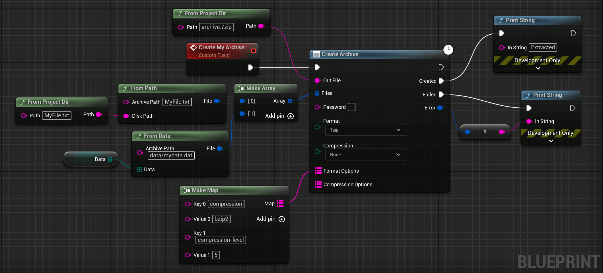
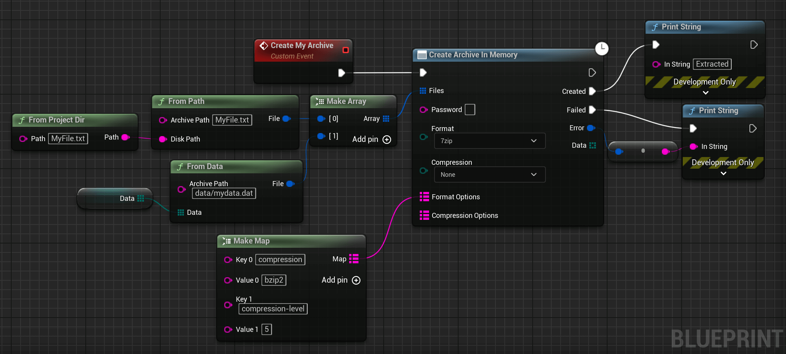

# Create an archive

This section covers how to create an archive.

## Create an archive on disk
Let's assume we want to create a *7zip* archive containing the following:
- A file located at `<ProjectRoot>/text/MyFile.txt` placed at the root of the archive.
- Some data from our game placed at `data/mydata.dat` inside the archive.

```
archive.7zip/
  ├── data/
  │   └── MyData.dat -> From binary data in memory
  └── MyFile.txt     -> From a file on disk
```

The following code shows how to achieve that.

<div class="code-switcher show-cpp-false"><div class="switcher">
<span class="sw-bp" onclick="switchBp()">Blueprints</span><span class="sw-cpp" onclick="switchCpp()">C++</span></div>
<div class="cpp">

```cpp
// Main header file of the UCL.
#include "UCL/UCL.h"

// For FPaths::ProjectDir().
#include "Misc/Paths.h"

// ...

// Example data obtained from somewhere we want to put inside the archive.
TArray<uint8> MyData = ...;

// Calls UCL::CreateArchiveSync to create the archive.
// This function returns an error object to inform about the result of the operation.
FUCLError Error = UCL::CreateArchiveSync(

    // Where to save the archive.
    FPaths::ProjectDir() / TEXT("archive.7zip"),

    // What is inside the archive.
    {
        // A first entry from a file.
        {
            TEXT("MyFile.txt"),
            FPaths::ProjectDir() / TEXT("MyFile.txt"),
        },

        // A second entry from data.
        {
            TEXT("data/MyData.dat"),
            MyData
        },
    },

    // Optional password. 7zip format doesn't support password.
    TEXT(""),

    // Create a 7zip archive.
    EUCLArchiveFormat::_7zip,

    // We don't apply any additional compression on the archive.
    EUCLArchiveCompression::None,

    // Optional options for the format. We configure compression through 7zip format for example here.
    {
        // Use bzip2
        {
            TEXT("compression"),
            TEXT("bzip2")
        },

        // And set the compression level to 5. Values from 0 to 9 are supported by 7zip.
        {
            TEXT("compression-level"),
            TEXT("5")
        }
    }
);

// Checks for errors.
if (Error)
{
    // There is an error. Let's print it to the output log.
    UE_LOG(LogTemp, Error, TEXT("Failed to create archive: %s"), *Error.Message);
}
else
{
    // No error. The 7zip archive has been created with the following entries:
    // 
    // archive.7zip/
    //   ├── data/
    //   │   └── MyData.dat
    //   └── MyFile.txt
}

```

</div>
<div class="bp">
<div class="bpcode">
<textarea readonly>
Begin Object Class=/Script/BlueprintGraph.K2Node_AsyncAction Name="K2Node_AsyncAction_14" ExportPath=/Script/BlueprintGraph.K2Node_AsyncAction'"/Game/DemoActor.DemoActor:EventGraph.K2Node_AsyncAction_14"'
   ProxyFactoryFunctionName="CreateArchive"
   ProxyFactoryClass=/Script/CoreUObject.Class'"/Script/UltimateCompressionLibrary.CreateArchiveProxy"'
   ProxyClass=/Script/CoreUObject.Class'"/Script/UltimateCompressionLibrary.CreateArchiveProxy"'
   NodePosX=-1072
   NodePosY=-4640
   NodeGuid=3562B2144C8D3E5FD252E0B18E089B54
   CustomProperties Pin (PinId=EE2E80F741DDE772F17DA4B480ADFFCD,PinName="execute",PinToolTip="\nExec",PinType.PinCategory="exec",PinType.PinSubCategory="",PinType.PinSubCategoryObject=None,PinType.PinSubCategoryMemberReference=(),PinType.PinValueType=(),PinType.ContainerType=None,PinType.bIsReference=False,PinType.bIsConst=False,PinType.bIsWeakPointer=False,PinType.bIsUObjectWrapper=False,PinType.bSerializeAsSinglePrecisionFloat=False,LinkedTo=(K2Node_CustomEvent_2 B90EA7A84B658DC832CE72B65B5B2EF6,),PersistentGuid=00000000000000000000000000000000,bHidden=False,bNotConnectable=False,bDefaultValueIsReadOnly=False,bDefaultValueIsIgnored=False,bAdvancedView=False,bOrphanedPin=False,)
   CustomProperties Pin (PinId=FFA381AE4E5154C9CCD27C9C4372A55D,PinName="then",Direction="EGPD_Output",PinType.PinCategory="exec",PinType.PinSubCategory="",PinType.PinSubCategoryObject=None,PinType.PinSubCategoryMemberReference=(),PinType.PinValueType=(),PinType.ContainerType=None,PinType.bIsReference=False,PinType.bIsConst=False,PinType.bIsWeakPointer=False,PinType.bIsUObjectWrapper=False,PinType.bSerializeAsSinglePrecisionFloat=False,PersistentGuid=00000000000000000000000000000000,bHidden=False,bNotConnectable=False,bDefaultValueIsReadOnly=False,bDefaultValueIsIgnored=False,bAdvancedView=False,bOrphanedPin=False,)
   CustomProperties Pin (PinId=BB1DBD7547D83F179D23F58411E95008,PinName="Created",PinFriendlyName=NSLOCTEXT("", "74451E074A3EB8B688853C85C1AE3CA8", "Created"),Direction="EGPD_Output",PinType.PinCategory="exec",PinType.PinSubCategory="",PinType.PinSubCategoryObject=None,PinType.PinSubCategoryMemberReference=(),PinType.PinValueType=(),PinType.ContainerType=None,PinType.bIsReference=False,PinType.bIsConst=False,PinType.bIsWeakPointer=False,PinType.bIsUObjectWrapper=False,PinType.bSerializeAsSinglePrecisionFloat=False,LinkedTo=(K2Node_CallFunction_48 A56A405347AB5E4440FC969356DBA1AE,),PersistentGuid=00000000000000000000000000000000,bHidden=False,bNotConnectable=False,bDefaultValueIsReadOnly=False,bDefaultValueIsIgnored=False,bAdvancedView=False,bOrphanedPin=False,)
   CustomProperties Pin (PinId=4BB0638144E0AFCB461610B51A65C287,PinName="Failed",PinFriendlyName=NSLOCTEXT("", "0BB59C0A43BF187534113983D97765D8", "Failed"),Direction="EGPD_Output",PinType.PinCategory="exec",PinType.PinSubCategory="",PinType.PinSubCategoryObject=None,PinType.PinSubCategoryMemberReference=(),PinType.PinValueType=(),PinType.ContainerType=None,PinType.bIsReference=False,PinType.bIsConst=False,PinType.bIsWeakPointer=False,PinType.bIsUObjectWrapper=False,PinType.bSerializeAsSinglePrecisionFloat=False,LinkedTo=(K2Node_CallFunction_46 88E1C2D54E08BD42D9CA06838C26AFA7,),PersistentGuid=00000000000000000000000000000000,bHidden=False,bNotConnectable=False,bDefaultValueIsReadOnly=False,bDefaultValueIsIgnored=False,bAdvancedView=False,bOrphanedPin=False,)
   CustomProperties Pin (PinId=9E611FA249D229E6BBB3B3BE4F97B279,PinName="Error",PinToolTip="Error\nUCLError Structure (by ref)",Direction="EGPD_Output",PinType.PinCategory="struct",PinType.PinSubCategory="",PinType.PinSubCategoryObject=/Script/CoreUObject.ScriptStruct'"/Script/UltimateCompressionLibrary.UCLError"',PinType.PinSubCategoryMemberReference=(),PinType.PinValueType=(),PinType.ContainerType=None,PinType.bIsReference=True,PinType.bIsConst=True,PinType.bIsWeakPointer=False,PinType.bIsUObjectWrapper=False,PinType.bSerializeAsSinglePrecisionFloat=False,LinkedTo=(K2Node_CallFunction_47 C20359E940DE74F04A6F0DBD47FEF9CE,),PersistentGuid=00000000000000000000000000000000,bHidden=False,bNotConnectable=False,bDefaultValueIsReadOnly=False,bDefaultValueIsIgnored=False,bAdvancedView=False,bOrphanedPin=False,)
   CustomProperties Pin (PinId=5976F0FF4E1F20922E3E1582CC200003,PinName="OutFile",PinToolTip="Out File\nString\n\nThe path to the archive created.",PinType.PinCategory="string",PinType.PinSubCategory="",PinType.PinSubCategoryObject=None,PinType.PinSubCategoryMemberReference=(),PinType.PinValueType=(),PinType.ContainerType=None,PinType.bIsReference=False,PinType.bIsConst=False,PinType.bIsWeakPointer=False,PinType.bIsUObjectWrapper=False,PinType.bSerializeAsSinglePrecisionFloat=False,LinkedTo=(K2Node_CallFunction_77 64B82AAD46BAFB1C232E438A52161E8C,),PersistentGuid=00000000000000000000000000000000,bHidden=False,bNotConnectable=False,bDefaultValueIsReadOnly=False,bDefaultValueIsIgnored=False,bAdvancedView=False,bOrphanedPin=False,)
   CustomProperties Pin (PinId=C56D5D27431A125787EFA2AE63893BD3,PinName="Files",PinToolTip="Files\nArray of UCLFile Structures\n\nThe files to include in the archive.",PinType.PinCategory="struct",PinType.PinSubCategory="",PinType.PinSubCategoryObject=/Script/CoreUObject.ScriptStruct'"/Script/UltimateCompressionLibrary.UCLFile"',PinType.PinSubCategoryMemberReference=(),PinType.PinValueType=(),PinType.ContainerType=Array,PinType.bIsReference=False,PinType.bIsConst=False,PinType.bIsWeakPointer=False,PinType.bIsUObjectWrapper=False,PinType.bSerializeAsSinglePrecisionFloat=False,LinkedTo=(K2Node_MakeArray_6 94A95E7B4D39B08F17E82C90274DABBB,),PersistentGuid=00000000000000000000000000000000,bHidden=False,bNotConnectable=False,bDefaultValueIsReadOnly=False,bDefaultValueIsIgnored=False,bAdvancedView=False,bOrphanedPin=False,)
   CustomProperties Pin (PinId=69529D3E4FECDE89A6AC3F9E67D9EB26,PinName="Password",PinToolTip="Password\nString",PinType.PinCategory="string",PinType.PinSubCategory="",PinType.PinSubCategoryObject=None,PinType.PinSubCategoryMemberReference=(),PinType.PinValueType=(),PinType.ContainerType=None,PinType.bIsReference=False,PinType.bIsConst=False,PinType.bIsWeakPointer=False,PinType.bIsUObjectWrapper=False,PinType.bSerializeAsSinglePrecisionFloat=False,PersistentGuid=00000000000000000000000000000000,bHidden=False,bNotConnectable=False,bDefaultValueIsReadOnly=False,bDefaultValueIsIgnored=False,bAdvancedView=False,bOrphanedPin=False,)
   CustomProperties Pin (PinId=E90BD3304D274E52D55DD7B24627DC04,PinName="Format",PinToolTip="Format\nEUCLArchiveFormat Enum\n\nThe format of the archive.",PinType.PinCategory="byte",PinType.PinSubCategory="",PinType.PinSubCategoryObject=/Script/CoreUObject.Enum'"/Script/UltimateCompressionLibrary.EUCLArchiveFormat"',PinType.PinSubCategoryMemberReference=(),PinType.PinValueType=(),PinType.ContainerType=None,PinType.bIsReference=False,PinType.bIsConst=True,PinType.bIsWeakPointer=False,PinType.bIsUObjectWrapper=False,PinType.bSerializeAsSinglePrecisionFloat=False,DefaultValue="_7zip",PersistentGuid=00000000000000000000000000000000,bHidden=False,bNotConnectable=False,bDefaultValueIsReadOnly=False,bDefaultValueIsIgnored=False,bAdvancedView=False,bOrphanedPin=False,)
   CustomProperties Pin (PinId=8845021244732567A0A9B6AE0B28DCAB,PinName="Compression",PinToolTip="Compression\nEUCLArchiveCompression Enum\n\nThe compression to apply to the archive.",PinType.PinCategory="byte",PinType.PinSubCategory="",PinType.PinSubCategoryObject=/Script/CoreUObject.Enum'"/Script/UltimateCompressionLibrary.EUCLArchiveCompression"',PinType.PinSubCategoryMemberReference=(),PinType.PinValueType=(),PinType.ContainerType=None,PinType.bIsReference=False,PinType.bIsConst=True,PinType.bIsWeakPointer=False,PinType.bIsUObjectWrapper=False,PinType.bSerializeAsSinglePrecisionFloat=False,DefaultValue="None",PersistentGuid=00000000000000000000000000000000,bHidden=False,bNotConnectable=False,bDefaultValueIsReadOnly=False,bDefaultValueIsIgnored=False,bAdvancedView=False,bOrphanedPin=False,)
   CustomProperties Pin (PinId=6E4CD62040B53803CB6239BCC4343E32,PinName="FormatOptions",PinToolTip="Format Options\nMap of Strings to Strings\n\nOptional options passed when formatting.",PinType.PinCategory="string",PinType.PinSubCategory="",PinType.PinSubCategoryObject=None,PinType.PinSubCategoryMemberReference=(),PinType.PinValueType=(TerminalCategory="string"),PinType.ContainerType=Map,PinType.bIsReference=False,PinType.bIsConst=False,PinType.bIsWeakPointer=False,PinType.bIsUObjectWrapper=False,PinType.bSerializeAsSinglePrecisionFloat=False,LinkedTo=(K2Node_MakeMap_0 3ED8AF5E4FA3EBDFF6C0BAA7412F12A3,),PersistentGuid=00000000000000000000000000000000,bHidden=False,bNotConnectable=False,bDefaultValueIsReadOnly=False,bDefaultValueIsIgnored=False,bAdvancedView=False,bOrphanedPin=False,)
   CustomProperties Pin (PinId=96E322BF456989B7E078B189B8C0E9EB,PinName="CompressionOptions",PinToolTip="Compression Options\nMap of Strings to Strings\n\nOptional options passed when compressing.",PinType.PinCategory="string",PinType.PinSubCategory="",PinType.PinSubCategoryObject=None,PinType.PinSubCategoryMemberReference=(),PinType.PinValueType=(TerminalCategory="string"),PinType.ContainerType=Map,PinType.bIsReference=False,PinType.bIsConst=False,PinType.bIsWeakPointer=False,PinType.bIsUObjectWrapper=False,PinType.bSerializeAsSinglePrecisionFloat=False,PersistentGuid=00000000000000000000000000000000,bHidden=False,bNotConnectable=False,bDefaultValueIsReadOnly=False,bDefaultValueIsIgnored=False,bAdvancedView=False,bOrphanedPin=False,)
End Object
Begin Object Class=/Script/BlueprintGraph.K2Node_CustomEvent Name="K2Node_CustomEvent_2" ExportPath=/Script/BlueprintGraph.K2Node_CustomEvent'"/Game/DemoActor.DemoActor:EventGraph.K2Node_CustomEvent_2"'
   CustomFunctionName="Create My Archive"
   NodePosX=-1360
   NodePosY=-4656
   ErrorType=1
   NodeGuid=EE6C8AA143D9C2A87A7E58BDEE3EEB11
   CustomProperties Pin (PinId=FBD560D940594F899C6BD89ED9877934,PinName="OutputDelegate",Direction="EGPD_Output",PinType.PinCategory="delegate",PinType.PinSubCategory="",PinType.PinSubCategoryObject=None,PinType.PinSubCategoryMemberReference=(MemberParent=/Script/Engine.BlueprintGeneratedClass'"/Game/DemoActor.DemoActor_C"',MemberName="Create My Archive",MemberGuid=EE6C8AA143D9C2A87A7E58BDEE3EEB11),PinType.PinValueType=(),PinType.ContainerType=None,PinType.bIsReference=False,PinType.bIsConst=False,PinType.bIsWeakPointer=False,PinType.bIsUObjectWrapper=False,PinType.bSerializeAsSinglePrecisionFloat=False,PersistentGuid=00000000000000000000000000000000,bHidden=False,bNotConnectable=False,bDefaultValueIsReadOnly=False,bDefaultValueIsIgnored=False,bAdvancedView=False,bOrphanedPin=False,)
   CustomProperties Pin (PinId=B90EA7A84B658DC832CE72B65B5B2EF6,PinName="then",Direction="EGPD_Output",PinType.PinCategory="exec",PinType.PinSubCategory="",PinType.PinSubCategoryObject=None,PinType.PinSubCategoryMemberReference=(),PinType.PinValueType=(),PinType.ContainerType=None,PinType.bIsReference=False,PinType.bIsConst=False,PinType.bIsWeakPointer=False,PinType.bIsUObjectWrapper=False,PinType.bSerializeAsSinglePrecisionFloat=False,LinkedTo=(K2Node_AsyncAction_14 EE2E80F741DDE772F17DA4B480ADFFCD,),PersistentGuid=00000000000000000000000000000000,bHidden=False,bNotConnectable=False,bDefaultValueIsReadOnly=False,bDefaultValueIsIgnored=False,bAdvancedView=False,bOrphanedPin=False,)
End Object
Begin Object Class=/Script/BlueprintGraph.K2Node_MakeArray Name="K2Node_MakeArray_6" ExportPath=/Script/BlueprintGraph.K2Node_MakeArray'"/Game/DemoActor.DemoActor:EventGraph.K2Node_MakeArray_6"'
   NumInputs=2
   NodePosX=-1248
   NodePosY=-4560
   NodeGuid=AD6B720447FC33FE2021ECA5F75398FE
   CustomProperties Pin (PinId=94A95E7B4D39B08F17E82C90274DABBB,PinName="Array",Direction="EGPD_Output",PinType.PinCategory="struct",PinType.PinSubCategory="",PinType.PinSubCategoryObject=/Script/CoreUObject.ScriptStruct'"/Script/UltimateCompressionLibrary.UCLFile"',PinType.PinSubCategoryMemberReference=(),PinType.PinValueType=(),PinType.ContainerType=Array,PinType.bIsReference=False,PinType.bIsConst=False,PinType.bIsWeakPointer=False,PinType.bIsUObjectWrapper=False,PinType.bSerializeAsSinglePrecisionFloat=False,LinkedTo=(K2Node_AsyncAction_14 C56D5D27431A125787EFA2AE63893BD3,),PersistentGuid=00000000000000000000000000000000,bHidden=False,bNotConnectable=False,bDefaultValueIsReadOnly=False,bDefaultValueIsIgnored=False,bAdvancedView=False,bOrphanedPin=False,)
   CustomProperties Pin (PinId=A2FB072149DE57999B7F79A0BFC960FA,PinName="[0]",PinType.PinCategory="struct",PinType.PinSubCategory="",PinType.PinSubCategoryObject=/Script/CoreUObject.ScriptStruct'"/Script/UltimateCompressionLibrary.UCLFile"',PinType.PinSubCategoryMemberReference=(),PinType.PinValueType=(),PinType.ContainerType=None,PinType.bIsReference=False,PinType.bIsConst=False,PinType.bIsWeakPointer=False,PinType.bIsUObjectWrapper=False,PinType.bSerializeAsSinglePrecisionFloat=False,LinkedTo=(K2Node_CallFunction_44 E9120ACC41CA08FEE6CDCFAC84737CAF,),PersistentGuid=00000000000000000000000000000000,bHidden=False,bNotConnectable=False,bDefaultValueIsReadOnly=False,bDefaultValueIsIgnored=False,bAdvancedView=False,bOrphanedPin=False,)
   CustomProperties Pin (PinId=3006CF204F2EEF5A84A23882CF33F64F,PinName="[1]",PinType.PinCategory="struct",PinType.PinSubCategory="",PinType.PinSubCategoryObject=/Script/CoreUObject.ScriptStruct'"/Script/UltimateCompressionLibrary.UCLFile"',PinType.PinSubCategoryMemberReference=(),PinType.PinValueType=(),PinType.ContainerType=None,PinType.bIsReference=False,PinType.bIsConst=False,PinType.bIsWeakPointer=False,PinType.bIsUObjectWrapper=False,PinType.bSerializeAsSinglePrecisionFloat=False,LinkedTo=(K2Node_CallFunction_45 07ACB0AD45B97968A5C0AC8E296BE7CA,),PersistentGuid=00000000000000000000000000000000,bHidden=False,bNotConnectable=False,bDefaultValueIsReadOnly=False,bDefaultValueIsIgnored=False,bAdvancedView=False,bOrphanedPin=False,)
End Object
Begin Object Class=/Script/BlueprintGraph.K2Node_CallFunction Name="K2Node_CallFunction_44" ExportPath=/Script/BlueprintGraph.K2Node_CallFunction'"/Game/DemoActor.DemoActor:EventGraph.K2Node_CallFunction_44"'
   bIsPureFunc=True
   FunctionReference=(MemberParent=/Script/CoreUObject.Class'"/Script/UltimateCompressionLibrary.UCLLibrary"',MemberName="FromPath")
   NodePosX=-1520
   NodePosY=-4560
   NodeGuid=37DB5FD940AD70213570BB8A616F37F6
   CustomProperties Pin (PinId=0FA2697B45579680BB0BF7849BCAB2F9,PinName="self",PinFriendlyName=NSLOCTEXT("K2Node", "Target", "Target"),PinToolTip="Target\nUCLLibrary Object Reference",PinType.PinCategory="object",PinType.PinSubCategory="",PinType.PinSubCategoryObject=/Script/CoreUObject.Class'"/Script/UltimateCompressionLibrary.UCLLibrary"',PinType.PinSubCategoryMemberReference=(),PinType.PinValueType=(),PinType.ContainerType=None,PinType.bIsReference=False,PinType.bIsConst=False,PinType.bIsWeakPointer=False,PinType.bIsUObjectWrapper=False,PinType.bSerializeAsSinglePrecisionFloat=False,DefaultObject="/Script/UltimateCompressionLibrary.Default__UCLLibrary",PersistentGuid=00000000000000000000000000000000,bHidden=True,bNotConnectable=False,bDefaultValueIsReadOnly=False,bDefaultValueIsIgnored=False,bAdvancedView=False,bOrphanedPin=False,)
   CustomProperties Pin (PinId=B83156184939C9FAF8ECB8ABD64913C2,PinName="ArchivePath",PinToolTip="Archive Path\nString",PinType.PinCategory="string",PinType.PinSubCategory="",PinType.PinSubCategoryObject=None,PinType.PinSubCategoryMemberReference=(),PinType.PinValueType=(),PinType.ContainerType=None,PinType.bIsReference=False,PinType.bIsConst=False,PinType.bIsWeakPointer=False,PinType.bIsUObjectWrapper=False,PinType.bSerializeAsSinglePrecisionFloat=False,DefaultValue="MyFile.txt",PersistentGuid=00000000000000000000000000000000,bHidden=False,bNotConnectable=False,bDefaultValueIsReadOnly=False,bDefaultValueIsIgnored=False,bAdvancedView=False,bOrphanedPin=False,)
   CustomProperties Pin (PinId=6D538C8B4BB043BD19E026AC41536839,PinName="DiskPath",PinToolTip="Disk Path\nString",PinType.PinCategory="string",PinType.PinSubCategory="",PinType.PinSubCategoryObject=None,PinType.PinSubCategoryMemberReference=(),PinType.PinValueType=(),PinType.ContainerType=None,PinType.bIsReference=False,PinType.bIsConst=False,PinType.bIsWeakPointer=False,PinType.bIsUObjectWrapper=False,PinType.bSerializeAsSinglePrecisionFloat=False,LinkedTo=(K2Node_CallFunction_76 8180DE66446369DBC88C9B9F151B056A,),PersistentGuid=00000000000000000000000000000000,bHidden=False,bNotConnectable=False,bDefaultValueIsReadOnly=False,bDefaultValueIsIgnored=False,bAdvancedView=False,bOrphanedPin=False,)
   CustomProperties Pin (PinId=E9120ACC41CA08FEE6CDCFAC84737CAF,PinName="ReturnValue",PinFriendlyName=NSLOCTEXT("", "0D530EC147A7D8D80CF5E79F7A47F2AD", "File"),PinToolTip="File\nUCLFile Structure\n\nCreates an archive entry from a file. It only registers the path and will be loaded in memory\nwhen thewhen creating the archive.",Direction="EGPD_Output",PinType.PinCategory="struct",PinType.PinSubCategory="",PinType.PinSubCategoryObject=/Script/CoreUObject.ScriptStruct'"/Script/UltimateCompressionLibrary.UCLFile"',PinType.PinSubCategoryMemberReference=(),PinType.PinValueType=(),PinType.ContainerType=None,PinType.bIsReference=False,PinType.bIsConst=False,PinType.bIsWeakPointer=False,PinType.bIsUObjectWrapper=False,PinType.bSerializeAsSinglePrecisionFloat=False,LinkedTo=(K2Node_MakeArray_6 A2FB072149DE57999B7F79A0BFC960FA,),PersistentGuid=00000000000000000000000000000000,bHidden=False,bNotConnectable=False,bDefaultValueIsReadOnly=False,bDefaultValueIsIgnored=False,bAdvancedView=False,bOrphanedPin=False,)
End Object
Begin Object Class=/Script/BlueprintGraph.K2Node_CallFunction Name="K2Node_CallFunction_45" ExportPath=/Script/BlueprintGraph.K2Node_CallFunction'"/Game/DemoActor.DemoActor:EventGraph.K2Node_CallFunction_45"'
   bIsPureFunc=True
   FunctionReference=(MemberParent=/Script/CoreUObject.Class'"/Script/UltimateCompressionLibrary.UCLLibrary"',MemberName="FromData")
   NodePosX=-1488
   NodePosY=-4448
   NodeGuid=7E70E6E3485DF6777C3740BDF1803889
   CustomProperties Pin (PinId=3C15654A4F63CE5638B7649B98C78849,PinName="self",PinFriendlyName=NSLOCTEXT("K2Node", "Target", "Target"),PinToolTip="Target\nUCLLibrary Object Reference",PinType.PinCategory="object",PinType.PinSubCategory="",PinType.PinSubCategoryObject=/Script/CoreUObject.Class'"/Script/UltimateCompressionLibrary.UCLLibrary"',PinType.PinSubCategoryMemberReference=(),PinType.PinValueType=(),PinType.ContainerType=None,PinType.bIsReference=False,PinType.bIsConst=False,PinType.bIsWeakPointer=False,PinType.bIsUObjectWrapper=False,PinType.bSerializeAsSinglePrecisionFloat=False,DefaultObject="/Script/UltimateCompressionLibrary.Default__UCLLibrary",PersistentGuid=00000000000000000000000000000000,bHidden=True,bNotConnectable=False,bDefaultValueIsReadOnly=False,bDefaultValueIsIgnored=False,bAdvancedView=False,bOrphanedPin=False,)
   CustomProperties Pin (PinId=D1AB24B540C85308EE7D689D59D99A0B,PinName="ArchivePath",PinToolTip="Archive Path\nString",PinType.PinCategory="string",PinType.PinSubCategory="",PinType.PinSubCategoryObject=None,PinType.PinSubCategoryMemberReference=(),PinType.PinValueType=(),PinType.ContainerType=None,PinType.bIsReference=False,PinType.bIsConst=False,PinType.bIsWeakPointer=False,PinType.bIsUObjectWrapper=False,PinType.bSerializeAsSinglePrecisionFloat=False,DefaultValue="data/mydata.dat",PersistentGuid=00000000000000000000000000000000,bHidden=False,bNotConnectable=False,bDefaultValueIsReadOnly=False,bDefaultValueIsIgnored=False,bAdvancedView=False,bOrphanedPin=False,)
   CustomProperties Pin (PinId=975BCC2A4BB44E9857581F8E13108134,PinName="Data",PinToolTip="Data\nArray of Bytes",PinType.PinCategory="byte",PinType.PinSubCategory="",PinType.PinSubCategoryObject=None,PinType.PinSubCategoryMemberReference=(),PinType.PinValueType=(),PinType.ContainerType=Array,PinType.bIsReference=False,PinType.bIsConst=False,PinType.bIsWeakPointer=False,PinType.bIsUObjectWrapper=False,PinType.bSerializeAsSinglePrecisionFloat=False,LinkedTo=(K2Node_VariableGet_0 1E5EA07D4E2A30FDCC56369E8EA2993A,),PersistentGuid=00000000000000000000000000000000,bHidden=False,bNotConnectable=False,bDefaultValueIsReadOnly=False,bDefaultValueIsIgnored=False,bAdvancedView=False,bOrphanedPin=False,)
   CustomProperties Pin (PinId=07ACB0AD45B97968A5C0AC8E296BE7CA,PinName="ReturnValue",PinFriendlyName=NSLOCTEXT("", "DF54834844D135BC83971D8BCF202494", "File"),PinToolTip="File\nUCLFile Structure\n\nCreates an archive entry from data.",Direction="EGPD_Output",PinType.PinCategory="struct",PinType.PinSubCategory="",PinType.PinSubCategoryObject=/Script/CoreUObject.ScriptStruct'"/Script/UltimateCompressionLibrary.UCLFile"',PinType.PinSubCategoryMemberReference=(),PinType.PinValueType=(),PinType.ContainerType=None,PinType.bIsReference=False,PinType.bIsConst=False,PinType.bIsWeakPointer=False,PinType.bIsUObjectWrapper=False,PinType.bSerializeAsSinglePrecisionFloat=False,LinkedTo=(K2Node_MakeArray_6 3006CF204F2EEF5A84A23882CF33F64F,),PersistentGuid=00000000000000000000000000000000,bHidden=False,bNotConnectable=False,bDefaultValueIsReadOnly=False,bDefaultValueIsIgnored=False,bAdvancedView=False,bOrphanedPin=False,)
End Object
Begin Object Class=/Script/BlueprintGraph.K2Node_VariableGet Name="K2Node_VariableGet_0" ExportPath=/Script/BlueprintGraph.K2Node_VariableGet'"/Game/DemoActor.DemoActor:EventGraph.K2Node_VariableGet_0"'
   VariableReference=(MemberName="Data",MemberGuid=FE3C08F5403033840881B79912133B8B,bSelfContext=True)
   NodePosX=-1648
   NodePosY=-4400
   NodeGuid=84F333B3410B6F57E49D70BF32600A1B
   CustomProperties Pin (PinId=1E5EA07D4E2A30FDCC56369E8EA2993A,PinName="Data",Direction="EGPD_Output",PinType.PinCategory="byte",PinType.PinSubCategory="",PinType.PinSubCategoryObject=None,PinType.PinSubCategoryMemberReference=(),PinType.PinValueType=(),PinType.ContainerType=Array,PinType.bIsReference=False,PinType.bIsConst=False,PinType.bIsWeakPointer=False,PinType.bIsUObjectWrapper=False,PinType.bSerializeAsSinglePrecisionFloat=False,LinkedTo=(K2Node_CallFunction_45 975BCC2A4BB44E9857581F8E13108134,),PersistentGuid=00000000000000000000000000000000,bHidden=False,bNotConnectable=False,bDefaultValueIsReadOnly=False,bDefaultValueIsIgnored=False,bAdvancedView=False,bOrphanedPin=False,)
   CustomProperties Pin (PinId=EA69A4474A53B5E2C7CC798112FD9FC2,PinName="self",PinFriendlyName=NSLOCTEXT("K2Node", "Target", "Target"),PinType.PinCategory="object",PinType.PinSubCategory="",PinType.PinSubCategoryObject=/Script/Engine.BlueprintGeneratedClass'"/Game/DemoActor.DemoActor_C"',PinType.PinSubCategoryMemberReference=(),PinType.PinValueType=(),PinType.ContainerType=None,PinType.bIsReference=False,PinType.bIsConst=False,PinType.bIsWeakPointer=False,PinType.bIsUObjectWrapper=False,PinType.bSerializeAsSinglePrecisionFloat=False,PersistentGuid=00000000000000000000000000000000,bHidden=True,bNotConnectable=False,bDefaultValueIsReadOnly=False,bDefaultValueIsIgnored=False,bAdvancedView=False,bOrphanedPin=False,)
End Object
Begin Object Class=/Script/BlueprintGraph.K2Node_MakeMap Name="K2Node_MakeMap_0" ExportPath=/Script/BlueprintGraph.K2Node_MakeMap'"/Game/DemoActor.DemoActor:EventGraph.K2Node_MakeMap_0"'
   NumInputs=2
   NodePosX=-1376
   NodePosY=-4320
   NodeGuid=A04AB59B4AA5F154AEE81EA65FA7CF10
   CustomProperties Pin (PinId=3ED8AF5E4FA3EBDFF6C0BAA7412F12A3,PinName="Map",Direction="EGPD_Output",PinType.PinCategory="string",PinType.PinSubCategory="",PinType.PinSubCategoryObject=None,PinType.PinSubCategoryMemberReference=(),PinType.PinValueType=(TerminalCategory="string"),PinType.ContainerType=Map,PinType.bIsReference=False,PinType.bIsConst=False,PinType.bIsWeakPointer=False,PinType.bIsUObjectWrapper=False,PinType.bSerializeAsSinglePrecisionFloat=False,LinkedTo=(K2Node_AsyncAction_14 6E4CD62040B53803CB6239BCC4343E32,),PersistentGuid=00000000000000000000000000000000,bHidden=False,bNotConnectable=False,bDefaultValueIsReadOnly=False,bDefaultValueIsIgnored=False,bAdvancedView=False,bOrphanedPin=False,)
   CustomProperties Pin (PinId=F102FB224DCB29306DE66289F53423E2,PinName="Key 0",PinType.PinCategory="string",PinType.PinSubCategory="",PinType.PinSubCategoryObject=None,PinType.PinSubCategoryMemberReference=(),PinType.PinValueType=(),PinType.ContainerType=None,PinType.bIsReference=False,PinType.bIsConst=False,PinType.bIsWeakPointer=False,PinType.bIsUObjectWrapper=False,PinType.bSerializeAsSinglePrecisionFloat=False,DefaultValue="compression",PersistentGuid=00000000000000000000000000000000,bHidden=False,bNotConnectable=False,bDefaultValueIsReadOnly=False,bDefaultValueIsIgnored=False,bAdvancedView=False,bOrphanedPin=False,)
   CustomProperties Pin (PinId=E858A8BB4005780B46AA0293C35FCA8F,PinName="Value 0",PinType.PinCategory="string",PinType.PinSubCategory="",PinType.PinSubCategoryObject=None,PinType.PinSubCategoryMemberReference=(),PinType.PinValueType=(),PinType.ContainerType=None,PinType.bIsReference=False,PinType.bIsConst=False,PinType.bIsWeakPointer=False,PinType.bIsUObjectWrapper=False,PinType.bSerializeAsSinglePrecisionFloat=False,DefaultValue="bzip2",PersistentGuid=00000000000000000000000000000000,bHidden=False,bNotConnectable=False,bDefaultValueIsReadOnly=False,bDefaultValueIsIgnored=False,bAdvancedView=False,bOrphanedPin=False,)
   CustomProperties Pin (PinId=2D24A00A478E4224CC8D16BCEADC0845,PinName="Key 1",PinType.PinCategory="string",PinType.PinSubCategory="",PinType.PinSubCategoryObject=None,PinType.PinSubCategoryMemberReference=(),PinType.PinValueType=(),PinType.ContainerType=None,PinType.bIsReference=False,PinType.bIsConst=False,PinType.bIsWeakPointer=False,PinType.bIsUObjectWrapper=False,PinType.bSerializeAsSinglePrecisionFloat=False,DefaultValue="compression-level",PersistentGuid=00000000000000000000000000000000,bHidden=False,bNotConnectable=False,bDefaultValueIsReadOnly=False,bDefaultValueIsIgnored=False,bAdvancedView=False,bOrphanedPin=False,)
   CustomProperties Pin (PinId=F7B567914C0EB1D8B06EA89C42867873,PinName="Value 1",PinType.PinCategory="string",PinType.PinSubCategory="",PinType.PinSubCategoryObject=None,PinType.PinSubCategoryMemberReference=(),PinType.PinValueType=(),PinType.ContainerType=None,PinType.bIsReference=False,PinType.bIsConst=False,PinType.bIsWeakPointer=False,PinType.bIsUObjectWrapper=False,PinType.bSerializeAsSinglePrecisionFloat=False,DefaultValue="5",PersistentGuid=00000000000000000000000000000000,bHidden=False,bNotConnectable=False,bDefaultValueIsReadOnly=False,bDefaultValueIsIgnored=False,bAdvancedView=False,bOrphanedPin=False,)
End Object
Begin Object Class=/Script/BlueprintGraph.K2Node_CallFunction Name="K2Node_CallFunction_46" ExportPath=/Script/BlueprintGraph.K2Node_CallFunction'"/Game/DemoActor.DemoActor:EventGraph.K2Node_CallFunction_46"'
   FunctionReference=(MemberParent=/Script/CoreUObject.Class'"/Script/Engine.KismetSystemLibrary"',MemberName="PrintString")
   NodePosX=-576
   NodePosY=-4544
   AdvancedPinDisplay=Hidden
   EnabledState=DevelopmentOnly
   NodeGuid=054886E5429DADA4D092C39948718570
   CustomProperties Pin (PinId=88E1C2D54E08BD42D9CA06838C26AFA7,PinName="execute",PinType.PinCategory="exec",PinType.PinSubCategory="",PinType.PinSubCategoryObject=None,PinType.PinSubCategoryMemberReference=(),PinType.PinValueType=(),PinType.ContainerType=None,PinType.bIsReference=False,PinType.bIsConst=False,PinType.bIsWeakPointer=False,PinType.bIsUObjectWrapper=False,PinType.bSerializeAsSinglePrecisionFloat=False,LinkedTo=(K2Node_AsyncAction_14 4BB0638144E0AFCB461610B51A65C287,),PersistentGuid=00000000000000000000000000000000,bHidden=False,bNotConnectable=False,bDefaultValueIsReadOnly=False,bDefaultValueIsIgnored=False,bAdvancedView=False,bOrphanedPin=False,)
   CustomProperties Pin (PinId=9C7EDA8D43D78336BE36F6B9F0BF0752,PinName="then",Direction="EGPD_Output",PinType.PinCategory="exec",PinType.PinSubCategory="",PinType.PinSubCategoryObject=None,PinType.PinSubCategoryMemberReference=(),PinType.PinValueType=(),PinType.ContainerType=None,PinType.bIsReference=False,PinType.bIsConst=False,PinType.bIsWeakPointer=False,PinType.bIsUObjectWrapper=False,PinType.bSerializeAsSinglePrecisionFloat=False,PersistentGuid=00000000000000000000000000000000,bHidden=False,bNotConnectable=False,bDefaultValueIsReadOnly=False,bDefaultValueIsIgnored=False,bAdvancedView=False,bOrphanedPin=False,)
   CustomProperties Pin (PinId=7A897FD14F242301A6BE9D9C231A7AB4,PinName="self",PinFriendlyName=NSLOCTEXT("K2Node", "Target", "Target"),PinType.PinCategory="object",PinType.PinSubCategory="",PinType.PinSubCategoryObject=/Script/CoreUObject.Class'"/Script/Engine.KismetSystemLibrary"',PinType.PinSubCategoryMemberReference=(),PinType.PinValueType=(),PinType.ContainerType=None,PinType.bIsReference=False,PinType.bIsConst=False,PinType.bIsWeakPointer=False,PinType.bIsUObjectWrapper=False,PinType.bSerializeAsSinglePrecisionFloat=False,DefaultObject="/Script/Engine.Default__KismetSystemLibrary",PersistentGuid=00000000000000000000000000000000,bHidden=True,bNotConnectable=False,bDefaultValueIsReadOnly=False,bDefaultValueIsIgnored=False,bAdvancedView=False,bOrphanedPin=False,)
   CustomProperties Pin (PinId=E13BBD114A2A2C946C7DDAA218EB7EA8,PinName="WorldContextObject",PinType.PinCategory="object",PinType.PinSubCategory="",PinType.PinSubCategoryObject=/Script/CoreUObject.Class'"/Script/CoreUObject.Object"',PinType.PinSubCategoryMemberReference=(),PinType.PinValueType=(),PinType.ContainerType=None,PinType.bIsReference=False,PinType.bIsConst=True,PinType.bIsWeakPointer=False,PinType.bIsUObjectWrapper=False,PinType.bSerializeAsSinglePrecisionFloat=False,PersistentGuid=00000000000000000000000000000000,bHidden=True,bNotConnectable=False,bDefaultValueIsReadOnly=False,bDefaultValueIsIgnored=False,bAdvancedView=False,bOrphanedPin=False,)
   CustomProperties Pin (PinId=6D4D90AE4690D7FB321B5E87B3D78365,PinName="InString",PinType.PinCategory="string",PinType.PinSubCategory="",PinType.PinSubCategoryObject=None,PinType.PinSubCategoryMemberReference=(),PinType.PinValueType=(),PinType.ContainerType=None,PinType.bIsReference=False,PinType.bIsConst=False,PinType.bIsWeakPointer=False,PinType.bIsUObjectWrapper=False,PinType.bSerializeAsSinglePrecisionFloat=False,DefaultValue="Hello",AutogeneratedDefaultValue="Hello",LinkedTo=(K2Node_CallFunction_47 89A365AC4EE1BC73D22E6380B489B4FC,),PersistentGuid=00000000000000000000000000000000,bHidden=False,bNotConnectable=False,bDefaultValueIsReadOnly=False,bDefaultValueIsIgnored=False,bAdvancedView=False,bOrphanedPin=False,)
   CustomProperties Pin (PinId=162316B24758D1DDFEF3E08CB38887A6,PinName="bPrintToScreen",PinType.PinCategory="bool",PinType.PinSubCategory="",PinType.PinSubCategoryObject=None,PinType.PinSubCategoryMemberReference=(),PinType.PinValueType=(),PinType.ContainerType=None,PinType.bIsReference=False,PinType.bIsConst=False,PinType.bIsWeakPointer=False,PinType.bIsUObjectWrapper=False,PinType.bSerializeAsSinglePrecisionFloat=False,DefaultValue="true",AutogeneratedDefaultValue="true",PersistentGuid=00000000000000000000000000000000,bHidden=False,bNotConnectable=False,bDefaultValueIsReadOnly=False,bDefaultValueIsIgnored=False,bAdvancedView=True,bOrphanedPin=False,)
   CustomProperties Pin (PinId=73AB0CBF486DA1C40BF6F4B41C79B3FE,PinName="bPrintToLog",PinType.PinCategory="bool",PinType.PinSubCategory="",PinType.PinSubCategoryObject=None,PinType.PinSubCategoryMemberReference=(),PinType.PinValueType=(),PinType.ContainerType=None,PinType.bIsReference=False,PinType.bIsConst=False,PinType.bIsWeakPointer=False,PinType.bIsUObjectWrapper=False,PinType.bSerializeAsSinglePrecisionFloat=False,DefaultValue="true",AutogeneratedDefaultValue="true",PersistentGuid=00000000000000000000000000000000,bHidden=False,bNotConnectable=False,bDefaultValueIsReadOnly=False,bDefaultValueIsIgnored=False,bAdvancedView=True,bOrphanedPin=False,)
   CustomProperties Pin (PinId=F7B705E5497EA55FC5F888946CD1A9A5,PinName="TextColor",PinType.PinCategory="struct",PinType.PinSubCategory="",PinType.PinSubCategoryObject=/Script/CoreUObject.ScriptStruct'"/Script/CoreUObject.LinearColor"',PinType.PinSubCategoryMemberReference=(),PinType.PinValueType=(),PinType.ContainerType=None,PinType.bIsReference=False,PinType.bIsConst=False,PinType.bIsWeakPointer=False,PinType.bIsUObjectWrapper=False,PinType.bSerializeAsSinglePrecisionFloat=False,DefaultValue="(R=0.000000,G=0.660000,B=1.000000,A=1.000000)",AutogeneratedDefaultValue="(R=0.000000,G=0.660000,B=1.000000,A=1.000000)",PersistentGuid=00000000000000000000000000000000,bHidden=False,bNotConnectable=False,bDefaultValueIsReadOnly=False,bDefaultValueIsIgnored=False,bAdvancedView=True,bOrphanedPin=False,)
   CustomProperties Pin (PinId=7B7D0585460AE4E36C4A5295F41A5B18,PinName="Duration",PinType.PinCategory="real",PinType.PinSubCategory="float",PinType.PinSubCategoryObject=None,PinType.PinSubCategoryMemberReference=(),PinType.PinValueType=(),PinType.ContainerType=None,PinType.bIsReference=False,PinType.bIsConst=False,PinType.bIsWeakPointer=False,PinType.bIsUObjectWrapper=False,PinType.bSerializeAsSinglePrecisionFloat=False,DefaultValue="2.000000",AutogeneratedDefaultValue="2.000000",PersistentGuid=00000000000000000000000000000000,bHidden=False,bNotConnectable=False,bDefaultValueIsReadOnly=False,bDefaultValueIsIgnored=False,bAdvancedView=True,bOrphanedPin=False,)
   CustomProperties Pin (PinId=FD3D89604448F081FBE47ABF7782BD85,PinName="Key",PinType.PinCategory="name",PinType.PinSubCategory="",PinType.PinSubCategoryObject=None,PinType.PinSubCategoryMemberReference=(),PinType.PinValueType=(),PinType.ContainerType=None,PinType.bIsReference=False,PinType.bIsConst=True,PinType.bIsWeakPointer=False,PinType.bIsUObjectWrapper=False,PinType.bSerializeAsSinglePrecisionFloat=False,DefaultValue="None",AutogeneratedDefaultValue="None",PersistentGuid=00000000000000000000000000000000,bHidden=False,bNotConnectable=False,bDefaultValueIsReadOnly=False,bDefaultValueIsIgnored=False,bAdvancedView=True,bOrphanedPin=False,)
End Object
Begin Object Class=/Script/BlueprintGraph.K2Node_CallFunction Name="K2Node_CallFunction_47" ExportPath=/Script/BlueprintGraph.K2Node_CallFunction'"/Game/DemoActor.DemoActor:EventGraph.K2Node_CallFunction_47"'
   bIsPureFunc=True
   FunctionReference=(MemberParent=/Script/CoreUObject.Class'"/Script/UltimateCompressionLibrary.UCLLibrary"',MemberName="ToString")
   NodePosX=-720
   NodePosY=-4464
   NodeGuid=5B9BFF804CC967451557CFBEAA55FDB4
   CustomProperties Pin (PinId=F0AABBB6466B6045797B448159381197,PinName="self",PinFriendlyName=NSLOCTEXT("K2Node", "Target", "Target"),PinType.PinCategory="object",PinType.PinSubCategory="",PinType.PinSubCategoryObject=/Script/CoreUObject.Class'"/Script/UltimateCompressionLibrary.UCLLibrary"',PinType.PinSubCategoryMemberReference=(),PinType.PinValueType=(),PinType.ContainerType=None,PinType.bIsReference=False,PinType.bIsConst=False,PinType.bIsWeakPointer=False,PinType.bIsUObjectWrapper=False,PinType.bSerializeAsSinglePrecisionFloat=False,DefaultObject="/Script/UltimateCompressionLibrary.Default__UCLLibrary",PersistentGuid=00000000000000000000000000000000,bHidden=True,bNotConnectable=False,bDefaultValueIsReadOnly=False,bDefaultValueIsIgnored=False,bAdvancedView=False,bOrphanedPin=False,)
   CustomProperties Pin (PinId=C20359E940DE74F04A6F0DBD47FEF9CE,PinName="Error",PinType.PinCategory="struct",PinType.PinSubCategory="",PinType.PinSubCategoryObject=/Script/CoreUObject.ScriptStruct'"/Script/UltimateCompressionLibrary.UCLError"',PinType.PinSubCategoryMemberReference=(),PinType.PinValueType=(),PinType.ContainerType=None,PinType.bIsReference=False,PinType.bIsConst=False,PinType.bIsWeakPointer=False,PinType.bIsUObjectWrapper=False,PinType.bSerializeAsSinglePrecisionFloat=False,LinkedTo=(K2Node_AsyncAction_14 9E611FA249D229E6BBB3B3BE4F97B279,),PersistentGuid=00000000000000000000000000000000,bHidden=False,bNotConnectable=False,bDefaultValueIsReadOnly=False,bDefaultValueIsIgnored=False,bAdvancedView=False,bOrphanedPin=False,)
   CustomProperties Pin (PinId=89A365AC4EE1BC73D22E6380B489B4FC,PinName="ReturnValue",Direction="EGPD_Output",PinType.PinCategory="string",PinType.PinSubCategory="",PinType.PinSubCategoryObject=None,PinType.PinSubCategoryMemberReference=(),PinType.PinValueType=(),PinType.ContainerType=None,PinType.bIsReference=False,PinType.bIsConst=False,PinType.bIsWeakPointer=False,PinType.bIsUObjectWrapper=False,PinType.bSerializeAsSinglePrecisionFloat=False,LinkedTo=(K2Node_CallFunction_46 6D4D90AE4690D7FB321B5E87B3D78365,),PersistentGuid=00000000000000000000000000000000,bHidden=False,bNotConnectable=False,bDefaultValueIsReadOnly=False,bDefaultValueIsIgnored=False,bAdvancedView=False,bOrphanedPin=False,)
End Object
Begin Object Class=/Script/BlueprintGraph.K2Node_CallFunction Name="K2Node_CallFunction_48" ExportPath=/Script/BlueprintGraph.K2Node_CallFunction'"/Game/DemoActor.DemoActor:EventGraph.K2Node_CallFunction_48"'
   FunctionReference=(MemberParent=/Script/CoreUObject.Class'"/Script/Engine.KismetSystemLibrary"',MemberName="PrintString")
   NodePosX=-640
   NodePosY=-4720
   AdvancedPinDisplay=Hidden
   EnabledState=DevelopmentOnly
   NodeGuid=AD527662442B8D948BDC6DB94526D3BC
   CustomProperties Pin (PinId=A56A405347AB5E4440FC969356DBA1AE,PinName="execute",PinToolTip="\nExec",PinType.PinCategory="exec",PinType.PinSubCategory="",PinType.PinSubCategoryObject=None,PinType.PinSubCategoryMemberReference=(),PinType.PinValueType=(),PinType.ContainerType=None,PinType.bIsReference=False,PinType.bIsConst=False,PinType.bIsWeakPointer=False,PinType.bIsUObjectWrapper=False,PinType.bSerializeAsSinglePrecisionFloat=False,LinkedTo=(K2Node_AsyncAction_14 BB1DBD7547D83F179D23F58411E95008,),PersistentGuid=00000000000000000000000000000000,bHidden=False,bNotConnectable=False,bDefaultValueIsReadOnly=False,bDefaultValueIsIgnored=False,bAdvancedView=False,bOrphanedPin=False,)
   CustomProperties Pin (PinId=62ED52EE4C5BDC7B4F28B78A0FBEE624,PinName="then",PinToolTip="\nExec",Direction="EGPD_Output",PinType.PinCategory="exec",PinType.PinSubCategory="",PinType.PinSubCategoryObject=None,PinType.PinSubCategoryMemberReference=(),PinType.PinValueType=(),PinType.ContainerType=None,PinType.bIsReference=False,PinType.bIsConst=False,PinType.bIsWeakPointer=False,PinType.bIsUObjectWrapper=False,PinType.bSerializeAsSinglePrecisionFloat=False,PersistentGuid=00000000000000000000000000000000,bHidden=False,bNotConnectable=False,bDefaultValueIsReadOnly=False,bDefaultValueIsIgnored=False,bAdvancedView=False,bOrphanedPin=False,)
   CustomProperties Pin (PinId=E1EC49E14CF623A0E571D6A93585CFBA,PinName="self",PinFriendlyName=NSLOCTEXT("K2Node", "Target", "Target"),PinToolTip="Target\nKismet System Library Object Reference",PinType.PinCategory="object",PinType.PinSubCategory="",PinType.PinSubCategoryObject=/Script/CoreUObject.Class'"/Script/Engine.KismetSystemLibrary"',PinType.PinSubCategoryMemberReference=(),PinType.PinValueType=(),PinType.ContainerType=None,PinType.bIsReference=False,PinType.bIsConst=False,PinType.bIsWeakPointer=False,PinType.bIsUObjectWrapper=False,PinType.bSerializeAsSinglePrecisionFloat=False,DefaultObject="/Script/Engine.Default__KismetSystemLibrary",PersistentGuid=00000000000000000000000000000000,bHidden=True,bNotConnectable=False,bDefaultValueIsReadOnly=False,bDefaultValueIsIgnored=False,bAdvancedView=False,bOrphanedPin=False,)
   CustomProperties Pin (PinId=77BA114A4AE420327D9A839DB0D379A6,PinName="WorldContextObject",PinToolTip="World Context Object\nObject Reference",PinType.PinCategory="object",PinType.PinSubCategory="",PinType.PinSubCategoryObject=/Script/CoreUObject.Class'"/Script/CoreUObject.Object"',PinType.PinSubCategoryMemberReference=(),PinType.PinValueType=(),PinType.ContainerType=None,PinType.bIsReference=False,PinType.bIsConst=True,PinType.bIsWeakPointer=False,PinType.bIsUObjectWrapper=False,PinType.bSerializeAsSinglePrecisionFloat=False,PersistentGuid=00000000000000000000000000000000,bHidden=True,bNotConnectable=False,bDefaultValueIsReadOnly=False,bDefaultValueIsIgnored=False,bAdvancedView=False,bOrphanedPin=False,)
   CustomProperties Pin (PinId=B9ADD1494FD176F7B6BAAF842E832533,PinName="InString",PinToolTip="In String\nString\n\nThe string to log out",PinType.PinCategory="string",PinType.PinSubCategory="",PinType.PinSubCategoryObject=None,PinType.PinSubCategoryMemberReference=(),PinType.PinValueType=(),PinType.ContainerType=None,PinType.bIsReference=False,PinType.bIsConst=False,PinType.bIsWeakPointer=False,PinType.bIsUObjectWrapper=False,PinType.bSerializeAsSinglePrecisionFloat=False,DefaultValue="Extracted",AutogeneratedDefaultValue="Hello",PersistentGuid=00000000000000000000000000000000,bHidden=False,bNotConnectable=False,bDefaultValueIsReadOnly=False,bDefaultValueIsIgnored=False,bAdvancedView=False,bOrphanedPin=False,)
   CustomProperties Pin (PinId=05867B55462A8EEF3166F4B9EBA244E8,PinName="bPrintToScreen",PinToolTip="Print to Screen\nBoolean\n\nWhether or not to print the output to the screen",PinType.PinCategory="bool",PinType.PinSubCategory="",PinType.PinSubCategoryObject=None,PinType.PinSubCategoryMemberReference=(),PinType.PinValueType=(),PinType.ContainerType=None,PinType.bIsReference=False,PinType.bIsConst=False,PinType.bIsWeakPointer=False,PinType.bIsUObjectWrapper=False,PinType.bSerializeAsSinglePrecisionFloat=False,DefaultValue="true",AutogeneratedDefaultValue="true",PersistentGuid=00000000000000000000000000000000,bHidden=False,bNotConnectable=False,bDefaultValueIsReadOnly=False,bDefaultValueIsIgnored=False,bAdvancedView=True,bOrphanedPin=False,)
   CustomProperties Pin (PinId=A6B1B64A429CC689A258A2B61804E97A,PinName="bPrintToLog",PinToolTip="Print to Log\nBoolean\n\nWhether or not to print the output to the log",PinType.PinCategory="bool",PinType.PinSubCategory="",PinType.PinSubCategoryObject=None,PinType.PinSubCategoryMemberReference=(),PinType.PinValueType=(),PinType.ContainerType=None,PinType.bIsReference=False,PinType.bIsConst=False,PinType.bIsWeakPointer=False,PinType.bIsUObjectWrapper=False,PinType.bSerializeAsSinglePrecisionFloat=False,DefaultValue="true",AutogeneratedDefaultValue="true",PersistentGuid=00000000000000000000000000000000,bHidden=False,bNotConnectable=False,bDefaultValueIsReadOnly=False,bDefaultValueIsIgnored=False,bAdvancedView=True,bOrphanedPin=False,)
   CustomProperties Pin (PinId=DD6C8FE64555317DCEDDD0AFD30F2666,PinName="TextColor",PinToolTip="Text Color\nLinear Color Structure\n\nThe color of the text to display",PinType.PinCategory="struct",PinType.PinSubCategory="",PinType.PinSubCategoryObject=/Script/CoreUObject.ScriptStruct'"/Script/CoreUObject.LinearColor"',PinType.PinSubCategoryMemberReference=(),PinType.PinValueType=(),PinType.ContainerType=None,PinType.bIsReference=False,PinType.bIsConst=False,PinType.bIsWeakPointer=False,PinType.bIsUObjectWrapper=False,PinType.bSerializeAsSinglePrecisionFloat=False,DefaultValue="(R=0.000000,G=0.660000,B=1.000000,A=1.000000)",AutogeneratedDefaultValue="(R=0.000000,G=0.660000,B=1.000000,A=1.000000)",PersistentGuid=00000000000000000000000000000000,bHidden=False,bNotConnectable=False,bDefaultValueIsReadOnly=False,bDefaultValueIsIgnored=False,bAdvancedView=True,bOrphanedPin=False,)
   CustomProperties Pin (PinId=0D3D256A4C379C14341E5F99ED779D38,PinName="Duration",PinToolTip="Duration\nFloat (single-precision)\n\nThe display duration (if Print to Screen is True). Using negative number will result in loading the duration time from the config.",PinType.PinCategory="real",PinType.PinSubCategory="float",PinType.PinSubCategoryObject=None,PinType.PinSubCategoryMemberReference=(),PinType.PinValueType=(),PinType.ContainerType=None,PinType.bIsReference=False,PinType.bIsConst=False,PinType.bIsWeakPointer=False,PinType.bIsUObjectWrapper=False,PinType.bSerializeAsSinglePrecisionFloat=False,DefaultValue="2.000000",AutogeneratedDefaultValue="2.000000",PersistentGuid=00000000000000000000000000000000,bHidden=False,bNotConnectable=False,bDefaultValueIsReadOnly=False,bDefaultValueIsIgnored=False,bAdvancedView=True,bOrphanedPin=False,)
   CustomProperties Pin (PinId=B3F9632B46CFE796BAA056BC713A09DA,PinName="Key",PinToolTip="Key\nName\n\nIf a non-empty key is provided, the message will replace any existing on-screen messages with the same key.",PinType.PinCategory="name",PinType.PinSubCategory="",PinType.PinSubCategoryObject=None,PinType.PinSubCategoryMemberReference=(),PinType.PinValueType=(),PinType.ContainerType=None,PinType.bIsReference=False,PinType.bIsConst=True,PinType.bIsWeakPointer=False,PinType.bIsUObjectWrapper=False,PinType.bSerializeAsSinglePrecisionFloat=False,DefaultValue="None",AutogeneratedDefaultValue="None",PersistentGuid=00000000000000000000000000000000,bHidden=False,bNotConnectable=False,bDefaultValueIsReadOnly=False,bDefaultValueIsIgnored=False,bAdvancedView=True,bOrphanedPin=False,)
End Object
Begin Object Class=/Script/BlueprintGraph.K2Node_CallFunction Name="K2Node_CallFunction_76" ExportPath=/Script/BlueprintGraph.K2Node_CallFunction'"/Game/DemoActor.DemoActor:EventGraph.K2Node_CallFunction_76"'
   bIsPureFunc=True
   FunctionReference=(MemberParent=/Script/CoreUObject.Class'"/Script/UltimateCompressionLibrary.UCLLibrary"',MemberName="FromProjectDir")
   NodePosX=-1760
   NodePosY=-4528
   NodeGuid=220532B74492B57F19834E953FD4DD09
   CustomProperties Pin (PinId=DAC3226B45E511367596BCAEC068CE3E,PinName="self",PinFriendlyName=NSLOCTEXT("K2Node", "Target", "Target"),PinToolTip="Target\nUCLLibrary Object Reference",PinType.PinCategory="object",PinType.PinSubCategory="",PinType.PinSubCategoryObject=/Script/CoreUObject.Class'"/Script/UltimateCompressionLibrary.UCLLibrary"',PinType.PinSubCategoryMemberReference=(),PinType.PinValueType=(),PinType.ContainerType=None,PinType.bIsReference=False,PinType.bIsConst=False,PinType.bIsWeakPointer=False,PinType.bIsUObjectWrapper=False,PinType.bSerializeAsSinglePrecisionFloat=False,DefaultObject="/Script/UltimateCompressionLibrary.Default__UCLLibrary",PersistentGuid=00000000000000000000000000000000,bHidden=True,bNotConnectable=False,bDefaultValueIsReadOnly=False,bDefaultValueIsIgnored=False,bAdvancedView=False,bOrphanedPin=False,)
   CustomProperties Pin (PinId=34B70D5E449ECDD9B64DED92B5A7EBA0,PinName="Path",PinToolTip="Path\nString",PinType.PinCategory="string",PinType.PinSubCategory="",PinType.PinSubCategoryObject=None,PinType.PinSubCategoryMemberReference=(),PinType.PinValueType=(),PinType.ContainerType=None,PinType.bIsReference=False,PinType.bIsConst=False,PinType.bIsWeakPointer=False,PinType.bIsUObjectWrapper=False,PinType.bSerializeAsSinglePrecisionFloat=False,DefaultValue="MyFile.txt",PersistentGuid=00000000000000000000000000000000,bHidden=False,bNotConnectable=False,bDefaultValueIsReadOnly=False,bDefaultValueIsIgnored=False,bAdvancedView=False,bOrphanedPin=False,)
   CustomProperties Pin (PinId=8180DE66446369DBC88C9B9F151B056A,PinName="ReturnValue",PinFriendlyName=NSLOCTEXT("", "B4C0128B414BC6FC2B7735AA4B2BF092", "Path"),PinToolTip="Path\nString\n\nCreates a path starting at the project directory root.",Direction="EGPD_Output",PinType.PinCategory="string",PinType.PinSubCategory="",PinType.PinSubCategoryObject=None,PinType.PinSubCategoryMemberReference=(),PinType.PinValueType=(),PinType.ContainerType=None,PinType.bIsReference=False,PinType.bIsConst=False,PinType.bIsWeakPointer=False,PinType.bIsUObjectWrapper=False,PinType.bSerializeAsSinglePrecisionFloat=False,LinkedTo=(K2Node_CallFunction_44 6D538C8B4BB043BD19E026AC41536839,),PersistentGuid=00000000000000000000000000000000,bHidden=False,bNotConnectable=False,bDefaultValueIsReadOnly=False,bDefaultValueIsIgnored=False,bAdvancedView=False,bOrphanedPin=False,)
End Object
Begin Object Class=/Script/BlueprintGraph.K2Node_CallFunction Name="K2Node_CallFunction_77" ExportPath=/Script/BlueprintGraph.K2Node_CallFunction'"/Game/DemoActor.DemoActor:EventGraph.K2Node_CallFunction_77"'
   bIsPureFunc=True
   FunctionReference=(MemberParent=/Script/CoreUObject.Class'"/Script/UltimateCompressionLibrary.UCLLibrary"',MemberName="FromProjectDir")
   NodePosX=-1392
   NodePosY=-4736
   NodeGuid=876FC3544647A8CAE6B535AC4FEA16E3
   CustomProperties Pin (PinId=6B85458945F037587E1EE5A12178D151,PinName="self",PinFriendlyName=NSLOCTEXT("K2Node", "Target", "Target"),PinToolTip="Target\nUCLLibrary Object Reference",PinType.PinCategory="object",PinType.PinSubCategory="",PinType.PinSubCategoryObject=/Script/CoreUObject.Class'"/Script/UltimateCompressionLibrary.UCLLibrary"',PinType.PinSubCategoryMemberReference=(),PinType.PinValueType=(),PinType.ContainerType=None,PinType.bIsReference=False,PinType.bIsConst=False,PinType.bIsWeakPointer=False,PinType.bIsUObjectWrapper=False,PinType.bSerializeAsSinglePrecisionFloat=False,DefaultObject="/Script/UltimateCompressionLibrary.Default__UCLLibrary",PersistentGuid=00000000000000000000000000000000,bHidden=True,bNotConnectable=False,bDefaultValueIsReadOnly=False,bDefaultValueIsIgnored=False,bAdvancedView=False,bOrphanedPin=False,)
   CustomProperties Pin (PinId=5DB73ACF434EC54D6CE58F9B76FEF3CF,PinName="Path",PinToolTip="Path\nString",PinType.PinCategory="string",PinType.PinSubCategory="",PinType.PinSubCategoryObject=None,PinType.PinSubCategoryMemberReference=(),PinType.PinValueType=(),PinType.ContainerType=None,PinType.bIsReference=False,PinType.bIsConst=False,PinType.bIsWeakPointer=False,PinType.bIsUObjectWrapper=False,PinType.bSerializeAsSinglePrecisionFloat=False,DefaultValue="archive.7zip",PersistentGuid=00000000000000000000000000000000,bHidden=False,bNotConnectable=False,bDefaultValueIsReadOnly=False,bDefaultValueIsIgnored=False,bAdvancedView=False,bOrphanedPin=False,)
   CustomProperties Pin (PinId=64B82AAD46BAFB1C232E438A52161E8C,PinName="ReturnValue",PinFriendlyName=NSLOCTEXT("", "3A96D6634DA00C2965F8B6892C043426", "Path"),PinToolTip="Path\nString\n\nCreates a path starting at the project directory root.",Direction="EGPD_Output",PinType.PinCategory="string",PinType.PinSubCategory="",PinType.PinSubCategoryObject=None,PinType.PinSubCategoryMemberReference=(),PinType.PinValueType=(),PinType.ContainerType=None,PinType.bIsReference=False,PinType.bIsConst=False,PinType.bIsWeakPointer=False,PinType.bIsUObjectWrapper=False,PinType.bSerializeAsSinglePrecisionFloat=False,LinkedTo=(K2Node_AsyncAction_14 5976F0FF4E1F20922E3E1582CC200003,),PersistentGuid=00000000000000000000000000000000,bHidden=False,bNotConnectable=False,bDefaultValueIsReadOnly=False,bDefaultValueIsIgnored=False,bAdvancedView=False,bOrphanedPin=False,)
End Object
</textarea>

<button onclick="copyBlueprintCode(this)">Copy Code</button>
</div>
</div>
</div>

## Create an archive in memory

Let's assume we want to create a *7zip* archive containing the following:
- A file located at `<ProjectRoot>/text/MyFile.txt` placed at the root of the archive.
- Some data from our game placed at `data/mydata.dat` inside the archive.

```
archive.7zip/
  ├── data/
  │   └── MyData.dat -> From binary data in memory
  └── MyFile.txt     -> From a file on disk
```

The following code shows how to achieve that.

<div class="code-switcher show-cpp-false"><div class="switcher">
<span class="sw-bp" onclick="switchBp()">Blueprints</span><span class="sw-cpp" onclick="switchCpp()">C++</span></div>
<div class="cpp">

```cpp
// Main header file of the UCL.
#include "UCL/UCL.h"

// For FPaths::ProjectDir().
#include "Misc/Paths.h"

// ...


// Example data obtained from somewhere we want to put inside the archive.
TArray<uint8> MyData = ...;

// Variable used to store the binary of the archive.
TArray<uint8> ArchiveData;

// Calls UCL::CreateArchiveSync to create the archive.
// This function returns an error object to inform about the result of the operation.
FUCLError Error = UCL::CreateArchiveInMemorySync
(
    // Where we want to save the binary data.
    ArchiveData,

    // What is inside the archive.
    {
        // A first entry from a file.
        {
            TEXT("MyFile.txt"),
            FPaths::ProjectDir() / TEXT("MyFile.txt"),
        },

        // A second entry from data.
        {
            TEXT("data/MyData.dat"),
            MyData
        },
    },

    // Optional password. 7zip format doesn't support password.
    TEXT(""),

    // Create a 7zip archive.
    EUCLArchiveFormat::_7zip,

    // We don't apply any additional compression on the archive.
    EUCLArchiveCompression::None,

    // Optional options for the format. We configure compression through 7zip format for example here.
    {
        // Use bzip2
        {
            TEXT("compression"),
            TEXT("bzip2")
        },

        // And set the compression level to 5. Values from 0 to 9 are supported by 7zip.
        {
            TEXT("compression-level"),
            TEXT("5")
        }
    }
);

// Checks for errors.
if (Error)
{
    // There is an error. Let's print it to the output log.
    UE_LOG(LogTemp, Error, TEXT("Failed to create archive: %s"), *Error.Message);
}
else
{
    // No error. The 7zip archive has been created and is stored as binary in ArchiveData.
}
```

</div>
<div class="bp">
<div class="bpcode">
<textarea readonly>
Begin Object Class=/Script/BlueprintGraph.K2Node_CustomEvent Name="K2Node_CustomEvent_2" ExportPath=/Script/BlueprintGraph.K2Node_CustomEvent'"/Game/DemoActor.DemoActor:EventGraph.K2Node_CustomEvent_2"'
   CustomFunctionName="Create My Archive"
   NodePosX=-1376
   NodePosY=-4576
   ErrorType=1
   NodeGuid=78A193BD4DD6BC9318D5ED8274A4C15E
   CustomProperties Pin (PinId=FBD560D940594F899C6BD89ED9877934,PinName="OutputDelegate",Direction="EGPD_Output",PinType.PinCategory="delegate",PinType.PinSubCategory="",PinType.PinSubCategoryObject=None,PinType.PinSubCategoryMemberReference=(MemberParent=/Script/Engine.BlueprintGeneratedClass'"/Game/DemoActor.DemoActor_C"',MemberName="Create My Archive",MemberGuid=78A193BD4DD6BC9318D5ED8274A4C15E),PinType.PinValueType=(),PinType.ContainerType=None,PinType.bIsReference=False,PinType.bIsConst=False,PinType.bIsWeakPointer=False,PinType.bIsUObjectWrapper=False,PinType.bSerializeAsSinglePrecisionFloat=False,PersistentGuid=00000000000000000000000000000000,bHidden=False,bNotConnectable=False,bDefaultValueIsReadOnly=False,bDefaultValueIsIgnored=False,bAdvancedView=False,bOrphanedPin=False,)
   CustomProperties Pin (PinId=B90EA7A84B658DC832CE72B65B5B2EF6,PinName="then",Direction="EGPD_Output",PinType.PinCategory="exec",PinType.PinSubCategory="",PinType.PinSubCategoryObject=None,PinType.PinSubCategoryMemberReference=(),PinType.PinValueType=(),PinType.ContainerType=None,PinType.bIsReference=False,PinType.bIsConst=False,PinType.bIsWeakPointer=False,PinType.bIsUObjectWrapper=False,PinType.bSerializeAsSinglePrecisionFloat=False,LinkedTo=(K2Node_AsyncAction_15 ED0B7F8F411AC2830D01A4B5476E082F,),PersistentGuid=00000000000000000000000000000000,bHidden=False,bNotConnectable=False,bDefaultValueIsReadOnly=False,bDefaultValueIsIgnored=False,bAdvancedView=False,bOrphanedPin=False,)
End Object
Begin Object Class=/Script/BlueprintGraph.K2Node_MakeArray Name="K2Node_MakeArray_6" ExportPath=/Script/BlueprintGraph.K2Node_MakeArray'"/Game/DemoActor.DemoActor:EventGraph.K2Node_MakeArray_6"'
   NumInputs=2
   NodePosX=-1280
   NodePosY=-4480
   NodeGuid=D7EE5C3F445331F9004500A5EB7B615A
   CustomProperties Pin (PinId=94A95E7B4D39B08F17E82C90274DABBB,PinName="Array",Direction="EGPD_Output",PinType.PinCategory="struct",PinType.PinSubCategory="",PinType.PinSubCategoryObject=/Script/CoreUObject.ScriptStruct'"/Script/UltimateCompressionLibrary.UCLFile"',PinType.PinSubCategoryMemberReference=(),PinType.PinValueType=(),PinType.ContainerType=Array,PinType.bIsReference=False,PinType.bIsConst=False,PinType.bIsWeakPointer=False,PinType.bIsUObjectWrapper=False,PinType.bSerializeAsSinglePrecisionFloat=False,LinkedTo=(K2Node_AsyncAction_15 EEFE69414EF414FAD8C0549889114C07,),PersistentGuid=00000000000000000000000000000000,bHidden=False,bNotConnectable=False,bDefaultValueIsReadOnly=False,bDefaultValueIsIgnored=False,bAdvancedView=False,bOrphanedPin=False,)
   CustomProperties Pin (PinId=A2FB072149DE57999B7F79A0BFC960FA,PinName="[0]",PinType.PinCategory="struct",PinType.PinSubCategory="",PinType.PinSubCategoryObject=/Script/CoreUObject.ScriptStruct'"/Script/UltimateCompressionLibrary.UCLFile"',PinType.PinSubCategoryMemberReference=(),PinType.PinValueType=(),PinType.ContainerType=None,PinType.bIsReference=False,PinType.bIsConst=False,PinType.bIsWeakPointer=False,PinType.bIsUObjectWrapper=False,PinType.bSerializeAsSinglePrecisionFloat=False,LinkedTo=(K2Node_CallFunction_44 E9120ACC41CA08FEE6CDCFAC84737CAF,),PersistentGuid=00000000000000000000000000000000,bHidden=False,bNotConnectable=False,bDefaultValueIsReadOnly=False,bDefaultValueIsIgnored=False,bAdvancedView=False,bOrphanedPin=False,)
   CustomProperties Pin (PinId=3006CF204F2EEF5A84A23882CF33F64F,PinName="[1]",PinType.PinCategory="struct",PinType.PinSubCategory="",PinType.PinSubCategoryObject=/Script/CoreUObject.ScriptStruct'"/Script/UltimateCompressionLibrary.UCLFile"',PinType.PinSubCategoryMemberReference=(),PinType.PinValueType=(),PinType.ContainerType=None,PinType.bIsReference=False,PinType.bIsConst=False,PinType.bIsWeakPointer=False,PinType.bIsUObjectWrapper=False,PinType.bSerializeAsSinglePrecisionFloat=False,LinkedTo=(K2Node_CallFunction_45 07ACB0AD45B97968A5C0AC8E296BE7CA,),PersistentGuid=00000000000000000000000000000000,bHidden=False,bNotConnectable=False,bDefaultValueIsReadOnly=False,bDefaultValueIsIgnored=False,bAdvancedView=False,bOrphanedPin=False,)
End Object
Begin Object Class=/Script/BlueprintGraph.K2Node_CallFunction Name="K2Node_CallFunction_44" ExportPath=/Script/BlueprintGraph.K2Node_CallFunction'"/Game/DemoActor.DemoActor:EventGraph.K2Node_CallFunction_44"'
   bIsPureFunc=True
   FunctionReference=(MemberParent=/Script/CoreUObject.Class'"/Script/UltimateCompressionLibrary.UCLLibrary"',MemberName="FromPath")
   NodePosX=-1552
   NodePosY=-4480
   NodeGuid=52813DAC4C7F51F6A8F1F78870E21731
   CustomProperties Pin (PinId=0FA2697B45579680BB0BF7849BCAB2F9,PinName="self",PinFriendlyName=NSLOCTEXT("K2Node", "Target", "Target"),PinToolTip="Target\nUCLLibrary Object Reference",PinType.PinCategory="object",PinType.PinSubCategory="",PinType.PinSubCategoryObject=/Script/CoreUObject.Class'"/Script/UltimateCompressionLibrary.UCLLibrary"',PinType.PinSubCategoryMemberReference=(),PinType.PinValueType=(),PinType.ContainerType=None,PinType.bIsReference=False,PinType.bIsConst=False,PinType.bIsWeakPointer=False,PinType.bIsUObjectWrapper=False,PinType.bSerializeAsSinglePrecisionFloat=False,DefaultObject="/Script/UltimateCompressionLibrary.Default__UCLLibrary",PersistentGuid=00000000000000000000000000000000,bHidden=True,bNotConnectable=False,bDefaultValueIsReadOnly=False,bDefaultValueIsIgnored=False,bAdvancedView=False,bOrphanedPin=False,)
   CustomProperties Pin (PinId=B83156184939C9FAF8ECB8ABD64913C2,PinName="ArchivePath",PinToolTip="Archive Path\nString",PinType.PinCategory="string",PinType.PinSubCategory="",PinType.PinSubCategoryObject=None,PinType.PinSubCategoryMemberReference=(),PinType.PinValueType=(),PinType.ContainerType=None,PinType.bIsReference=False,PinType.bIsConst=False,PinType.bIsWeakPointer=False,PinType.bIsUObjectWrapper=False,PinType.bSerializeAsSinglePrecisionFloat=False,DefaultValue="MyFile.txt",PersistentGuid=00000000000000000000000000000000,bHidden=False,bNotConnectable=False,bDefaultValueIsReadOnly=False,bDefaultValueIsIgnored=False,bAdvancedView=False,bOrphanedPin=False,)
   CustomProperties Pin (PinId=6D538C8B4BB043BD19E026AC41536839,PinName="DiskPath",PinToolTip="Disk Path\nString",PinType.PinCategory="string",PinType.PinSubCategory="",PinType.PinSubCategoryObject=None,PinType.PinSubCategoryMemberReference=(),PinType.PinValueType=(),PinType.ContainerType=None,PinType.bIsReference=False,PinType.bIsConst=False,PinType.bIsWeakPointer=False,PinType.bIsUObjectWrapper=False,PinType.bSerializeAsSinglePrecisionFloat=False,LinkedTo=(K2Node_CallFunction_68 C9DEA1A44E7479CE285A798383ACD502,),PersistentGuid=00000000000000000000000000000000,bHidden=False,bNotConnectable=False,bDefaultValueIsReadOnly=False,bDefaultValueIsIgnored=False,bAdvancedView=False,bOrphanedPin=False,)
   CustomProperties Pin (PinId=E9120ACC41CA08FEE6CDCFAC84737CAF,PinName="ReturnValue",PinFriendlyName="File",PinToolTip="File\nUCLFile Structure\n\nCreates an archive entry from a file. It only registers the path and will be loaded in memory\nwhen thewhen creating the archive.",Direction="EGPD_Output",PinType.PinCategory="struct",PinType.PinSubCategory="",PinType.PinSubCategoryObject=/Script/CoreUObject.ScriptStruct'"/Script/UltimateCompressionLibrary.UCLFile"',PinType.PinSubCategoryMemberReference=(),PinType.PinValueType=(),PinType.ContainerType=None,PinType.bIsReference=False,PinType.bIsConst=False,PinType.bIsWeakPointer=False,PinType.bIsUObjectWrapper=False,PinType.bSerializeAsSinglePrecisionFloat=False,LinkedTo=(K2Node_MakeArray_6 A2FB072149DE57999B7F79A0BFC960FA,),PersistentGuid=00000000000000000000000000000000,bHidden=False,bNotConnectable=False,bDefaultValueIsReadOnly=False,bDefaultValueIsIgnored=False,bAdvancedView=False,bOrphanedPin=False,)
End Object
Begin Object Class=/Script/BlueprintGraph.K2Node_CallFunction Name="K2Node_CallFunction_45" ExportPath=/Script/BlueprintGraph.K2Node_CallFunction'"/Game/DemoActor.DemoActor:EventGraph.K2Node_CallFunction_45"'
   bIsPureFunc=True
   FunctionReference=(MemberParent=/Script/CoreUObject.Class'"/Script/UltimateCompressionLibrary.UCLLibrary"',MemberName="FromData")
   NodePosX=-1520
   NodePosY=-4368
   NodeGuid=90231EF64F56D368714A8A872E6A2AB8
   CustomProperties Pin (PinId=3C15654A4F63CE5638B7649B98C78849,PinName="self",PinFriendlyName=NSLOCTEXT("K2Node", "Target", "Target"),PinToolTip="Target\nUCLLibrary Object Reference",PinType.PinCategory="object",PinType.PinSubCategory="",PinType.PinSubCategoryObject=/Script/CoreUObject.Class'"/Script/UltimateCompressionLibrary.UCLLibrary"',PinType.PinSubCategoryMemberReference=(),PinType.PinValueType=(),PinType.ContainerType=None,PinType.bIsReference=False,PinType.bIsConst=False,PinType.bIsWeakPointer=False,PinType.bIsUObjectWrapper=False,PinType.bSerializeAsSinglePrecisionFloat=False,DefaultObject="/Script/UltimateCompressionLibrary.Default__UCLLibrary",PersistentGuid=00000000000000000000000000000000,bHidden=True,bNotConnectable=False,bDefaultValueIsReadOnly=False,bDefaultValueIsIgnored=False,bAdvancedView=False,bOrphanedPin=False,)
   CustomProperties Pin (PinId=D1AB24B540C85308EE7D689D59D99A0B,PinName="ArchivePath",PinToolTip="Archive Path\nString",PinType.PinCategory="string",PinType.PinSubCategory="",PinType.PinSubCategoryObject=None,PinType.PinSubCategoryMemberReference=(),PinType.PinValueType=(),PinType.ContainerType=None,PinType.bIsReference=False,PinType.bIsConst=False,PinType.bIsWeakPointer=False,PinType.bIsUObjectWrapper=False,PinType.bSerializeAsSinglePrecisionFloat=False,DefaultValue="data/mydata.dat",PersistentGuid=00000000000000000000000000000000,bHidden=False,bNotConnectable=False,bDefaultValueIsReadOnly=False,bDefaultValueIsIgnored=False,bAdvancedView=False,bOrphanedPin=False,)
   CustomProperties Pin (PinId=975BCC2A4BB44E9857581F8E13108134,PinName="Data",PinToolTip="Data\nArray of Bytes",PinType.PinCategory="byte",PinType.PinSubCategory="",PinType.PinSubCategoryObject=None,PinType.PinSubCategoryMemberReference=(),PinType.PinValueType=(),PinType.ContainerType=Array,PinType.bIsReference=False,PinType.bIsConst=False,PinType.bIsWeakPointer=False,PinType.bIsUObjectWrapper=False,PinType.bSerializeAsSinglePrecisionFloat=False,LinkedTo=(K2Node_VariableGet_0 1E5EA07D4E2A30FDCC56369E8EA2993A,),PersistentGuid=00000000000000000000000000000000,bHidden=False,bNotConnectable=False,bDefaultValueIsReadOnly=False,bDefaultValueIsIgnored=False,bAdvancedView=False,bOrphanedPin=False,)
   CustomProperties Pin (PinId=07ACB0AD45B97968A5C0AC8E296BE7CA,PinName="ReturnValue",PinFriendlyName="File",PinToolTip="File\nUCLFile Structure\n\nCreates an archive entry from data.",Direction="EGPD_Output",PinType.PinCategory="struct",PinType.PinSubCategory="",PinType.PinSubCategoryObject=/Script/CoreUObject.ScriptStruct'"/Script/UltimateCompressionLibrary.UCLFile"',PinType.PinSubCategoryMemberReference=(),PinType.PinValueType=(),PinType.ContainerType=None,PinType.bIsReference=False,PinType.bIsConst=False,PinType.bIsWeakPointer=False,PinType.bIsUObjectWrapper=False,PinType.bSerializeAsSinglePrecisionFloat=False,LinkedTo=(K2Node_MakeArray_6 3006CF204F2EEF5A84A23882CF33F64F,),PersistentGuid=00000000000000000000000000000000,bHidden=False,bNotConnectable=False,bDefaultValueIsReadOnly=False,bDefaultValueIsIgnored=False,bAdvancedView=False,bOrphanedPin=False,)
End Object
Begin Object Class=/Script/BlueprintGraph.K2Node_VariableGet Name="K2Node_VariableGet_0" ExportPath=/Script/BlueprintGraph.K2Node_VariableGet'"/Game/DemoActor.DemoActor:EventGraph.K2Node_VariableGet_0"'
   VariableReference=(MemberName="Data",MemberGuid=FE3C08F5403033840881B79912133B8B,bSelfContext=True)
   NodePosX=-1680
   NodePosY=-4320
   NodeGuid=2E68395C4E1127BC34631DA32F7A4FC1
   CustomProperties Pin (PinId=1E5EA07D4E2A30FDCC56369E8EA2993A,PinName="Data",Direction="EGPD_Output",PinType.PinCategory="byte",PinType.PinSubCategory="",PinType.PinSubCategoryObject=None,PinType.PinSubCategoryMemberReference=(),PinType.PinValueType=(),PinType.ContainerType=Array,PinType.bIsReference=False,PinType.bIsConst=False,PinType.bIsWeakPointer=False,PinType.bIsUObjectWrapper=False,PinType.bSerializeAsSinglePrecisionFloat=False,LinkedTo=(K2Node_CallFunction_45 975BCC2A4BB44E9857581F8E13108134,),PersistentGuid=00000000000000000000000000000000,bHidden=False,bNotConnectable=False,bDefaultValueIsReadOnly=False,bDefaultValueIsIgnored=False,bAdvancedView=False,bOrphanedPin=False,)
   CustomProperties Pin (PinId=EA69A4474A53B5E2C7CC798112FD9FC2,PinName="self",PinFriendlyName=NSLOCTEXT("K2Node", "Target", "Target"),PinType.PinCategory="object",PinType.PinSubCategory="",PinType.PinSubCategoryObject=/Script/Engine.BlueprintGeneratedClass'"/Game/DemoActor.DemoActor_C"',PinType.PinSubCategoryMemberReference=(),PinType.PinValueType=(),PinType.ContainerType=None,PinType.bIsReference=False,PinType.bIsConst=False,PinType.bIsWeakPointer=False,PinType.bIsUObjectWrapper=False,PinType.bSerializeAsSinglePrecisionFloat=False,PersistentGuid=00000000000000000000000000000000,bHidden=True,bNotConnectable=False,bDefaultValueIsReadOnly=False,bDefaultValueIsIgnored=False,bAdvancedView=False,bOrphanedPin=False,)
End Object
Begin Object Class=/Script/BlueprintGraph.K2Node_MakeMap Name="K2Node_MakeMap_0" ExportPath=/Script/BlueprintGraph.K2Node_MakeMap'"/Game/DemoActor.DemoActor:EventGraph.K2Node_MakeMap_0"'
   NumInputs=2
   NodePosX=-1440
   NodePosY=-4240
   NodeGuid=3F87DEDB419D041F2203A5BD1FADB960
   CustomProperties Pin (PinId=3ED8AF5E4FA3EBDFF6C0BAA7412F12A3,PinName="Map",Direction="EGPD_Output",PinType.PinCategory="string",PinType.PinSubCategory="",PinType.PinSubCategoryObject=None,PinType.PinSubCategoryMemberReference=(),PinType.PinValueType=(TerminalCategory="string"),PinType.ContainerType=Map,PinType.bIsReference=False,PinType.bIsConst=False,PinType.bIsWeakPointer=False,PinType.bIsUObjectWrapper=False,PinType.bSerializeAsSinglePrecisionFloat=False,LinkedTo=(K2Node_AsyncAction_15 0590CAFB47F4BBA83FD5CF9569787802,),PersistentGuid=00000000000000000000000000000000,bHidden=False,bNotConnectable=False,bDefaultValueIsReadOnly=False,bDefaultValueIsIgnored=False,bAdvancedView=False,bOrphanedPin=False,)
   CustomProperties Pin (PinId=F102FB224DCB29306DE66289F53423E2,PinName="Key 0",PinType.PinCategory="string",PinType.PinSubCategory="",PinType.PinSubCategoryObject=None,PinType.PinSubCategoryMemberReference=(),PinType.PinValueType=(),PinType.ContainerType=None,PinType.bIsReference=False,PinType.bIsConst=False,PinType.bIsWeakPointer=False,PinType.bIsUObjectWrapper=False,PinType.bSerializeAsSinglePrecisionFloat=False,DefaultValue="compression",PersistentGuid=00000000000000000000000000000000,bHidden=False,bNotConnectable=False,bDefaultValueIsReadOnly=False,bDefaultValueIsIgnored=False,bAdvancedView=False,bOrphanedPin=False,)
   CustomProperties Pin (PinId=E858A8BB4005780B46AA0293C35FCA8F,PinName="Value 0",PinType.PinCategory="string",PinType.PinSubCategory="",PinType.PinSubCategoryObject=None,PinType.PinSubCategoryMemberReference=(),PinType.PinValueType=(),PinType.ContainerType=None,PinType.bIsReference=False,PinType.bIsConst=False,PinType.bIsWeakPointer=False,PinType.bIsUObjectWrapper=False,PinType.bSerializeAsSinglePrecisionFloat=False,DefaultValue="bzip2",PersistentGuid=00000000000000000000000000000000,bHidden=False,bNotConnectable=False,bDefaultValueIsReadOnly=False,bDefaultValueIsIgnored=False,bAdvancedView=False,bOrphanedPin=False,)
   CustomProperties Pin (PinId=2D24A00A478E4224CC8D16BCEADC0845,PinName="Key 1",PinType.PinCategory="string",PinType.PinSubCategory="",PinType.PinSubCategoryObject=None,PinType.PinSubCategoryMemberReference=(),PinType.PinValueType=(),PinType.ContainerType=None,PinType.bIsReference=False,PinType.bIsConst=False,PinType.bIsWeakPointer=False,PinType.bIsUObjectWrapper=False,PinType.bSerializeAsSinglePrecisionFloat=False,DefaultValue="compression-level",PersistentGuid=00000000000000000000000000000000,bHidden=False,bNotConnectable=False,bDefaultValueIsReadOnly=False,bDefaultValueIsIgnored=False,bAdvancedView=False,bOrphanedPin=False,)
   CustomProperties Pin (PinId=F7B567914C0EB1D8B06EA89C42867873,PinName="Value 1",PinType.PinCategory="string",PinType.PinSubCategory="",PinType.PinSubCategoryObject=None,PinType.PinSubCategoryMemberReference=(),PinType.PinValueType=(),PinType.ContainerType=None,PinType.bIsReference=False,PinType.bIsConst=False,PinType.bIsWeakPointer=False,PinType.bIsUObjectWrapper=False,PinType.bSerializeAsSinglePrecisionFloat=False,DefaultValue="5",PersistentGuid=00000000000000000000000000000000,bHidden=False,bNotConnectable=False,bDefaultValueIsReadOnly=False,bDefaultValueIsIgnored=False,bAdvancedView=False,bOrphanedPin=False,)
End Object
Begin Object Class=/Script/BlueprintGraph.K2Node_CallFunction Name="K2Node_CallFunction_46" ExportPath=/Script/BlueprintGraph.K2Node_CallFunction'"/Game/DemoActor.DemoActor:EventGraph.K2Node_CallFunction_46"'
   FunctionReference=(MemberParent=/Script/CoreUObject.Class'"/Script/Engine.KismetSystemLibrary"',MemberName="PrintString")
   NodePosX=-640
   NodePosY=-4464
   AdvancedPinDisplay=Hidden
   EnabledState=DevelopmentOnly
   NodeGuid=563ECD08482F36B671DBD7A8112B24D2
   CustomProperties Pin (PinId=88E1C2D54E08BD42D9CA06838C26AFA7,PinName="execute",PinType.PinCategory="exec",PinType.PinSubCategory="",PinType.PinSubCategoryObject=None,PinType.PinSubCategoryMemberReference=(),PinType.PinValueType=(),PinType.ContainerType=None,PinType.bIsReference=False,PinType.bIsConst=False,PinType.bIsWeakPointer=False,PinType.bIsUObjectWrapper=False,PinType.bSerializeAsSinglePrecisionFloat=False,LinkedTo=(K2Node_AsyncAction_15 0D06A64A45479BF64C6667B858D20417,),PersistentGuid=00000000000000000000000000000000,bHidden=False,bNotConnectable=False,bDefaultValueIsReadOnly=False,bDefaultValueIsIgnored=False,bAdvancedView=False,bOrphanedPin=False,)
   CustomProperties Pin (PinId=9C7EDA8D43D78336BE36F6B9F0BF0752,PinName="then",Direction="EGPD_Output",PinType.PinCategory="exec",PinType.PinSubCategory="",PinType.PinSubCategoryObject=None,PinType.PinSubCategoryMemberReference=(),PinType.PinValueType=(),PinType.ContainerType=None,PinType.bIsReference=False,PinType.bIsConst=False,PinType.bIsWeakPointer=False,PinType.bIsUObjectWrapper=False,PinType.bSerializeAsSinglePrecisionFloat=False,PersistentGuid=00000000000000000000000000000000,bHidden=False,bNotConnectable=False,bDefaultValueIsReadOnly=False,bDefaultValueIsIgnored=False,bAdvancedView=False,bOrphanedPin=False,)
   CustomProperties Pin (PinId=7A897FD14F242301A6BE9D9C231A7AB4,PinName="self",PinFriendlyName=NSLOCTEXT("K2Node", "Target", "Target"),PinType.PinCategory="object",PinType.PinSubCategory="",PinType.PinSubCategoryObject=/Script/CoreUObject.Class'"/Script/Engine.KismetSystemLibrary"',PinType.PinSubCategoryMemberReference=(),PinType.PinValueType=(),PinType.ContainerType=None,PinType.bIsReference=False,PinType.bIsConst=False,PinType.bIsWeakPointer=False,PinType.bIsUObjectWrapper=False,PinType.bSerializeAsSinglePrecisionFloat=False,DefaultObject="/Script/Engine.Default__KismetSystemLibrary",PersistentGuid=00000000000000000000000000000000,bHidden=True,bNotConnectable=False,bDefaultValueIsReadOnly=False,bDefaultValueIsIgnored=False,bAdvancedView=False,bOrphanedPin=False,)
   CustomProperties Pin (PinId=E13BBD114A2A2C946C7DDAA218EB7EA8,PinName="WorldContextObject",PinType.PinCategory="object",PinType.PinSubCategory="",PinType.PinSubCategoryObject=/Script/CoreUObject.Class'"/Script/CoreUObject.Object"',PinType.PinSubCategoryMemberReference=(),PinType.PinValueType=(),PinType.ContainerType=None,PinType.bIsReference=False,PinType.bIsConst=True,PinType.bIsWeakPointer=False,PinType.bIsUObjectWrapper=False,PinType.bSerializeAsSinglePrecisionFloat=False,PersistentGuid=00000000000000000000000000000000,bHidden=True,bNotConnectable=False,bDefaultValueIsReadOnly=False,bDefaultValueIsIgnored=False,bAdvancedView=False,bOrphanedPin=False,)
   CustomProperties Pin (PinId=6D4D90AE4690D7FB321B5E87B3D78365,PinName="InString",PinType.PinCategory="string",PinType.PinSubCategory="",PinType.PinSubCategoryObject=None,PinType.PinSubCategoryMemberReference=(),PinType.PinValueType=(),PinType.ContainerType=None,PinType.bIsReference=False,PinType.bIsConst=False,PinType.bIsWeakPointer=False,PinType.bIsUObjectWrapper=False,PinType.bSerializeAsSinglePrecisionFloat=False,DefaultValue="Hello",AutogeneratedDefaultValue="Hello",LinkedTo=(K2Node_CallFunction_47 89A365AC4EE1BC73D22E6380B489B4FC,),PersistentGuid=00000000000000000000000000000000,bHidden=False,bNotConnectable=False,bDefaultValueIsReadOnly=False,bDefaultValueIsIgnored=False,bAdvancedView=False,bOrphanedPin=False,)
   CustomProperties Pin (PinId=162316B24758D1DDFEF3E08CB38887A6,PinName="bPrintToScreen",PinType.PinCategory="bool",PinType.PinSubCategory="",PinType.PinSubCategoryObject=None,PinType.PinSubCategoryMemberReference=(),PinType.PinValueType=(),PinType.ContainerType=None,PinType.bIsReference=False,PinType.bIsConst=False,PinType.bIsWeakPointer=False,PinType.bIsUObjectWrapper=False,PinType.bSerializeAsSinglePrecisionFloat=False,DefaultValue="true",AutogeneratedDefaultValue="true",PersistentGuid=00000000000000000000000000000000,bHidden=False,bNotConnectable=False,bDefaultValueIsReadOnly=False,bDefaultValueIsIgnored=False,bAdvancedView=True,bOrphanedPin=False,)
   CustomProperties Pin (PinId=73AB0CBF486DA1C40BF6F4B41C79B3FE,PinName="bPrintToLog",PinType.PinCategory="bool",PinType.PinSubCategory="",PinType.PinSubCategoryObject=None,PinType.PinSubCategoryMemberReference=(),PinType.PinValueType=(),PinType.ContainerType=None,PinType.bIsReference=False,PinType.bIsConst=False,PinType.bIsWeakPointer=False,PinType.bIsUObjectWrapper=False,PinType.bSerializeAsSinglePrecisionFloat=False,DefaultValue="true",AutogeneratedDefaultValue="true",PersistentGuid=00000000000000000000000000000000,bHidden=False,bNotConnectable=False,bDefaultValueIsReadOnly=False,bDefaultValueIsIgnored=False,bAdvancedView=True,bOrphanedPin=False,)
   CustomProperties Pin (PinId=F7B705E5497EA55FC5F888946CD1A9A5,PinName="TextColor",PinType.PinCategory="struct",PinType.PinSubCategory="",PinType.PinSubCategoryObject=/Script/CoreUObject.ScriptStruct'"/Script/CoreUObject.LinearColor"',PinType.PinSubCategoryMemberReference=(),PinType.PinValueType=(),PinType.ContainerType=None,PinType.bIsReference=False,PinType.bIsConst=False,PinType.bIsWeakPointer=False,PinType.bIsUObjectWrapper=False,PinType.bSerializeAsSinglePrecisionFloat=False,DefaultValue="(R=0.000000,G=0.660000,B=1.000000,A=1.000000)",AutogeneratedDefaultValue="(R=0.000000,G=0.660000,B=1.000000,A=1.000000)",PersistentGuid=00000000000000000000000000000000,bHidden=False,bNotConnectable=False,bDefaultValueIsReadOnly=False,bDefaultValueIsIgnored=False,bAdvancedView=True,bOrphanedPin=False,)
   CustomProperties Pin (PinId=7B7D0585460AE4E36C4A5295F41A5B18,PinName="Duration",PinType.PinCategory="real",PinType.PinSubCategory="float",PinType.PinSubCategoryObject=None,PinType.PinSubCategoryMemberReference=(),PinType.PinValueType=(),PinType.ContainerType=None,PinType.bIsReference=False,PinType.bIsConst=False,PinType.bIsWeakPointer=False,PinType.bIsUObjectWrapper=False,PinType.bSerializeAsSinglePrecisionFloat=False,DefaultValue="2.000000",AutogeneratedDefaultValue="2.000000",PersistentGuid=00000000000000000000000000000000,bHidden=False,bNotConnectable=False,bDefaultValueIsReadOnly=False,bDefaultValueIsIgnored=False,bAdvancedView=True,bOrphanedPin=False,)
   CustomProperties Pin (PinId=FD3D89604448F081FBE47ABF7782BD85,PinName="Key",PinType.PinCategory="name",PinType.PinSubCategory="",PinType.PinSubCategoryObject=None,PinType.PinSubCategoryMemberReference=(),PinType.PinValueType=(),PinType.ContainerType=None,PinType.bIsReference=False,PinType.bIsConst=True,PinType.bIsWeakPointer=False,PinType.bIsUObjectWrapper=False,PinType.bSerializeAsSinglePrecisionFloat=False,DefaultValue="None",AutogeneratedDefaultValue="None",PersistentGuid=00000000000000000000000000000000,bHidden=False,bNotConnectable=False,bDefaultValueIsReadOnly=False,bDefaultValueIsIgnored=False,bAdvancedView=True,bOrphanedPin=False,)
End Object
Begin Object Class=/Script/BlueprintGraph.K2Node_CallFunction Name="K2Node_CallFunction_47" ExportPath=/Script/BlueprintGraph.K2Node_CallFunction'"/Game/DemoActor.DemoActor:EventGraph.K2Node_CallFunction_47"'
   bIsPureFunc=True
   FunctionReference=(MemberParent=/Script/CoreUObject.Class'"/Script/UltimateCompressionLibrary.UCLLibrary"',MemberName="ToString")
   NodePosX=-768
   NodePosY=-4400
   NodeGuid=2FEC1E4846C83C91E461C2AF371ED406
   CustomProperties Pin (PinId=F0AABBB6466B6045797B448159381197,PinName="self",PinFriendlyName=NSLOCTEXT("K2Node", "Target", "Target"),PinType.PinCategory="object",PinType.PinSubCategory="",PinType.PinSubCategoryObject=/Script/CoreUObject.Class'"/Script/UltimateCompressionLibrary.UCLLibrary"',PinType.PinSubCategoryMemberReference=(),PinType.PinValueType=(),PinType.ContainerType=None,PinType.bIsReference=False,PinType.bIsConst=False,PinType.bIsWeakPointer=False,PinType.bIsUObjectWrapper=False,PinType.bSerializeAsSinglePrecisionFloat=False,DefaultObject="/Script/UltimateCompressionLibrary.Default__UCLLibrary",PersistentGuid=00000000000000000000000000000000,bHidden=True,bNotConnectable=False,bDefaultValueIsReadOnly=False,bDefaultValueIsIgnored=False,bAdvancedView=False,bOrphanedPin=False,)
   CustomProperties Pin (PinId=C20359E940DE74F04A6F0DBD47FEF9CE,PinName="Error",PinType.PinCategory="struct",PinType.PinSubCategory="",PinType.PinSubCategoryObject=/Script/CoreUObject.ScriptStruct'"/Script/UltimateCompressionLibrary.UCLError"',PinType.PinSubCategoryMemberReference=(),PinType.PinValueType=(),PinType.ContainerType=None,PinType.bIsReference=False,PinType.bIsConst=False,PinType.bIsWeakPointer=False,PinType.bIsUObjectWrapper=False,PinType.bSerializeAsSinglePrecisionFloat=False,LinkedTo=(K2Node_AsyncAction_15 B19138744EF4F7C65F81A5A0002E7E00,),PersistentGuid=00000000000000000000000000000000,bHidden=False,bNotConnectable=False,bDefaultValueIsReadOnly=False,bDefaultValueIsIgnored=False,bAdvancedView=False,bOrphanedPin=False,)
   CustomProperties Pin (PinId=89A365AC4EE1BC73D22E6380B489B4FC,PinName="ReturnValue",Direction="EGPD_Output",PinType.PinCategory="string",PinType.PinSubCategory="",PinType.PinSubCategoryObject=None,PinType.PinSubCategoryMemberReference=(),PinType.PinValueType=(),PinType.ContainerType=None,PinType.bIsReference=False,PinType.bIsConst=False,PinType.bIsWeakPointer=False,PinType.bIsUObjectWrapper=False,PinType.bSerializeAsSinglePrecisionFloat=False,LinkedTo=(K2Node_CallFunction_46 6D4D90AE4690D7FB321B5E87B3D78365,),PersistentGuid=00000000000000000000000000000000,bHidden=False,bNotConnectable=False,bDefaultValueIsReadOnly=False,bDefaultValueIsIgnored=False,bAdvancedView=False,bOrphanedPin=False,)
End Object
Begin Object Class=/Script/BlueprintGraph.K2Node_CallFunction Name="K2Node_CallFunction_48" ExportPath=/Script/BlueprintGraph.K2Node_CallFunction'"/Game/DemoActor.DemoActor:EventGraph.K2Node_CallFunction_48"'
   FunctionReference=(MemberParent=/Script/CoreUObject.Class'"/Script/Engine.KismetSystemLibrary"',MemberName="PrintString")
   NodePosX=-704
   NodePosY=-4608
   AdvancedPinDisplay=Hidden
   EnabledState=DevelopmentOnly
   NodeGuid=B6679C534C7030B9CA344E9B4AAA7867
   CustomProperties Pin (PinId=A56A405347AB5E4440FC969356DBA1AE,PinName="execute",PinToolTip="\nExec",PinType.PinCategory="exec",PinType.PinSubCategory="",PinType.PinSubCategoryObject=None,PinType.PinSubCategoryMemberReference=(),PinType.PinValueType=(),PinType.ContainerType=None,PinType.bIsReference=False,PinType.bIsConst=False,PinType.bIsWeakPointer=False,PinType.bIsUObjectWrapper=False,PinType.bSerializeAsSinglePrecisionFloat=False,LinkedTo=(K2Node_AsyncAction_15 1CD7C8574AB1F06FA66EC19467FBB1B8,),PersistentGuid=00000000000000000000000000000000,bHidden=False,bNotConnectable=False,bDefaultValueIsReadOnly=False,bDefaultValueIsIgnored=False,bAdvancedView=False,bOrphanedPin=False,)
   CustomProperties Pin (PinId=62ED52EE4C5BDC7B4F28B78A0FBEE624,PinName="then",PinToolTip="\nExec",Direction="EGPD_Output",PinType.PinCategory="exec",PinType.PinSubCategory="",PinType.PinSubCategoryObject=None,PinType.PinSubCategoryMemberReference=(),PinType.PinValueType=(),PinType.ContainerType=None,PinType.bIsReference=False,PinType.bIsConst=False,PinType.bIsWeakPointer=False,PinType.bIsUObjectWrapper=False,PinType.bSerializeAsSinglePrecisionFloat=False,PersistentGuid=00000000000000000000000000000000,bHidden=False,bNotConnectable=False,bDefaultValueIsReadOnly=False,bDefaultValueIsIgnored=False,bAdvancedView=False,bOrphanedPin=False,)
   CustomProperties Pin (PinId=E1EC49E14CF623A0E571D6A93585CFBA,PinName="self",PinFriendlyName=NSLOCTEXT("K2Node", "Target", "Target"),PinToolTip="Target\nKismet System Library Object Reference",PinType.PinCategory="object",PinType.PinSubCategory="",PinType.PinSubCategoryObject=/Script/CoreUObject.Class'"/Script/Engine.KismetSystemLibrary"',PinType.PinSubCategoryMemberReference=(),PinType.PinValueType=(),PinType.ContainerType=None,PinType.bIsReference=False,PinType.bIsConst=False,PinType.bIsWeakPointer=False,PinType.bIsUObjectWrapper=False,PinType.bSerializeAsSinglePrecisionFloat=False,DefaultObject="/Script/Engine.Default__KismetSystemLibrary",PersistentGuid=00000000000000000000000000000000,bHidden=True,bNotConnectable=False,bDefaultValueIsReadOnly=False,bDefaultValueIsIgnored=False,bAdvancedView=False,bOrphanedPin=False,)
   CustomProperties Pin (PinId=77BA114A4AE420327D9A839DB0D379A6,PinName="WorldContextObject",PinToolTip="World Context Object\nObject Reference",PinType.PinCategory="object",PinType.PinSubCategory="",PinType.PinSubCategoryObject=/Script/CoreUObject.Class'"/Script/CoreUObject.Object"',PinType.PinSubCategoryMemberReference=(),PinType.PinValueType=(),PinType.ContainerType=None,PinType.bIsReference=False,PinType.bIsConst=True,PinType.bIsWeakPointer=False,PinType.bIsUObjectWrapper=False,PinType.bSerializeAsSinglePrecisionFloat=False,PersistentGuid=00000000000000000000000000000000,bHidden=True,bNotConnectable=False,bDefaultValueIsReadOnly=False,bDefaultValueIsIgnored=False,bAdvancedView=False,bOrphanedPin=False,)
   CustomProperties Pin (PinId=B9ADD1494FD176F7B6BAAF842E832533,PinName="InString",PinToolTip="In String\nString\n\nThe string to log out",PinType.PinCategory="string",PinType.PinSubCategory="",PinType.PinSubCategoryObject=None,PinType.PinSubCategoryMemberReference=(),PinType.PinValueType=(),PinType.ContainerType=None,PinType.bIsReference=False,PinType.bIsConst=False,PinType.bIsWeakPointer=False,PinType.bIsUObjectWrapper=False,PinType.bSerializeAsSinglePrecisionFloat=False,DefaultValue="Extracted",AutogeneratedDefaultValue="Hello",PersistentGuid=00000000000000000000000000000000,bHidden=False,bNotConnectable=False,bDefaultValueIsReadOnly=False,bDefaultValueIsIgnored=False,bAdvancedView=False,bOrphanedPin=False,)
   CustomProperties Pin (PinId=05867B55462A8EEF3166F4B9EBA244E8,PinName="bPrintToScreen",PinToolTip="Print to Screen\nBoolean\n\nWhether or not to print the output to the screen",PinType.PinCategory="bool",PinType.PinSubCategory="",PinType.PinSubCategoryObject=None,PinType.PinSubCategoryMemberReference=(),PinType.PinValueType=(),PinType.ContainerType=None,PinType.bIsReference=False,PinType.bIsConst=False,PinType.bIsWeakPointer=False,PinType.bIsUObjectWrapper=False,PinType.bSerializeAsSinglePrecisionFloat=False,DefaultValue="true",AutogeneratedDefaultValue="true",PersistentGuid=00000000000000000000000000000000,bHidden=False,bNotConnectable=False,bDefaultValueIsReadOnly=False,bDefaultValueIsIgnored=False,bAdvancedView=True,bOrphanedPin=False,)
   CustomProperties Pin (PinId=A6B1B64A429CC689A258A2B61804E97A,PinName="bPrintToLog",PinToolTip="Print to Log\nBoolean\n\nWhether or not to print the output to the log",PinType.PinCategory="bool",PinType.PinSubCategory="",PinType.PinSubCategoryObject=None,PinType.PinSubCategoryMemberReference=(),PinType.PinValueType=(),PinType.ContainerType=None,PinType.bIsReference=False,PinType.bIsConst=False,PinType.bIsWeakPointer=False,PinType.bIsUObjectWrapper=False,PinType.bSerializeAsSinglePrecisionFloat=False,DefaultValue="true",AutogeneratedDefaultValue="true",PersistentGuid=00000000000000000000000000000000,bHidden=False,bNotConnectable=False,bDefaultValueIsReadOnly=False,bDefaultValueIsIgnored=False,bAdvancedView=True,bOrphanedPin=False,)
   CustomProperties Pin (PinId=DD6C8FE64555317DCEDDD0AFD30F2666,PinName="TextColor",PinToolTip="Text Color\nLinear Color Structure\n\nThe color of the text to display",PinType.PinCategory="struct",PinType.PinSubCategory="",PinType.PinSubCategoryObject=/Script/CoreUObject.ScriptStruct'"/Script/CoreUObject.LinearColor"',PinType.PinSubCategoryMemberReference=(),PinType.PinValueType=(),PinType.ContainerType=None,PinType.bIsReference=False,PinType.bIsConst=False,PinType.bIsWeakPointer=False,PinType.bIsUObjectWrapper=False,PinType.bSerializeAsSinglePrecisionFloat=False,DefaultValue="(R=0.000000,G=0.660000,B=1.000000,A=1.000000)",AutogeneratedDefaultValue="(R=0.000000,G=0.660000,B=1.000000,A=1.000000)",PersistentGuid=00000000000000000000000000000000,bHidden=False,bNotConnectable=False,bDefaultValueIsReadOnly=False,bDefaultValueIsIgnored=False,bAdvancedView=True,bOrphanedPin=False,)
   CustomProperties Pin (PinId=0D3D256A4C379C14341E5F99ED779D38,PinName="Duration",PinToolTip="Duration\nFloat (single-precision)\n\nThe display duration (if Print to Screen is True). Using negative number will result in loading the duration time from the config.",PinType.PinCategory="real",PinType.PinSubCategory="float",PinType.PinSubCategoryObject=None,PinType.PinSubCategoryMemberReference=(),PinType.PinValueType=(),PinType.ContainerType=None,PinType.bIsReference=False,PinType.bIsConst=False,PinType.bIsWeakPointer=False,PinType.bIsUObjectWrapper=False,PinType.bSerializeAsSinglePrecisionFloat=False,DefaultValue="2.000000",AutogeneratedDefaultValue="2.000000",PersistentGuid=00000000000000000000000000000000,bHidden=False,bNotConnectable=False,bDefaultValueIsReadOnly=False,bDefaultValueIsIgnored=False,bAdvancedView=True,bOrphanedPin=False,)
   CustomProperties Pin (PinId=B3F9632B46CFE796BAA056BC713A09DA,PinName="Key",PinToolTip="Key\nName\n\nIf a non-empty key is provided, the message will replace any existing on-screen messages with the same key.",PinType.PinCategory="name",PinType.PinSubCategory="",PinType.PinSubCategoryObject=None,PinType.PinSubCategoryMemberReference=(),PinType.PinValueType=(),PinType.ContainerType=None,PinType.bIsReference=False,PinType.bIsConst=True,PinType.bIsWeakPointer=False,PinType.bIsUObjectWrapper=False,PinType.bSerializeAsSinglePrecisionFloat=False,DefaultValue="None",AutogeneratedDefaultValue="None",PersistentGuid=00000000000000000000000000000000,bHidden=False,bNotConnectable=False,bDefaultValueIsReadOnly=False,bDefaultValueIsIgnored=False,bAdvancedView=True,bOrphanedPin=False,)
End Object
Begin Object Class=/Script/BlueprintGraph.K2Node_AsyncAction Name="K2Node_AsyncAction_15" ExportPath=/Script/BlueprintGraph.K2Node_AsyncAction'"/Game/DemoActor.DemoActor:EventGraph.K2Node_AsyncAction_15"'
   ProxyFactoryFunctionName="CreateArchiveInMemory"
   ProxyFactoryClass=/Script/CoreUObject.Class'"/Script/UltimateCompressionLibrary.CreateArchiveInMemoryProxy"'
   ProxyClass=/Script/CoreUObject.Class'"/Script/UltimateCompressionLibrary.CreateArchiveInMemoryProxy"'
   NodePosX=-1104
   NodePosY=-4560
   NodeGuid=A7B6C1844095899165A91EB117D03B58
   CustomProperties Pin (PinId=ED0B7F8F411AC2830D01A4B5476E082F,PinName="execute",PinType.PinCategory="exec",PinType.PinSubCategory="",PinType.PinSubCategoryObject=None,PinType.PinSubCategoryMemberReference=(),PinType.PinValueType=(),PinType.ContainerType=None,PinType.bIsReference=False,PinType.bIsConst=False,PinType.bIsWeakPointer=False,PinType.bIsUObjectWrapper=False,PinType.bSerializeAsSinglePrecisionFloat=False,LinkedTo=(K2Node_CustomEvent_2 B90EA7A84B658DC832CE72B65B5B2EF6,),PersistentGuid=00000000000000000000000000000000,bHidden=False,bNotConnectable=False,bDefaultValueIsReadOnly=False,bDefaultValueIsIgnored=False,bAdvancedView=False,bOrphanedPin=False,)
   CustomProperties Pin (PinId=86FD50064471E1E8034E5081BCED674A,PinName="then",Direction="EGPD_Output",PinType.PinCategory="exec",PinType.PinSubCategory="",PinType.PinSubCategoryObject=None,PinType.PinSubCategoryMemberReference=(),PinType.PinValueType=(),PinType.ContainerType=None,PinType.bIsReference=False,PinType.bIsConst=False,PinType.bIsWeakPointer=False,PinType.bIsUObjectWrapper=False,PinType.bSerializeAsSinglePrecisionFloat=False,PersistentGuid=00000000000000000000000000000000,bHidden=False,bNotConnectable=False,bDefaultValueIsReadOnly=False,bDefaultValueIsIgnored=False,bAdvancedView=False,bOrphanedPin=False,)
   CustomProperties Pin (PinId=1CD7C8574AB1F06FA66EC19467FBB1B8,PinName="Created",PinFriendlyName="Created",Direction="EGPD_Output",PinType.PinCategory="exec",PinType.PinSubCategory="",PinType.PinSubCategoryObject=None,PinType.PinSubCategoryMemberReference=(),PinType.PinValueType=(),PinType.ContainerType=None,PinType.bIsReference=False,PinType.bIsConst=False,PinType.bIsWeakPointer=False,PinType.bIsUObjectWrapper=False,PinType.bSerializeAsSinglePrecisionFloat=False,LinkedTo=(K2Node_CallFunction_48 A56A405347AB5E4440FC969356DBA1AE,),PersistentGuid=00000000000000000000000000000000,bHidden=False,bNotConnectable=False,bDefaultValueIsReadOnly=False,bDefaultValueIsIgnored=False,bAdvancedView=False,bOrphanedPin=False,)
   CustomProperties Pin (PinId=0D06A64A45479BF64C6667B858D20417,PinName="Failed",PinFriendlyName="Failed",Direction="EGPD_Output",PinType.PinCategory="exec",PinType.PinSubCategory="",PinType.PinSubCategoryObject=None,PinType.PinSubCategoryMemberReference=(),PinType.PinValueType=(),PinType.ContainerType=None,PinType.bIsReference=False,PinType.bIsConst=False,PinType.bIsWeakPointer=False,PinType.bIsUObjectWrapper=False,PinType.bSerializeAsSinglePrecisionFloat=False,LinkedTo=(K2Node_CallFunction_46 88E1C2D54E08BD42D9CA06838C26AFA7,),PersistentGuid=00000000000000000000000000000000,bHidden=False,bNotConnectable=False,bDefaultValueIsReadOnly=False,bDefaultValueIsIgnored=False,bAdvancedView=False,bOrphanedPin=False,)
   CustomProperties Pin (PinId=B19138744EF4F7C65F81A5A0002E7E00,PinName="Error",PinToolTip="Error\nUCLError Structure (by ref)",Direction="EGPD_Output",PinType.PinCategory="struct",PinType.PinSubCategory="",PinType.PinSubCategoryObject=/Script/CoreUObject.ScriptStruct'"/Script/UltimateCompressionLibrary.UCLError"',PinType.PinSubCategoryMemberReference=(),PinType.PinValueType=(),PinType.ContainerType=None,PinType.bIsReference=True,PinType.bIsConst=True,PinType.bIsWeakPointer=False,PinType.bIsUObjectWrapper=False,PinType.bSerializeAsSinglePrecisionFloat=False,LinkedTo=(K2Node_CallFunction_47 C20359E940DE74F04A6F0DBD47FEF9CE,),PersistentGuid=00000000000000000000000000000000,bHidden=False,bNotConnectable=False,bDefaultValueIsReadOnly=False,bDefaultValueIsIgnored=False,bAdvancedView=False,bOrphanedPin=False,)
   CustomProperties Pin (PinId=41D0B6AF451257C3E283F0814E5F0CD2,PinName="Data",PinToolTip="Data\nArray of Bytes",Direction="EGPD_Output",PinType.PinCategory="byte",PinType.PinSubCategory="",PinType.PinSubCategoryObject=None,PinType.PinSubCategoryMemberReference=(),PinType.PinValueType=(),PinType.ContainerType=Array,PinType.bIsReference=True,PinType.bIsConst=True,PinType.bIsWeakPointer=False,PinType.bIsUObjectWrapper=False,PinType.bSerializeAsSinglePrecisionFloat=False,PersistentGuid=00000000000000000000000000000000,bHidden=False,bNotConnectable=False,bDefaultValueIsReadOnly=False,bDefaultValueIsIgnored=False,bAdvancedView=False,bOrphanedPin=False,)
   CustomProperties Pin (PinId=EEFE69414EF414FAD8C0549889114C07,PinName="Files",PinType.PinCategory="struct",PinType.PinSubCategory="",PinType.PinSubCategoryObject=/Script/CoreUObject.ScriptStruct'"/Script/UltimateCompressionLibrary.UCLFile"',PinType.PinSubCategoryMemberReference=(),PinType.PinValueType=(),PinType.ContainerType=Array,PinType.bIsReference=False,PinType.bIsConst=False,PinType.bIsWeakPointer=False,PinType.bIsUObjectWrapper=False,PinType.bSerializeAsSinglePrecisionFloat=False,LinkedTo=(K2Node_MakeArray_6 94A95E7B4D39B08F17E82C90274DABBB,),PersistentGuid=00000000000000000000000000000000,bHidden=False,bNotConnectable=False,bDefaultValueIsReadOnly=False,bDefaultValueIsIgnored=False,bAdvancedView=False,bOrphanedPin=False,)
   CustomProperties Pin (PinId=E1B43417402EE0B87EC85088AD9185B4,PinName="Password",PinType.PinCategory="string",PinType.PinSubCategory="",PinType.PinSubCategoryObject=None,PinType.PinSubCategoryMemberReference=(),PinType.PinValueType=(),PinType.ContainerType=None,PinType.bIsReference=False,PinType.bIsConst=False,PinType.bIsWeakPointer=False,PinType.bIsUObjectWrapper=False,PinType.bSerializeAsSinglePrecisionFloat=False,PersistentGuid=00000000000000000000000000000000,bHidden=False,bNotConnectable=False,bDefaultValueIsReadOnly=False,bDefaultValueIsIgnored=False,bAdvancedView=False,bOrphanedPin=False,)
   CustomProperties Pin (PinId=474F844B49CCB622AE7BD2A789A246B3,PinName="Format",PinType.PinCategory="byte",PinType.PinSubCategory="",PinType.PinSubCategoryObject=/Script/CoreUObject.Enum'"/Script/UltimateCompressionLibrary.EUCLArchiveFormat"',PinType.PinSubCategoryMemberReference=(),PinType.PinValueType=(),PinType.ContainerType=None,PinType.bIsReference=False,PinType.bIsConst=False,PinType.bIsWeakPointer=False,PinType.bIsUObjectWrapper=False,PinType.bSerializeAsSinglePrecisionFloat=False,DefaultValue="_7zip",PersistentGuid=00000000000000000000000000000000,bHidden=False,bNotConnectable=False,bDefaultValueIsReadOnly=False,bDefaultValueIsIgnored=False,bAdvancedView=False,bOrphanedPin=False,)
   CustomProperties Pin (PinId=F9C18EC948D8ED07C95C268A8BC136BA,PinName="Compression",PinType.PinCategory="byte",PinType.PinSubCategory="",PinType.PinSubCategoryObject=/Script/CoreUObject.Enum'"/Script/UltimateCompressionLibrary.EUCLArchiveCompression"',PinType.PinSubCategoryMemberReference=(),PinType.PinValueType=(),PinType.ContainerType=None,PinType.bIsReference=False,PinType.bIsConst=False,PinType.bIsWeakPointer=False,PinType.bIsUObjectWrapper=False,PinType.bSerializeAsSinglePrecisionFloat=False,DefaultValue="None",PersistentGuid=00000000000000000000000000000000,bHidden=False,bNotConnectable=False,bDefaultValueIsReadOnly=False,bDefaultValueIsIgnored=False,bAdvancedView=False,bOrphanedPin=False,)
   CustomProperties Pin (PinId=0590CAFB47F4BBA83FD5CF9569787802,PinName="FormatOptions",PinType.PinCategory="string",PinType.PinSubCategory="",PinType.PinSubCategoryObject=None,PinType.PinSubCategoryMemberReference=(),PinType.PinValueType=(TerminalCategory="string"),PinType.ContainerType=Map,PinType.bIsReference=False,PinType.bIsConst=False,PinType.bIsWeakPointer=False,PinType.bIsUObjectWrapper=False,PinType.bSerializeAsSinglePrecisionFloat=False,LinkedTo=(K2Node_MakeMap_0 3ED8AF5E4FA3EBDFF6C0BAA7412F12A3,),PersistentGuid=00000000000000000000000000000000,bHidden=False,bNotConnectable=False,bDefaultValueIsReadOnly=False,bDefaultValueIsIgnored=False,bAdvancedView=False,bOrphanedPin=False,)
   CustomProperties Pin (PinId=199B331D438519B9BA59D3A08DFEE4F1,PinName="CompressionOptions",PinType.PinCategory="string",PinType.PinSubCategory="",PinType.PinSubCategoryObject=None,PinType.PinSubCategoryMemberReference=(),PinType.PinValueType=(TerminalCategory="string"),PinType.ContainerType=Map,PinType.bIsReference=False,PinType.bIsConst=False,PinType.bIsWeakPointer=False,PinType.bIsUObjectWrapper=False,PinType.bSerializeAsSinglePrecisionFloat=False,PersistentGuid=00000000000000000000000000000000,bHidden=False,bNotConnectable=False,bDefaultValueIsReadOnly=False,bDefaultValueIsIgnored=False,bAdvancedView=False,bOrphanedPin=False,)
End Object
Begin Object Class=/Script/BlueprintGraph.K2Node_CallFunction Name="K2Node_CallFunction_68" ExportPath=/Script/BlueprintGraph.K2Node_CallFunction'"/Game/DemoActor.DemoActor:EventGraph.K2Node_CallFunction_68"'
   bIsPureFunc=True
   FunctionReference=(MemberParent=/Script/CoreUObject.Class'"/Script/UltimateCompressionLibrary.UCLLibrary"',MemberName="FromProjectDir")
   NodePosX=-1792
   NodePosY=-4448
   NodeGuid=9C8C9B9D4598D2A35A608DB12A10B434
   CustomProperties Pin (PinId=20D30B1E49CEB09C87F451849D5E9349,PinName="self",PinFriendlyName=NSLOCTEXT("K2Node", "Target", "Target"),PinToolTip="Target\nUCLLibrary Object Reference",PinType.PinCategory="object",PinType.PinSubCategory="",PinType.PinSubCategoryObject=/Script/CoreUObject.Class'"/Script/UltimateCompressionLibrary.UCLLibrary"',PinType.PinSubCategoryMemberReference=(),PinType.PinValueType=(),PinType.ContainerType=None,PinType.bIsReference=False,PinType.bIsConst=False,PinType.bIsWeakPointer=False,PinType.bIsUObjectWrapper=False,PinType.bSerializeAsSinglePrecisionFloat=False,DefaultObject="/Script/UltimateCompressionLibrary.Default__UCLLibrary",PersistentGuid=00000000000000000000000000000000,bHidden=True,bNotConnectable=False,bDefaultValueIsReadOnly=False,bDefaultValueIsIgnored=False,bAdvancedView=False,bOrphanedPin=False,)
   CustomProperties Pin (PinId=22C84B414A1651A0DA530882CB1A2A14,PinName="Path",PinToolTip="Path\nString",PinType.PinCategory="string",PinType.PinSubCategory="",PinType.PinSubCategoryObject=None,PinType.PinSubCategoryMemberReference=(),PinType.PinValueType=(),PinType.ContainerType=None,PinType.bIsReference=False,PinType.bIsConst=False,PinType.bIsWeakPointer=False,PinType.bIsUObjectWrapper=False,PinType.bSerializeAsSinglePrecisionFloat=False,DefaultValue="MyFile.txt",PersistentGuid=00000000000000000000000000000000,bHidden=False,bNotConnectable=False,bDefaultValueIsReadOnly=False,bDefaultValueIsIgnored=False,bAdvancedView=False,bOrphanedPin=False,)
   CustomProperties Pin (PinId=C9DEA1A44E7479CE285A798383ACD502,PinName="ReturnValue",PinFriendlyName="Path",PinToolTip="Path\nString\n\nCreates a path starting at the project directory root.",Direction="EGPD_Output",PinType.PinCategory="string",PinType.PinSubCategory="",PinType.PinSubCategoryObject=None,PinType.PinSubCategoryMemberReference=(),PinType.PinValueType=(),PinType.ContainerType=None,PinType.bIsReference=False,PinType.bIsConst=False,PinType.bIsWeakPointer=False,PinType.bIsUObjectWrapper=False,PinType.bSerializeAsSinglePrecisionFloat=False,LinkedTo=(K2Node_CallFunction_44 6D538C8B4BB043BD19E026AC41536839,),PersistentGuid=00000000000000000000000000000000,bHidden=False,bNotConnectable=False,bDefaultValueIsReadOnly=False,bDefaultValueIsIgnored=False,bAdvancedView=False,bOrphanedPin=False,)
End Object
</textarea>

<button onclick="copyBlueprintCode(this)">Copy Code</button>
</div>
</div>
</div>


<script>
setTimeout(() => {
	bShowCPP = !JSON.parse(getCookie('bShowCPP'));
	switchCode();
}, 0);
</script>