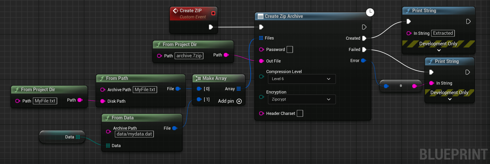

# Create a ZIP archive

This section shows how to create a ZIP archive with the plugin.

!> The same result can be obtained by using `CreateArchive` as shown [here](/createarchive).


Let's assume we want to create a *zip* archive containing the following:
- A file located at `<ProjectRoot>/text/MyFile.txt` placed at the root of the archive.
- Some data from our game placed at `data/mydata.dat` inside the archive.

```
archive.7zip/
  ├── data/
  │   └── MyData.dat -> From binary data in memory
  └── MyFile.txt     -> From a file on disk
```

The following code shows how to achieve that using the specific ZIP function.


<div class="code-switcher show-cpp-false"><div class="switcher">
<span class="sw-bp" onclick="switchBp()">Blueprints</span><span class="sw-cpp" onclick="switchCpp()">C++</span></div>
<div class="cpp">

```cpp

// Includes UCL.
#include "UCL/UCL.h"

// For FPaths::ProjectDir().
#include "Misc/Paths.h"

// ...

// Example data to include in the zip archive.
TArray<uint8> MyData = ...;

// Calls `UCL::CreateZipArchiveSync` to create the archive.
FUCLError Error = UCL::CreateZipArchiveSync(
    // What is inside the archive.
    {
        // A first entry from a file.
        {
            TEXT("MyFile.txt"),
            FPaths::ProjectDir() / TEXT("MyFile.txt"),
        },

        // A second entry from data.
        {
            TEXT("data/MyData.dat"),
            MyData
        },
    },

    // Optional password. Zip format supports passwords. Leave empty for no password.
    TEXT("MyPwd"),

    // The path where we want to save the archive.
    FPaths::ProjectDir() / TEXT("MyZip.zip"),

    // The compression level. 0 is faster but bad, 9 is slow but better.
    EUCLZipCompressionLevel::Level5,

    // The encryption type for the archive.
    EUCLZipEncryptionType::zipcrypt
);

// Checks for errors.
if (Error)
{
    // There is an error. Let's print it to the output log.
    UE_LOG(LogTemp, Error, TEXT("Failed to create archive: %s"), *Error.Message);
}
else
{
    // No error. The 7zip archive has been created and is stored as binary in ArchiveData.
}
```

</div>
<div class="bp">
<div class="bpcode">
<textarea readonly>
Begin Object Class=/Script/BlueprintGraph.K2Node_AsyncAction Name="K2Node_AsyncAction_14" ExportPath=/Script/BlueprintGraph.K2Node_AsyncAction'"/Game/DemoActor.DemoActor:EventGraph.K2Node_AsyncAction_14"'
   ProxyFactoryFunctionName="CreateZipArchive"
   ProxyFactoryClass=/Script/CoreUObject.Class'"/Script/UltimateCompressionLibrary.CreateZipArchiveProxy"'
   ProxyClass=/Script/CoreUObject.Class'"/Script/UltimateCompressionLibrary.CreateZipArchiveProxy"'
   NodePosX=864
   NodePosY=-5568
   NodeGuid=05B11EBA4CAD7FE219DC9D867F0BDFA4
   CustomProperties Pin (PinId=8B578939443C96C4CE8E2A8F184AEABD,PinName="execute",PinToolTip="\nExec",PinType.PinCategory="exec",PinType.PinSubCategory="",PinType.PinSubCategoryObject=None,PinType.PinSubCategoryMemberReference=(),PinType.PinValueType=(),PinType.ContainerType=None,PinType.bIsReference=False,PinType.bIsConst=False,PinType.bIsWeakPointer=False,PinType.bIsUObjectWrapper=False,PinType.bSerializeAsSinglePrecisionFloat=False,LinkedTo=(K2Node_CustomEvent_3 841D5C9A49596C24512296AE262BE27A,),PersistentGuid=00000000000000000000000000000000,bHidden=False,bNotConnectable=False,bDefaultValueIsReadOnly=False,bDefaultValueIsIgnored=False,bAdvancedView=False,bOrphanedPin=False,)
   CustomProperties Pin (PinId=7AD3DB9D43BB3954952F0E86D724C362,PinName="then",Direction="EGPD_Output",PinType.PinCategory="exec",PinType.PinSubCategory="",PinType.PinSubCategoryObject=None,PinType.PinSubCategoryMemberReference=(),PinType.PinValueType=(),PinType.ContainerType=None,PinType.bIsReference=False,PinType.bIsConst=False,PinType.bIsWeakPointer=False,PinType.bIsUObjectWrapper=False,PinType.bSerializeAsSinglePrecisionFloat=False,PersistentGuid=00000000000000000000000000000000,bHidden=False,bNotConnectable=False,bDefaultValueIsReadOnly=False,bDefaultValueIsIgnored=False,bAdvancedView=False,bOrphanedPin=False,)
   CustomProperties Pin (PinId=F01790704333A37B55AB44BE5616CB50,PinName="Created",PinFriendlyName="Created",Direction="EGPD_Output",PinType.PinCategory="exec",PinType.PinSubCategory="",PinType.PinSubCategoryObject=None,PinType.PinSubCategoryMemberReference=(),PinType.PinValueType=(),PinType.ContainerType=None,PinType.bIsReference=False,PinType.bIsConst=False,PinType.bIsWeakPointer=False,PinType.bIsUObjectWrapper=False,PinType.bSerializeAsSinglePrecisionFloat=False,LinkedTo=(K2Node_CallFunction_48 A56A405347AB5E4440FC969356DBA1AE,),PersistentGuid=00000000000000000000000000000000,bHidden=False,bNotConnectable=False,bDefaultValueIsReadOnly=False,bDefaultValueIsIgnored=False,bAdvancedView=False,bOrphanedPin=False,)
   CustomProperties Pin (PinId=21BB4A98430C50EF6276BA96E8CCB243,PinName="Failed",PinFriendlyName="Failed",Direction="EGPD_Output",PinType.PinCategory="exec",PinType.PinSubCategory="",PinType.PinSubCategoryObject=None,PinType.PinSubCategoryMemberReference=(),PinType.PinValueType=(),PinType.ContainerType=None,PinType.bIsReference=False,PinType.bIsConst=False,PinType.bIsWeakPointer=False,PinType.bIsUObjectWrapper=False,PinType.bSerializeAsSinglePrecisionFloat=False,LinkedTo=(K2Node_CallFunction_46 88E1C2D54E08BD42D9CA06838C26AFA7,),PersistentGuid=00000000000000000000000000000000,bHidden=False,bNotConnectable=False,bDefaultValueIsReadOnly=False,bDefaultValueIsIgnored=False,bAdvancedView=False,bOrphanedPin=False,)
   CustomProperties Pin (PinId=91D9F436424598BDA28CF1A240EE7A1C,PinName="Error",PinToolTip="Error\nUCLError Structure (by ref)",Direction="EGPD_Output",PinType.PinCategory="struct",PinType.PinSubCategory="",PinType.PinSubCategoryObject=/Script/CoreUObject.ScriptStruct'"/Script/UltimateCompressionLibrary.UCLError"',PinType.PinSubCategoryMemberReference=(),PinType.PinValueType=(),PinType.ContainerType=None,PinType.bIsReference=True,PinType.bIsConst=True,PinType.bIsWeakPointer=False,PinType.bIsUObjectWrapper=False,PinType.bSerializeAsSinglePrecisionFloat=False,LinkedTo=(K2Node_CallFunction_47 C20359E940DE74F04A6F0DBD47FEF9CE,),PersistentGuid=00000000000000000000000000000000,bHidden=False,bNotConnectable=False,bDefaultValueIsReadOnly=False,bDefaultValueIsIgnored=False,bAdvancedView=False,bOrphanedPin=False,)
   CustomProperties Pin (PinId=E3165F8845D6AF9B974DB88576E9CD7C,PinName="Files",PinToolTip="Files\nArray of UCLFile Structures\n\nThe files to include inside the archive.",PinType.PinCategory="struct",PinType.PinSubCategory="",PinType.PinSubCategoryObject=/Script/CoreUObject.ScriptStruct'"/Script/UltimateCompressionLibrary.UCLFile"',PinType.PinSubCategoryMemberReference=(),PinType.PinValueType=(),PinType.ContainerType=Array,PinType.bIsReference=False,PinType.bIsConst=False,PinType.bIsWeakPointer=False,PinType.bIsUObjectWrapper=False,PinType.bSerializeAsSinglePrecisionFloat=False,LinkedTo=(K2Node_MakeArray_6 94A95E7B4D39B08F17E82C90274DABBB,),PersistentGuid=00000000000000000000000000000000,bHidden=False,bNotConnectable=False,bDefaultValueIsReadOnly=False,bDefaultValueIsIgnored=False,bAdvancedView=False,bOrphanedPin=False,)
   CustomProperties Pin (PinId=C496D55A4FEE2A13AE63D2A1C50AF547,PinName="Password",PinToolTip="Password\nString\n\nThe optional password for the archive.",PinType.PinCategory="string",PinType.PinSubCategory="",PinType.PinSubCategoryObject=None,PinType.PinSubCategoryMemberReference=(),PinType.PinValueType=(),PinType.ContainerType=None,PinType.bIsReference=False,PinType.bIsConst=False,PinType.bIsWeakPointer=False,PinType.bIsUObjectWrapper=False,PinType.bSerializeAsSinglePrecisionFloat=False,PersistentGuid=00000000000000000000000000000000,bHidden=False,bNotConnectable=False,bDefaultValueIsReadOnly=False,bDefaultValueIsIgnored=False,bAdvancedView=False,bOrphanedPin=False,)
   CustomProperties Pin (PinId=F3364157457B60E75CC2849C1E2F57A7,PinName="OutFile",PinToolTip="Out File\nString\n\nThe path to the resulting archive.",PinType.PinCategory="string",PinType.PinSubCategory="",PinType.PinSubCategoryObject=None,PinType.PinSubCategoryMemberReference=(),PinType.PinValueType=(),PinType.ContainerType=None,PinType.bIsReference=False,PinType.bIsConst=False,PinType.bIsWeakPointer=False,PinType.bIsUObjectWrapper=False,PinType.bSerializeAsSinglePrecisionFloat=False,LinkedTo=(K2Node_CallFunction_60 31D9BC7F43E21678394639B191D5A7B8,),PersistentGuid=00000000000000000000000000000000,bHidden=False,bNotConnectable=False,bDefaultValueIsReadOnly=False,bDefaultValueIsIgnored=False,bAdvancedView=False,bOrphanedPin=False,)
   CustomProperties Pin (PinId=5DFDB46D4FC1335BCC9B888F769EA1AE,PinName="CompressionLevel",PinToolTip="Compression Level\nEUCLZipCompressionLevel Enum\n\nThe compression level of the archive.",PinType.PinCategory="byte",PinType.PinSubCategory="",PinType.PinSubCategoryObject=/Script/CoreUObject.Enum'"/Script/UltimateCompressionLibrary.EUCLZipCompressionLevel"',PinType.PinSubCategoryMemberReference=(),PinType.PinValueType=(),PinType.ContainerType=None,PinType.bIsReference=False,PinType.bIsConst=False,PinType.bIsWeakPointer=False,PinType.bIsUObjectWrapper=False,PinType.bSerializeAsSinglePrecisionFloat=False,DefaultValue="Level6",PersistentGuid=00000000000000000000000000000000,bHidden=False,bNotConnectable=False,bDefaultValueIsReadOnly=False,bDefaultValueIsIgnored=False,bAdvancedView=False,bOrphanedPin=False,)
   CustomProperties Pin (PinId=BCD62E5F46D21CE745F2EB8913980531,PinName="Encryption",PinToolTip="Encryption\nEUCLZipEncryptionType Enum\n\nThe encryption to use (requires password).",PinType.PinCategory="byte",PinType.PinSubCategory="",PinType.PinSubCategoryObject=/Script/CoreUObject.Enum'"/Script/UltimateCompressionLibrary.EUCLZipEncryptionType"',PinType.PinSubCategoryMemberReference=(),PinType.PinValueType=(),PinType.ContainerType=None,PinType.bIsReference=False,PinType.bIsConst=False,PinType.bIsWeakPointer=False,PinType.bIsUObjectWrapper=False,PinType.bSerializeAsSinglePrecisionFloat=False,DefaultValue="zipcrypt",PersistentGuid=00000000000000000000000000000000,bHidden=False,bNotConnectable=False,bDefaultValueIsReadOnly=False,bDefaultValueIsIgnored=False,bAdvancedView=False,bOrphanedPin=False,)
   CustomProperties Pin (PinId=8E138A3D4AD43AAE8C20C9A5F427A109,PinName="HeaderCharset",PinToolTip="Header Charset\nString\n\nOptional charset to use.",PinType.PinCategory="string",PinType.PinSubCategory="",PinType.PinSubCategoryObject=None,PinType.PinSubCategoryMemberReference=(),PinType.PinValueType=(),PinType.ContainerType=None,PinType.bIsReference=False,PinType.bIsConst=False,PinType.bIsWeakPointer=False,PinType.bIsUObjectWrapper=False,PinType.bSerializeAsSinglePrecisionFloat=False,PersistentGuid=00000000000000000000000000000000,bHidden=False,bNotConnectable=False,bDefaultValueIsReadOnly=False,bDefaultValueIsIgnored=False,bAdvancedView=False,bOrphanedPin=False,)
End Object
Begin Object Class=/Script/BlueprintGraph.K2Node_CustomEvent Name="K2Node_CustomEvent_3" ExportPath=/Script/BlueprintGraph.K2Node_CustomEvent'"/Game/DemoActor.DemoActor:EventGraph.K2Node_CustomEvent_3"'
   CustomFunctionName="Create ZIP"
   NodePosX=624
   NodePosY=-5584
   NodeGuid=B5C5719D4619265BF640ACB0E7E441F8
   CustomProperties Pin (PinId=FBC3FF1B4939C42C8197A2954A38190E,PinName="OutputDelegate",Direction="EGPD_Output",PinType.PinCategory="delegate",PinType.PinSubCategory="",PinType.PinSubCategoryObject=None,PinType.PinSubCategoryMemberReference=(MemberParent=/Script/Engine.BlueprintGeneratedClass'"/Game/DemoActor.DemoActor_C"',MemberName="Create ZIP",MemberGuid=B5C5719D4619265BF640ACB0E7E441F8),PinType.PinValueType=(),PinType.ContainerType=None,PinType.bIsReference=False,PinType.bIsConst=False,PinType.bIsWeakPointer=False,PinType.bIsUObjectWrapper=False,PinType.bSerializeAsSinglePrecisionFloat=False,PersistentGuid=00000000000000000000000000000000,bHidden=False,bNotConnectable=False,bDefaultValueIsReadOnly=False,bDefaultValueIsIgnored=False,bAdvancedView=False,bOrphanedPin=False,)
   CustomProperties Pin (PinId=841D5C9A49596C24512296AE262BE27A,PinName="then",Direction="EGPD_Output",PinType.PinCategory="exec",PinType.PinSubCategory="",PinType.PinSubCategoryObject=None,PinType.PinSubCategoryMemberReference=(),PinType.PinValueType=(),PinType.ContainerType=None,PinType.bIsReference=False,PinType.bIsConst=False,PinType.bIsWeakPointer=False,PinType.bIsUObjectWrapper=False,PinType.bSerializeAsSinglePrecisionFloat=False,LinkedTo=(K2Node_AsyncAction_14 8B578939443C96C4CE8E2A8F184AEABD,),PersistentGuid=00000000000000000000000000000000,bHidden=False,bNotConnectable=False,bDefaultValueIsReadOnly=False,bDefaultValueIsIgnored=False,bAdvancedView=False,bOrphanedPin=False,)
End Object
Begin Object Class=/Script/BlueprintGraph.K2Node_MakeArray Name="K2Node_MakeArray_6" ExportPath=/Script/BlueprintGraph.K2Node_MakeArray'"/Game/DemoActor.DemoActor:EventGraph.K2Node_MakeArray_6"'
   NumInputs=2
   NodePosX=688
   NodePosY=-5392
   NodeGuid=06D31C3747A63EA996C0629C4C5F0E8A
   CustomProperties Pin (PinId=94A95E7B4D39B08F17E82C90274DABBB,PinName="Array",Direction="EGPD_Output",PinType.PinCategory="struct",PinType.PinSubCategory="",PinType.PinSubCategoryObject=/Script/CoreUObject.ScriptStruct'"/Script/UltimateCompressionLibrary.UCLFile"',PinType.PinSubCategoryMemberReference=(),PinType.PinValueType=(),PinType.ContainerType=Array,PinType.bIsReference=False,PinType.bIsConst=False,PinType.bIsWeakPointer=False,PinType.bIsUObjectWrapper=False,PinType.bSerializeAsSinglePrecisionFloat=False,LinkedTo=(K2Node_AsyncAction_14 E3165F8845D6AF9B974DB88576E9CD7C,),PersistentGuid=00000000000000000000000000000000,bHidden=False,bNotConnectable=False,bDefaultValueIsReadOnly=False,bDefaultValueIsIgnored=False,bAdvancedView=False,bOrphanedPin=False,)
   CustomProperties Pin (PinId=A2FB072149DE57999B7F79A0BFC960FA,PinName="[0]",PinType.PinCategory="struct",PinType.PinSubCategory="",PinType.PinSubCategoryObject=/Script/CoreUObject.ScriptStruct'"/Script/UltimateCompressionLibrary.UCLFile"',PinType.PinSubCategoryMemberReference=(),PinType.PinValueType=(),PinType.ContainerType=None,PinType.bIsReference=False,PinType.bIsConst=False,PinType.bIsWeakPointer=False,PinType.bIsUObjectWrapper=False,PinType.bSerializeAsSinglePrecisionFloat=False,LinkedTo=(K2Node_CallFunction_44 E9120ACC41CA08FEE6CDCFAC84737CAF,),PersistentGuid=00000000000000000000000000000000,bHidden=False,bNotConnectable=False,bDefaultValueIsReadOnly=False,bDefaultValueIsIgnored=False,bAdvancedView=False,bOrphanedPin=False,)
   CustomProperties Pin (PinId=3006CF204F2EEF5A84A23882CF33F64F,PinName="[1]",PinType.PinCategory="struct",PinType.PinSubCategory="",PinType.PinSubCategoryObject=/Script/CoreUObject.ScriptStruct'"/Script/UltimateCompressionLibrary.UCLFile"',PinType.PinSubCategoryMemberReference=(),PinType.PinValueType=(),PinType.ContainerType=None,PinType.bIsReference=False,PinType.bIsConst=False,PinType.bIsWeakPointer=False,PinType.bIsUObjectWrapper=False,PinType.bSerializeAsSinglePrecisionFloat=False,LinkedTo=(K2Node_CallFunction_45 07ACB0AD45B97968A5C0AC8E296BE7CA,),PersistentGuid=00000000000000000000000000000000,bHidden=False,bNotConnectable=False,bDefaultValueIsReadOnly=False,bDefaultValueIsIgnored=False,bAdvancedView=False,bOrphanedPin=False,)
End Object
Begin Object Class=/Script/BlueprintGraph.K2Node_CallFunction Name="K2Node_CallFunction_44" ExportPath=/Script/BlueprintGraph.K2Node_CallFunction'"/Game/DemoActor.DemoActor:EventGraph.K2Node_CallFunction_44"'
   bIsPureFunc=True
   FunctionReference=(MemberParent=/Script/CoreUObject.Class'"/Script/UltimateCompressionLibrary.UCLLibrary"',MemberName="FromPath")
   NodePosX=416
   NodePosY=-5392
   NodeGuid=654924C742421D6381572E8E720CB227
   CustomProperties Pin (PinId=0FA2697B45579680BB0BF7849BCAB2F9,PinName="self",PinFriendlyName=NSLOCTEXT("K2Node", "Target", "Target"),PinToolTip="Target\nUCLLibrary Object Reference",PinType.PinCategory="object",PinType.PinSubCategory="",PinType.PinSubCategoryObject=/Script/CoreUObject.Class'"/Script/UltimateCompressionLibrary.UCLLibrary"',PinType.PinSubCategoryMemberReference=(),PinType.PinValueType=(),PinType.ContainerType=None,PinType.bIsReference=False,PinType.bIsConst=False,PinType.bIsWeakPointer=False,PinType.bIsUObjectWrapper=False,PinType.bSerializeAsSinglePrecisionFloat=False,DefaultObject="/Script/UltimateCompressionLibrary.Default__UCLLibrary",PersistentGuid=00000000000000000000000000000000,bHidden=True,bNotConnectable=False,bDefaultValueIsReadOnly=False,bDefaultValueIsIgnored=False,bAdvancedView=False,bOrphanedPin=False,)
   CustomProperties Pin (PinId=B83156184939C9FAF8ECB8ABD64913C2,PinName="ArchivePath",PinToolTip="Archive Path\nString",PinType.PinCategory="string",PinType.PinSubCategory="",PinType.PinSubCategoryObject=None,PinType.PinSubCategoryMemberReference=(),PinType.PinValueType=(),PinType.ContainerType=None,PinType.bIsReference=False,PinType.bIsConst=False,PinType.bIsWeakPointer=False,PinType.bIsUObjectWrapper=False,PinType.bSerializeAsSinglePrecisionFloat=False,DefaultValue="MyFile.txt",PersistentGuid=00000000000000000000000000000000,bHidden=False,bNotConnectable=False,bDefaultValueIsReadOnly=False,bDefaultValueIsIgnored=False,bAdvancedView=False,bOrphanedPin=False,)
   CustomProperties Pin (PinId=6D538C8B4BB043BD19E026AC41536839,PinName="DiskPath",PinToolTip="Disk Path\nString",PinType.PinCategory="string",PinType.PinSubCategory="",PinType.PinSubCategoryObject=None,PinType.PinSubCategoryMemberReference=(),PinType.PinValueType=(),PinType.ContainerType=None,PinType.bIsReference=False,PinType.bIsConst=False,PinType.bIsWeakPointer=False,PinType.bIsUObjectWrapper=False,PinType.bSerializeAsSinglePrecisionFloat=False,LinkedTo=(K2Node_CallFunction_59 211F66A040155FA877592AAB03B14C6F,),PersistentGuid=00000000000000000000000000000000,bHidden=False,bNotConnectable=False,bDefaultValueIsReadOnly=False,bDefaultValueIsIgnored=False,bAdvancedView=False,bOrphanedPin=False,)
   CustomProperties Pin (PinId=E9120ACC41CA08FEE6CDCFAC84737CAF,PinName="ReturnValue",PinFriendlyName="File",PinToolTip="File\nUCLFile Structure\n\nCreates an archive entry from a file. It only registers the path and will be loaded in memory\nwhen thewhen creating the archive.",Direction="EGPD_Output",PinType.PinCategory="struct",PinType.PinSubCategory="",PinType.PinSubCategoryObject=/Script/CoreUObject.ScriptStruct'"/Script/UltimateCompressionLibrary.UCLFile"',PinType.PinSubCategoryMemberReference=(),PinType.PinValueType=(),PinType.ContainerType=None,PinType.bIsReference=False,PinType.bIsConst=False,PinType.bIsWeakPointer=False,PinType.bIsUObjectWrapper=False,PinType.bSerializeAsSinglePrecisionFloat=False,LinkedTo=(K2Node_MakeArray_6 A2FB072149DE57999B7F79A0BFC960FA,),PersistentGuid=00000000000000000000000000000000,bHidden=False,bNotConnectable=False,bDefaultValueIsReadOnly=False,bDefaultValueIsIgnored=False,bAdvancedView=False,bOrphanedPin=False,)
End Object
Begin Object Class=/Script/BlueprintGraph.K2Node_CallFunction Name="K2Node_CallFunction_45" ExportPath=/Script/BlueprintGraph.K2Node_CallFunction'"/Game/DemoActor.DemoActor:EventGraph.K2Node_CallFunction_45"'
   bIsPureFunc=True
   FunctionReference=(MemberParent=/Script/CoreUObject.Class'"/Script/UltimateCompressionLibrary.UCLLibrary"',MemberName="FromData")
   NodePosX=432
   NodePosY=-5280
   NodeGuid=51DB253D4A2CFE708620FB83C1A0D808
   CustomProperties Pin (PinId=3C15654A4F63CE5638B7649B98C78849,PinName="self",PinFriendlyName=NSLOCTEXT("K2Node", "Target", "Target"),PinToolTip="Target\nUCLLibrary Object Reference",PinType.PinCategory="object",PinType.PinSubCategory="",PinType.PinSubCategoryObject=/Script/CoreUObject.Class'"/Script/UltimateCompressionLibrary.UCLLibrary"',PinType.PinSubCategoryMemberReference=(),PinType.PinValueType=(),PinType.ContainerType=None,PinType.bIsReference=False,PinType.bIsConst=False,PinType.bIsWeakPointer=False,PinType.bIsUObjectWrapper=False,PinType.bSerializeAsSinglePrecisionFloat=False,DefaultObject="/Script/UltimateCompressionLibrary.Default__UCLLibrary",PersistentGuid=00000000000000000000000000000000,bHidden=True,bNotConnectable=False,bDefaultValueIsReadOnly=False,bDefaultValueIsIgnored=False,bAdvancedView=False,bOrphanedPin=False,)
   CustomProperties Pin (PinId=D1AB24B540C85308EE7D689D59D99A0B,PinName="ArchivePath",PinToolTip="Archive Path\nString",PinType.PinCategory="string",PinType.PinSubCategory="",PinType.PinSubCategoryObject=None,PinType.PinSubCategoryMemberReference=(),PinType.PinValueType=(),PinType.ContainerType=None,PinType.bIsReference=False,PinType.bIsConst=False,PinType.bIsWeakPointer=False,PinType.bIsUObjectWrapper=False,PinType.bSerializeAsSinglePrecisionFloat=False,DefaultValue="data/mydata.dat",PersistentGuid=00000000000000000000000000000000,bHidden=False,bNotConnectable=False,bDefaultValueIsReadOnly=False,bDefaultValueIsIgnored=False,bAdvancedView=False,bOrphanedPin=False,)
   CustomProperties Pin (PinId=975BCC2A4BB44E9857581F8E13108134,PinName="Data",PinToolTip="Data\nArray of Bytes",PinType.PinCategory="byte",PinType.PinSubCategory="",PinType.PinSubCategoryObject=None,PinType.PinSubCategoryMemberReference=(),PinType.PinValueType=(),PinType.ContainerType=Array,PinType.bIsReference=False,PinType.bIsConst=False,PinType.bIsWeakPointer=False,PinType.bIsUObjectWrapper=False,PinType.bSerializeAsSinglePrecisionFloat=False,LinkedTo=(K2Node_VariableGet_0 1E5EA07D4E2A30FDCC56369E8EA2993A,),PersistentGuid=00000000000000000000000000000000,bHidden=False,bNotConnectable=False,bDefaultValueIsReadOnly=False,bDefaultValueIsIgnored=False,bAdvancedView=False,bOrphanedPin=False,)
   CustomProperties Pin (PinId=07ACB0AD45B97968A5C0AC8E296BE7CA,PinName="ReturnValue",PinFriendlyName="File",PinToolTip="File\nUCLFile Structure\n\nCreates an archive entry from data.",Direction="EGPD_Output",PinType.PinCategory="struct",PinType.PinSubCategory="",PinType.PinSubCategoryObject=/Script/CoreUObject.ScriptStruct'"/Script/UltimateCompressionLibrary.UCLFile"',PinType.PinSubCategoryMemberReference=(),PinType.PinValueType=(),PinType.ContainerType=None,PinType.bIsReference=False,PinType.bIsConst=False,PinType.bIsWeakPointer=False,PinType.bIsUObjectWrapper=False,PinType.bSerializeAsSinglePrecisionFloat=False,LinkedTo=(K2Node_MakeArray_6 3006CF204F2EEF5A84A23882CF33F64F,),PersistentGuid=00000000000000000000000000000000,bHidden=False,bNotConnectable=False,bDefaultValueIsReadOnly=False,bDefaultValueIsIgnored=False,bAdvancedView=False,bOrphanedPin=False,)
End Object
Begin Object Class=/Script/BlueprintGraph.K2Node_VariableGet Name="K2Node_VariableGet_0" ExportPath=/Script/BlueprintGraph.K2Node_VariableGet'"/Game/DemoActor.DemoActor:EventGraph.K2Node_VariableGet_0"'
   VariableReference=(MemberName="Data",MemberGuid=FE3C08F5403033840881B79912133B8B,bSelfContext=True)
   NodePosX=256
   NodePosY=-5232
   NodeGuid=33C9EC2A4A116E7C327068B0127DF1B5
   CustomProperties Pin (PinId=1E5EA07D4E2A30FDCC56369E8EA2993A,PinName="Data",Direction="EGPD_Output",PinType.PinCategory="byte",PinType.PinSubCategory="",PinType.PinSubCategoryObject=None,PinType.PinSubCategoryMemberReference=(),PinType.PinValueType=(),PinType.ContainerType=Array,PinType.bIsReference=False,PinType.bIsConst=False,PinType.bIsWeakPointer=False,PinType.bIsUObjectWrapper=False,PinType.bSerializeAsSinglePrecisionFloat=False,LinkedTo=(K2Node_CallFunction_45 975BCC2A4BB44E9857581F8E13108134,),PersistentGuid=00000000000000000000000000000000,bHidden=False,bNotConnectable=False,bDefaultValueIsReadOnly=False,bDefaultValueIsIgnored=False,bAdvancedView=False,bOrphanedPin=False,)
   CustomProperties Pin (PinId=EA69A4474A53B5E2C7CC798112FD9FC2,PinName="self",PinFriendlyName=NSLOCTEXT("K2Node", "Target", "Target"),PinType.PinCategory="object",PinType.PinSubCategory="",PinType.PinSubCategoryObject=/Script/Engine.BlueprintGeneratedClass'"/Game/DemoActor.DemoActor_C"',PinType.PinSubCategoryMemberReference=(),PinType.PinValueType=(),PinType.ContainerType=None,PinType.bIsReference=False,PinType.bIsConst=False,PinType.bIsWeakPointer=False,PinType.bIsUObjectWrapper=False,PinType.bSerializeAsSinglePrecisionFloat=False,PersistentGuid=00000000000000000000000000000000,bHidden=True,bNotConnectable=False,bDefaultValueIsReadOnly=False,bDefaultValueIsIgnored=False,bAdvancedView=False,bOrphanedPin=False,)
End Object
Begin Object Class=/Script/BlueprintGraph.K2Node_CallFunction Name="K2Node_CallFunction_46" ExportPath=/Script/BlueprintGraph.K2Node_CallFunction'"/Game/DemoActor.DemoActor:EventGraph.K2Node_CallFunction_46"'
   FunctionReference=(MemberParent=/Script/CoreUObject.Class'"/Script/Engine.KismetSystemLibrary"',MemberName="PrintString")
   NodePosX=1344
   NodePosY=-5440
   AdvancedPinDisplay=Hidden
   EnabledState=DevelopmentOnly
   NodeGuid=2396FE1D412291566FA67D95A8A26E0D
   CustomProperties Pin (PinId=88E1C2D54E08BD42D9CA06838C26AFA7,PinName="execute",PinType.PinCategory="exec",PinType.PinSubCategory="",PinType.PinSubCategoryObject=None,PinType.PinSubCategoryMemberReference=(),PinType.PinValueType=(),PinType.ContainerType=None,PinType.bIsReference=False,PinType.bIsConst=False,PinType.bIsWeakPointer=False,PinType.bIsUObjectWrapper=False,PinType.bSerializeAsSinglePrecisionFloat=False,LinkedTo=(K2Node_AsyncAction_14 21BB4A98430C50EF6276BA96E8CCB243,),PersistentGuid=00000000000000000000000000000000,bHidden=False,bNotConnectable=False,bDefaultValueIsReadOnly=False,bDefaultValueIsIgnored=False,bAdvancedView=False,bOrphanedPin=False,)
   CustomProperties Pin (PinId=9C7EDA8D43D78336BE36F6B9F0BF0752,PinName="then",Direction="EGPD_Output",PinType.PinCategory="exec",PinType.PinSubCategory="",PinType.PinSubCategoryObject=None,PinType.PinSubCategoryMemberReference=(),PinType.PinValueType=(),PinType.ContainerType=None,PinType.bIsReference=False,PinType.bIsConst=False,PinType.bIsWeakPointer=False,PinType.bIsUObjectWrapper=False,PinType.bSerializeAsSinglePrecisionFloat=False,PersistentGuid=00000000000000000000000000000000,bHidden=False,bNotConnectable=False,bDefaultValueIsReadOnly=False,bDefaultValueIsIgnored=False,bAdvancedView=False,bOrphanedPin=False,)
   CustomProperties Pin (PinId=7A897FD14F242301A6BE9D9C231A7AB4,PinName="self",PinFriendlyName=NSLOCTEXT("K2Node", "Target", "Target"),PinType.PinCategory="object",PinType.PinSubCategory="",PinType.PinSubCategoryObject=/Script/CoreUObject.Class'"/Script/Engine.KismetSystemLibrary"',PinType.PinSubCategoryMemberReference=(),PinType.PinValueType=(),PinType.ContainerType=None,PinType.bIsReference=False,PinType.bIsConst=False,PinType.bIsWeakPointer=False,PinType.bIsUObjectWrapper=False,PinType.bSerializeAsSinglePrecisionFloat=False,DefaultObject="/Script/Engine.Default__KismetSystemLibrary",PersistentGuid=00000000000000000000000000000000,bHidden=True,bNotConnectable=False,bDefaultValueIsReadOnly=False,bDefaultValueIsIgnored=False,bAdvancedView=False,bOrphanedPin=False,)
   CustomProperties Pin (PinId=E13BBD114A2A2C946C7DDAA218EB7EA8,PinName="WorldContextObject",PinType.PinCategory="object",PinType.PinSubCategory="",PinType.PinSubCategoryObject=/Script/CoreUObject.Class'"/Script/CoreUObject.Object"',PinType.PinSubCategoryMemberReference=(),PinType.PinValueType=(),PinType.ContainerType=None,PinType.bIsReference=False,PinType.bIsConst=True,PinType.bIsWeakPointer=False,PinType.bIsUObjectWrapper=False,PinType.bSerializeAsSinglePrecisionFloat=False,PersistentGuid=00000000000000000000000000000000,bHidden=True,bNotConnectable=False,bDefaultValueIsReadOnly=False,bDefaultValueIsIgnored=False,bAdvancedView=False,bOrphanedPin=False,)
   CustomProperties Pin (PinId=6D4D90AE4690D7FB321B5E87B3D78365,PinName="InString",PinType.PinCategory="string",PinType.PinSubCategory="",PinType.PinSubCategoryObject=None,PinType.PinSubCategoryMemberReference=(),PinType.PinValueType=(),PinType.ContainerType=None,PinType.bIsReference=False,PinType.bIsConst=False,PinType.bIsWeakPointer=False,PinType.bIsUObjectWrapper=False,PinType.bSerializeAsSinglePrecisionFloat=False,DefaultValue="Hello",AutogeneratedDefaultValue="Hello",LinkedTo=(K2Node_CallFunction_47 89A365AC4EE1BC73D22E6380B489B4FC,),PersistentGuid=00000000000000000000000000000000,bHidden=False,bNotConnectable=False,bDefaultValueIsReadOnly=False,bDefaultValueIsIgnored=False,bAdvancedView=False,bOrphanedPin=False,)
   CustomProperties Pin (PinId=162316B24758D1DDFEF3E08CB38887A6,PinName="bPrintToScreen",PinType.PinCategory="bool",PinType.PinSubCategory="",PinType.PinSubCategoryObject=None,PinType.PinSubCategoryMemberReference=(),PinType.PinValueType=(),PinType.ContainerType=None,PinType.bIsReference=False,PinType.bIsConst=False,PinType.bIsWeakPointer=False,PinType.bIsUObjectWrapper=False,PinType.bSerializeAsSinglePrecisionFloat=False,DefaultValue="true",AutogeneratedDefaultValue="true",PersistentGuid=00000000000000000000000000000000,bHidden=False,bNotConnectable=False,bDefaultValueIsReadOnly=False,bDefaultValueIsIgnored=False,bAdvancedView=True,bOrphanedPin=False,)
   CustomProperties Pin (PinId=73AB0CBF486DA1C40BF6F4B41C79B3FE,PinName="bPrintToLog",PinType.PinCategory="bool",PinType.PinSubCategory="",PinType.PinSubCategoryObject=None,PinType.PinSubCategoryMemberReference=(),PinType.PinValueType=(),PinType.ContainerType=None,PinType.bIsReference=False,PinType.bIsConst=False,PinType.bIsWeakPointer=False,PinType.bIsUObjectWrapper=False,PinType.bSerializeAsSinglePrecisionFloat=False,DefaultValue="true",AutogeneratedDefaultValue="true",PersistentGuid=00000000000000000000000000000000,bHidden=False,bNotConnectable=False,bDefaultValueIsReadOnly=False,bDefaultValueIsIgnored=False,bAdvancedView=True,bOrphanedPin=False,)
   CustomProperties Pin (PinId=F7B705E5497EA55FC5F888946CD1A9A5,PinName="TextColor",PinType.PinCategory="struct",PinType.PinSubCategory="",PinType.PinSubCategoryObject=/Script/CoreUObject.ScriptStruct'"/Script/CoreUObject.LinearColor"',PinType.PinSubCategoryMemberReference=(),PinType.PinValueType=(),PinType.ContainerType=None,PinType.bIsReference=False,PinType.bIsConst=False,PinType.bIsWeakPointer=False,PinType.bIsUObjectWrapper=False,PinType.bSerializeAsSinglePrecisionFloat=False,DefaultValue="(R=0.000000,G=0.660000,B=1.000000,A=1.000000)",AutogeneratedDefaultValue="(R=0.000000,G=0.660000,B=1.000000,A=1.000000)",PersistentGuid=00000000000000000000000000000000,bHidden=False,bNotConnectable=False,bDefaultValueIsReadOnly=False,bDefaultValueIsIgnored=False,bAdvancedView=True,bOrphanedPin=False,)
   CustomProperties Pin (PinId=7B7D0585460AE4E36C4A5295F41A5B18,PinName="Duration",PinType.PinCategory="real",PinType.PinSubCategory="float",PinType.PinSubCategoryObject=None,PinType.PinSubCategoryMemberReference=(),PinType.PinValueType=(),PinType.ContainerType=None,PinType.bIsReference=False,PinType.bIsConst=False,PinType.bIsWeakPointer=False,PinType.bIsUObjectWrapper=False,PinType.bSerializeAsSinglePrecisionFloat=False,DefaultValue="2.000000",AutogeneratedDefaultValue="2.000000",PersistentGuid=00000000000000000000000000000000,bHidden=False,bNotConnectable=False,bDefaultValueIsReadOnly=False,bDefaultValueIsIgnored=False,bAdvancedView=True,bOrphanedPin=False,)
   CustomProperties Pin (PinId=FD3D89604448F081FBE47ABF7782BD85,PinName="Key",PinType.PinCategory="name",PinType.PinSubCategory="",PinType.PinSubCategoryObject=None,PinType.PinSubCategoryMemberReference=(),PinType.PinValueType=(),PinType.ContainerType=None,PinType.bIsReference=False,PinType.bIsConst=True,PinType.bIsWeakPointer=False,PinType.bIsUObjectWrapper=False,PinType.bSerializeAsSinglePrecisionFloat=False,DefaultValue="None",AutogeneratedDefaultValue="None",PersistentGuid=00000000000000000000000000000000,bHidden=False,bNotConnectable=False,bDefaultValueIsReadOnly=False,bDefaultValueIsIgnored=False,bAdvancedView=True,bOrphanedPin=False,)
End Object
Begin Object Class=/Script/BlueprintGraph.K2Node_CallFunction Name="K2Node_CallFunction_47" ExportPath=/Script/BlueprintGraph.K2Node_CallFunction'"/Game/DemoActor.DemoActor:EventGraph.K2Node_CallFunction_47"'
   bIsPureFunc=True
   FunctionReference=(MemberParent=/Script/CoreUObject.Class'"/Script/UltimateCompressionLibrary.UCLLibrary"',MemberName="ToString")
   NodePosX=1216
   NodePosY=-5376
   NodeGuid=E220D6E44E1B2E1CFCFC14BA709D0132
   CustomProperties Pin (PinId=F0AABBB6466B6045797B448159381197,PinName="self",PinFriendlyName=NSLOCTEXT("K2Node", "Target", "Target"),PinType.PinCategory="object",PinType.PinSubCategory="",PinType.PinSubCategoryObject=/Script/CoreUObject.Class'"/Script/UltimateCompressionLibrary.UCLLibrary"',PinType.PinSubCategoryMemberReference=(),PinType.PinValueType=(),PinType.ContainerType=None,PinType.bIsReference=False,PinType.bIsConst=False,PinType.bIsWeakPointer=False,PinType.bIsUObjectWrapper=False,PinType.bSerializeAsSinglePrecisionFloat=False,DefaultObject="/Script/UltimateCompressionLibrary.Default__UCLLibrary",PersistentGuid=00000000000000000000000000000000,bHidden=True,bNotConnectable=False,bDefaultValueIsReadOnly=False,bDefaultValueIsIgnored=False,bAdvancedView=False,bOrphanedPin=False,)
   CustomProperties Pin (PinId=C20359E940DE74F04A6F0DBD47FEF9CE,PinName="Error",PinType.PinCategory="struct",PinType.PinSubCategory="",PinType.PinSubCategoryObject=/Script/CoreUObject.ScriptStruct'"/Script/UltimateCompressionLibrary.UCLError"',PinType.PinSubCategoryMemberReference=(),PinType.PinValueType=(),PinType.ContainerType=None,PinType.bIsReference=False,PinType.bIsConst=False,PinType.bIsWeakPointer=False,PinType.bIsUObjectWrapper=False,PinType.bSerializeAsSinglePrecisionFloat=False,LinkedTo=(K2Node_AsyncAction_14 91D9F436424598BDA28CF1A240EE7A1C,),PersistentGuid=00000000000000000000000000000000,bHidden=False,bNotConnectable=False,bDefaultValueIsReadOnly=False,bDefaultValueIsIgnored=False,bAdvancedView=False,bOrphanedPin=False,)
   CustomProperties Pin (PinId=89A365AC4EE1BC73D22E6380B489B4FC,PinName="ReturnValue",Direction="EGPD_Output",PinType.PinCategory="string",PinType.PinSubCategory="",PinType.PinSubCategoryObject=None,PinType.PinSubCategoryMemberReference=(),PinType.PinValueType=(),PinType.ContainerType=None,PinType.bIsReference=False,PinType.bIsConst=False,PinType.bIsWeakPointer=False,PinType.bIsUObjectWrapper=False,PinType.bSerializeAsSinglePrecisionFloat=False,LinkedTo=(K2Node_CallFunction_46 6D4D90AE4690D7FB321B5E87B3D78365,),PersistentGuid=00000000000000000000000000000000,bHidden=False,bNotConnectable=False,bDefaultValueIsReadOnly=False,bDefaultValueIsIgnored=False,bAdvancedView=False,bOrphanedPin=False,)
End Object
Begin Object Class=/Script/BlueprintGraph.K2Node_CallFunction Name="K2Node_CallFunction_48" ExportPath=/Script/BlueprintGraph.K2Node_CallFunction'"/Game/DemoActor.DemoActor:EventGraph.K2Node_CallFunction_48"'
   FunctionReference=(MemberParent=/Script/CoreUObject.Class'"/Script/Engine.KismetSystemLibrary"',MemberName="PrintString")
   NodePosX=1280
   NodePosY=-5584
   AdvancedPinDisplay=Hidden
   EnabledState=DevelopmentOnly
   NodeGuid=6DB7ED0B4AA7D60C38D13B81C7742A01
   CustomProperties Pin (PinId=A56A405347AB5E4440FC969356DBA1AE,PinName="execute",PinType.PinCategory="exec",PinType.PinSubCategory="",PinType.PinSubCategoryObject=None,PinType.PinSubCategoryMemberReference=(),PinType.PinValueType=(),PinType.ContainerType=None,PinType.bIsReference=False,PinType.bIsConst=False,PinType.bIsWeakPointer=False,PinType.bIsUObjectWrapper=False,PinType.bSerializeAsSinglePrecisionFloat=False,LinkedTo=(K2Node_AsyncAction_14 F01790704333A37B55AB44BE5616CB50,),PersistentGuid=00000000000000000000000000000000,bHidden=False,bNotConnectable=False,bDefaultValueIsReadOnly=False,bDefaultValueIsIgnored=False,bAdvancedView=False,bOrphanedPin=False,)
   CustomProperties Pin (PinId=62ED52EE4C5BDC7B4F28B78A0FBEE624,PinName="then",Direction="EGPD_Output",PinType.PinCategory="exec",PinType.PinSubCategory="",PinType.PinSubCategoryObject=None,PinType.PinSubCategoryMemberReference=(),PinType.PinValueType=(),PinType.ContainerType=None,PinType.bIsReference=False,PinType.bIsConst=False,PinType.bIsWeakPointer=False,PinType.bIsUObjectWrapper=False,PinType.bSerializeAsSinglePrecisionFloat=False,PersistentGuid=00000000000000000000000000000000,bHidden=False,bNotConnectable=False,bDefaultValueIsReadOnly=False,bDefaultValueIsIgnored=False,bAdvancedView=False,bOrphanedPin=False,)
   CustomProperties Pin (PinId=E1EC49E14CF623A0E571D6A93585CFBA,PinName="self",PinFriendlyName=NSLOCTEXT("K2Node", "Target", "Target"),PinType.PinCategory="object",PinType.PinSubCategory="",PinType.PinSubCategoryObject=/Script/CoreUObject.Class'"/Script/Engine.KismetSystemLibrary"',PinType.PinSubCategoryMemberReference=(),PinType.PinValueType=(),PinType.ContainerType=None,PinType.bIsReference=False,PinType.bIsConst=False,PinType.bIsWeakPointer=False,PinType.bIsUObjectWrapper=False,PinType.bSerializeAsSinglePrecisionFloat=False,DefaultObject="/Script/Engine.Default__KismetSystemLibrary",PersistentGuid=00000000000000000000000000000000,bHidden=True,bNotConnectable=False,bDefaultValueIsReadOnly=False,bDefaultValueIsIgnored=False,bAdvancedView=False,bOrphanedPin=False,)
   CustomProperties Pin (PinId=77BA114A4AE420327D9A839DB0D379A6,PinName="WorldContextObject",PinType.PinCategory="object",PinType.PinSubCategory="",PinType.PinSubCategoryObject=/Script/CoreUObject.Class'"/Script/CoreUObject.Object"',PinType.PinSubCategoryMemberReference=(),PinType.PinValueType=(),PinType.ContainerType=None,PinType.bIsReference=False,PinType.bIsConst=True,PinType.bIsWeakPointer=False,PinType.bIsUObjectWrapper=False,PinType.bSerializeAsSinglePrecisionFloat=False,PersistentGuid=00000000000000000000000000000000,bHidden=True,bNotConnectable=False,bDefaultValueIsReadOnly=False,bDefaultValueIsIgnored=False,bAdvancedView=False,bOrphanedPin=False,)
   CustomProperties Pin (PinId=B9ADD1494FD176F7B6BAAF842E832533,PinName="InString",PinType.PinCategory="string",PinType.PinSubCategory="",PinType.PinSubCategoryObject=None,PinType.PinSubCategoryMemberReference=(),PinType.PinValueType=(),PinType.ContainerType=None,PinType.bIsReference=False,PinType.bIsConst=False,PinType.bIsWeakPointer=False,PinType.bIsUObjectWrapper=False,PinType.bSerializeAsSinglePrecisionFloat=False,DefaultValue="Extracted",AutogeneratedDefaultValue="Hello",PersistentGuid=00000000000000000000000000000000,bHidden=False,bNotConnectable=False,bDefaultValueIsReadOnly=False,bDefaultValueIsIgnored=False,bAdvancedView=False,bOrphanedPin=False,)
   CustomProperties Pin (PinId=05867B55462A8EEF3166F4B9EBA244E8,PinName="bPrintToScreen",PinType.PinCategory="bool",PinType.PinSubCategory="",PinType.PinSubCategoryObject=None,PinType.PinSubCategoryMemberReference=(),PinType.PinValueType=(),PinType.ContainerType=None,PinType.bIsReference=False,PinType.bIsConst=False,PinType.bIsWeakPointer=False,PinType.bIsUObjectWrapper=False,PinType.bSerializeAsSinglePrecisionFloat=False,DefaultValue="true",AutogeneratedDefaultValue="true",PersistentGuid=00000000000000000000000000000000,bHidden=False,bNotConnectable=False,bDefaultValueIsReadOnly=False,bDefaultValueIsIgnored=False,bAdvancedView=True,bOrphanedPin=False,)
   CustomProperties Pin (PinId=A6B1B64A429CC689A258A2B61804E97A,PinName="bPrintToLog",PinType.PinCategory="bool",PinType.PinSubCategory="",PinType.PinSubCategoryObject=None,PinType.PinSubCategoryMemberReference=(),PinType.PinValueType=(),PinType.ContainerType=None,PinType.bIsReference=False,PinType.bIsConst=False,PinType.bIsWeakPointer=False,PinType.bIsUObjectWrapper=False,PinType.bSerializeAsSinglePrecisionFloat=False,DefaultValue="true",AutogeneratedDefaultValue="true",PersistentGuid=00000000000000000000000000000000,bHidden=False,bNotConnectable=False,bDefaultValueIsReadOnly=False,bDefaultValueIsIgnored=False,bAdvancedView=True,bOrphanedPin=False,)
   CustomProperties Pin (PinId=DD6C8FE64555317DCEDDD0AFD30F2666,PinName="TextColor",PinType.PinCategory="struct",PinType.PinSubCategory="",PinType.PinSubCategoryObject=/Script/CoreUObject.ScriptStruct'"/Script/CoreUObject.LinearColor"',PinType.PinSubCategoryMemberReference=(),PinType.PinValueType=(),PinType.ContainerType=None,PinType.bIsReference=False,PinType.bIsConst=False,PinType.bIsWeakPointer=False,PinType.bIsUObjectWrapper=False,PinType.bSerializeAsSinglePrecisionFloat=False,DefaultValue="(R=0.000000,G=0.660000,B=1.000000,A=1.000000)",AutogeneratedDefaultValue="(R=0.000000,G=0.660000,B=1.000000,A=1.000000)",PersistentGuid=00000000000000000000000000000000,bHidden=False,bNotConnectable=False,bDefaultValueIsReadOnly=False,bDefaultValueIsIgnored=False,bAdvancedView=True,bOrphanedPin=False,)
   CustomProperties Pin (PinId=0D3D256A4C379C14341E5F99ED779D38,PinName="Duration",PinType.PinCategory="real",PinType.PinSubCategory="float",PinType.PinSubCategoryObject=None,PinType.PinSubCategoryMemberReference=(),PinType.PinValueType=(),PinType.ContainerType=None,PinType.bIsReference=False,PinType.bIsConst=False,PinType.bIsWeakPointer=False,PinType.bIsUObjectWrapper=False,PinType.bSerializeAsSinglePrecisionFloat=False,DefaultValue="2.000000",AutogeneratedDefaultValue="2.000000",PersistentGuid=00000000000000000000000000000000,bHidden=False,bNotConnectable=False,bDefaultValueIsReadOnly=False,bDefaultValueIsIgnored=False,bAdvancedView=True,bOrphanedPin=False,)
   CustomProperties Pin (PinId=B3F9632B46CFE796BAA056BC713A09DA,PinName="Key",PinType.PinCategory="name",PinType.PinSubCategory="",PinType.PinSubCategoryObject=None,PinType.PinSubCategoryMemberReference=(),PinType.PinValueType=(),PinType.ContainerType=None,PinType.bIsReference=False,PinType.bIsConst=True,PinType.bIsWeakPointer=False,PinType.bIsUObjectWrapper=False,PinType.bSerializeAsSinglePrecisionFloat=False,DefaultValue="None",AutogeneratedDefaultValue="None",PersistentGuid=00000000000000000000000000000000,bHidden=False,bNotConnectable=False,bDefaultValueIsReadOnly=False,bDefaultValueIsIgnored=False,bAdvancedView=True,bOrphanedPin=False,)
End Object
Begin Object Class=/Script/BlueprintGraph.K2Node_CallFunction Name="K2Node_CallFunction_59" ExportPath=/Script/BlueprintGraph.K2Node_CallFunction'"/Game/DemoActor.DemoActor:EventGraph.K2Node_CallFunction_59"'
   bIsPureFunc=True
   FunctionReference=(MemberParent=/Script/CoreUObject.Class'"/Script/UltimateCompressionLibrary.UCLLibrary"',MemberName="FromProjectDir")
   NodePosX=176
   NodePosY=-5360
   NodeGuid=08CE4AE8444080A24D1F56BF9C5EEBD0
   CustomProperties Pin (PinId=DDE5667943E988B47C94ACA3A93CFD3A,PinName="self",PinFriendlyName=NSLOCTEXT("K2Node", "Target", "Target"),PinToolTip="Target\nUCLLibrary Object Reference",PinType.PinCategory="object",PinType.PinSubCategory="",PinType.PinSubCategoryObject=/Script/CoreUObject.Class'"/Script/UltimateCompressionLibrary.UCLLibrary"',PinType.PinSubCategoryMemberReference=(),PinType.PinValueType=(),PinType.ContainerType=None,PinType.bIsReference=False,PinType.bIsConst=False,PinType.bIsWeakPointer=False,PinType.bIsUObjectWrapper=False,PinType.bSerializeAsSinglePrecisionFloat=False,DefaultObject="/Script/UltimateCompressionLibrary.Default__UCLLibrary",PersistentGuid=00000000000000000000000000000000,bHidden=True,bNotConnectable=False,bDefaultValueIsReadOnly=False,bDefaultValueIsIgnored=False,bAdvancedView=False,bOrphanedPin=False,)
   CustomProperties Pin (PinId=44BE73384B14B4E85CBF868F48A3F65E,PinName="Path",PinToolTip="Path\nString",PinType.PinCategory="string",PinType.PinSubCategory="",PinType.PinSubCategoryObject=None,PinType.PinSubCategoryMemberReference=(),PinType.PinValueType=(),PinType.ContainerType=None,PinType.bIsReference=False,PinType.bIsConst=False,PinType.bIsWeakPointer=False,PinType.bIsUObjectWrapper=False,PinType.bSerializeAsSinglePrecisionFloat=False,DefaultValue="MyFile.txt",PersistentGuid=00000000000000000000000000000000,bHidden=False,bNotConnectable=False,bDefaultValueIsReadOnly=False,bDefaultValueIsIgnored=False,bAdvancedView=False,bOrphanedPin=False,)
   CustomProperties Pin (PinId=211F66A040155FA877592AAB03B14C6F,PinName="ReturnValue",PinFriendlyName="Path",PinToolTip="Path\nString\n\nCreates a path starting at the project directory root.",Direction="EGPD_Output",PinType.PinCategory="string",PinType.PinSubCategory="",PinType.PinSubCategoryObject=None,PinType.PinSubCategoryMemberReference=(),PinType.PinValueType=(),PinType.ContainerType=None,PinType.bIsReference=False,PinType.bIsConst=False,PinType.bIsWeakPointer=False,PinType.bIsUObjectWrapper=False,PinType.bSerializeAsSinglePrecisionFloat=False,LinkedTo=(K2Node_CallFunction_44 6D538C8B4BB043BD19E026AC41536839,),PersistentGuid=00000000000000000000000000000000,bHidden=False,bNotConnectable=False,bDefaultValueIsReadOnly=False,bDefaultValueIsIgnored=False,bAdvancedView=False,bOrphanedPin=False,)
End Object
Begin Object Class=/Script/BlueprintGraph.K2Node_CallFunction Name="K2Node_CallFunction_60" ExportPath=/Script/BlueprintGraph.K2Node_CallFunction'"/Game/DemoActor.DemoActor:EventGraph.K2Node_CallFunction_60"'
   bIsPureFunc=True
   FunctionReference=(MemberParent=/Script/CoreUObject.Class'"/Script/UltimateCompressionLibrary.UCLLibrary"',MemberName="FromProjectDir")
   NodePosX=576
   NodePosY=-5488
   NodeGuid=989F776642A0B24C59B124A0ECF1E015
   CustomProperties Pin (PinId=4B9B156E4448665735091B8F8E40E04B,PinName="self",PinFriendlyName=NSLOCTEXT("K2Node", "Target", "Target"),PinToolTip="Target\nUCLLibrary Object Reference",PinType.PinCategory="object",PinType.PinSubCategory="",PinType.PinSubCategoryObject=/Script/CoreUObject.Class'"/Script/UltimateCompressionLibrary.UCLLibrary"',PinType.PinSubCategoryMemberReference=(),PinType.PinValueType=(),PinType.ContainerType=None,PinType.bIsReference=False,PinType.bIsConst=False,PinType.bIsWeakPointer=False,PinType.bIsUObjectWrapper=False,PinType.bSerializeAsSinglePrecisionFloat=False,DefaultObject="/Script/UltimateCompressionLibrary.Default__UCLLibrary",PersistentGuid=00000000000000000000000000000000,bHidden=True,bNotConnectable=False,bDefaultValueIsReadOnly=False,bDefaultValueIsIgnored=False,bAdvancedView=False,bOrphanedPin=False,)
   CustomProperties Pin (PinId=D6788A5B455CBAE2CF0DB19EA2D95353,PinName="Path",PinToolTip="Path\nString",PinType.PinCategory="string",PinType.PinSubCategory="",PinType.PinSubCategoryObject=None,PinType.PinSubCategoryMemberReference=(),PinType.PinValueType=(),PinType.ContainerType=None,PinType.bIsReference=False,PinType.bIsConst=False,PinType.bIsWeakPointer=False,PinType.bIsUObjectWrapper=False,PinType.bSerializeAsSinglePrecisionFloat=False,DefaultValue="archive.7zip",PersistentGuid=00000000000000000000000000000000,bHidden=False,bNotConnectable=False,bDefaultValueIsReadOnly=False,bDefaultValueIsIgnored=False,bAdvancedView=False,bOrphanedPin=False,)
   CustomProperties Pin (PinId=31D9BC7F43E21678394639B191D5A7B8,PinName="ReturnValue",PinFriendlyName="Path",PinToolTip="Path\nString\n\nCreates a path starting at the project directory root.",Direction="EGPD_Output",PinType.PinCategory="string",PinType.PinSubCategory="",PinType.PinSubCategoryObject=None,PinType.PinSubCategoryMemberReference=(),PinType.PinValueType=(),PinType.ContainerType=None,PinType.bIsReference=False,PinType.bIsConst=False,PinType.bIsWeakPointer=False,PinType.bIsUObjectWrapper=False,PinType.bSerializeAsSinglePrecisionFloat=False,LinkedTo=(K2Node_AsyncAction_14 F3364157457B60E75CC2849C1E2F57A7,),PersistentGuid=00000000000000000000000000000000,bHidden=False,bNotConnectable=False,bDefaultValueIsReadOnly=False,bDefaultValueIsIgnored=False,bAdvancedView=False,bOrphanedPin=False,)
End Object
</textarea>

<button onclick="copyBlueprintCode(this)">Copy Code</button>
</div>
</div>
</div>


<script>
setTimeout(() => {
	bShowCPP = !JSON.parse(getCookie('bShowCPP'));
	switchCode();
}, 0);
</script>
