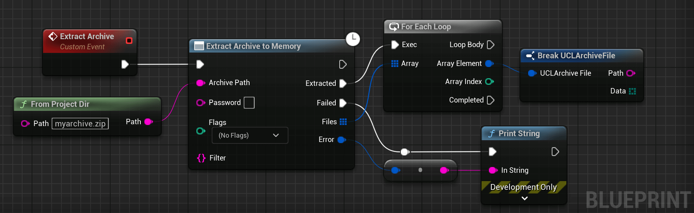
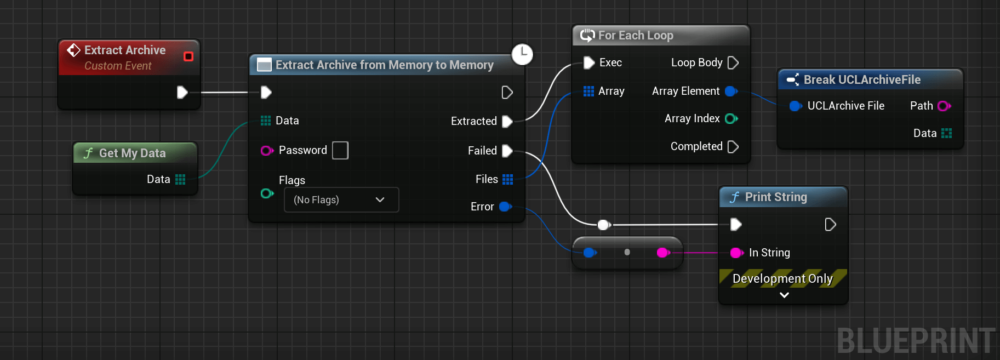
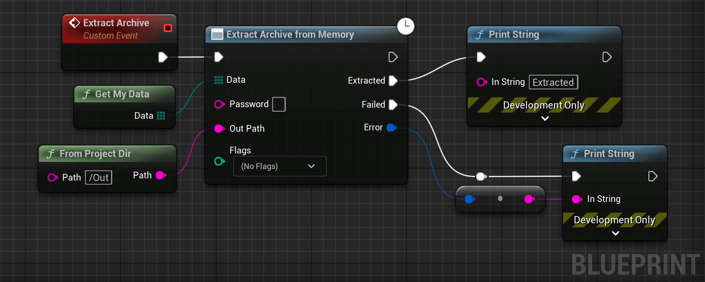

# Extract an archive

This section covers how to extract archives.

> UCL automatically detects the type of the archive and extracts it accordingly. You can use it to extract *7zip*, *zip*, *tar*, etc.

## From a File to a File

The plugin comes with a **universal decrompressor** that automatically detects the type of archive and decompresses it accordingly. It offers a single interface that allows to decompress any supported format.

To decompress an archive, call `UCL::ExtractArchive` as shown below.


<div class="code-switcher show-cpp-false"><div class="switcher">
<span class="sw-bp" onclick="switchBp()">Blueprints</span><span class="sw-cpp" onclick="switchCpp()">C++</span></div>
<div class="cpp">

#### Synchronously

```cpp
// Extracts the archive.
FUCLError Error = UCL::ExtractArchiveSync(
    // The path to the archive we want to extract.
    FPaths::ProjectDir() / TEXT("MyArchive.tar"),

    // The password of the archive.
    TEXT("Password"),

    // Where we want to extract it.
    FPaths::ProjectDir() / TEXT("Out/")
);

// Checks for errors.
if (Error)
{
    // There is an error. Let's print it to the output log.
    UE_LOG(LogTemp, Error, TEXT("Failed to extract archive: %s"), *Error.Message);
}
else
{
    // No error. The archive was extracted.
}
```

#### Asynchronously

```cpp
// Extracts the archive.
UCL::ExtractArchive(
    // The path to the archive we want to extract.
    FPaths::ProjectDir() / TEXT("MyArchive.tar"),

    // The password of the archive.
    TEXT("Password"),

    // Where we want to extract it.
    FPaths::ProjectDir() / TEXT("Out/"),

    //Flags to extract the archive.
    EUCLArchiveFlag::None,

    // Callback called on the game thread when the archive was extracted.
    FUCLExtractArchiveCallback::CreateLambda([](FUCLError Error) -> void
    {
        // Checks for errors.
        if (Error)
        {
            // There is an error. Let's print it to the output log.
            UE_LOG(LogTemp, Error, TEXT("Failed to extract archive: %s"), *Error.Message);
        }
        else
        {
            // No error. The archive was extracted.
        }
    })
);
```

</div>
<div class="bp">
<div class="bpcode">
<textarea readonly>
Begin Object Class=/Script/BlueprintGraph.K2Node_CustomEvent Name="K2Node_CustomEvent_6" ExportPath=/Script/BlueprintGraph.K2Node_CustomEvent'"/Game/DemoActor.DemoActor:EventGraph.K2Node_CustomEvent_6"'
   CustomFunctionName="Extract Archive"
   NodePosX=320
   NodePosY=-6016
   ErrorType=1
   NodeGuid=67F8599B4D350F1CDBDFD38BEEBDD5B7
   CustomProperties Pin (PinId=B3BD259E476CE6E5FCF6D9AB6E320665,PinName="OutputDelegate",Direction="EGPD_Output",PinType.PinCategory="delegate",PinType.PinSubCategory="",PinType.PinSubCategoryObject=None,PinType.PinSubCategoryMemberReference=(MemberParent=/Script/Engine.BlueprintGeneratedClass'"/Game/DemoActor.DemoActor_C"',MemberName="Extract Archive",MemberGuid=67F8599B4D350F1CDBDFD38BEEBDD5B7),PinType.PinValueType=(),PinType.ContainerType=None,PinType.bIsReference=False,PinType.bIsConst=False,PinType.bIsWeakPointer=False,PinType.bIsUObjectWrapper=False,PinType.bSerializeAsSinglePrecisionFloat=False,PersistentGuid=00000000000000000000000000000000,bHidden=False,bNotConnectable=False,bDefaultValueIsReadOnly=False,bDefaultValueIsIgnored=False,bAdvancedView=False,bOrphanedPin=False,)
   CustomProperties Pin (PinId=3DBFA033449B4CAC76BE1EB54B081945,PinName="then",Direction="EGPD_Output",PinType.PinCategory="exec",PinType.PinSubCategory="",PinType.PinSubCategoryObject=None,PinType.PinSubCategoryMemberReference=(),PinType.PinValueType=(),PinType.ContainerType=None,PinType.bIsReference=False,PinType.bIsConst=False,PinType.bIsWeakPointer=False,PinType.bIsUObjectWrapper=False,PinType.bSerializeAsSinglePrecisionFloat=False,LinkedTo=(K2Node_AsyncAction_16 CC4E4D1A45634DD0ADD8799842A9301C,),PersistentGuid=00000000000000000000000000000000,bHidden=False,bNotConnectable=False,bDefaultValueIsReadOnly=False,bDefaultValueIsIgnored=False,bAdvancedView=False,bOrphanedPin=False,)
End Object
Begin Object Class=/Script/BlueprintGraph.K2Node_AsyncAction Name="K2Node_AsyncAction_16" ExportPath=/Script/BlueprintGraph.K2Node_AsyncAction'"/Game/DemoActor.DemoActor:EventGraph.K2Node_AsyncAction_16"'
   ProxyFactoryFunctionName="ExtractArchive"
   ProxyFactoryClass=/Script/CoreUObject.Class'"/Script/UltimateCompressionLibrary.ExtractArchiveProxy"'
   ProxyClass=/Script/CoreUObject.Class'"/Script/UltimateCompressionLibrary.ExtractArchiveProxy"'
   NodePosX=544
   NodePosY=-6000
   NodeGuid=EEDF552F4C8855BDDD7A9CB0CCDF33C4
   CustomProperties Pin (PinId=CC4E4D1A45634DD0ADD8799842A9301C,PinName="execute",PinToolTip="\nExec",PinType.PinCategory="exec",PinType.PinSubCategory="",PinType.PinSubCategoryObject=None,PinType.PinSubCategoryMemberReference=(),PinType.PinValueType=(),PinType.ContainerType=None,PinType.bIsReference=False,PinType.bIsConst=False,PinType.bIsWeakPointer=False,PinType.bIsUObjectWrapper=False,PinType.bSerializeAsSinglePrecisionFloat=False,LinkedTo=(K2Node_CustomEvent_6 3DBFA033449B4CAC76BE1EB54B081945,),PersistentGuid=00000000000000000000000000000000,bHidden=False,bNotConnectable=False,bDefaultValueIsReadOnly=False,bDefaultValueIsIgnored=False,bAdvancedView=False,bOrphanedPin=False,)
   CustomProperties Pin (PinId=F7B42A314EA41E6E79BD3CBA3F358654,PinName="then",Direction="EGPD_Output",PinType.PinCategory="exec",PinType.PinSubCategory="",PinType.PinSubCategoryObject=None,PinType.PinSubCategoryMemberReference=(),PinType.PinValueType=(),PinType.ContainerType=None,PinType.bIsReference=False,PinType.bIsConst=False,PinType.bIsWeakPointer=False,PinType.bIsUObjectWrapper=False,PinType.bSerializeAsSinglePrecisionFloat=False,PersistentGuid=00000000000000000000000000000000,bHidden=False,bNotConnectable=False,bDefaultValueIsReadOnly=False,bDefaultValueIsIgnored=False,bAdvancedView=False,bOrphanedPin=False,)
   CustomProperties Pin (PinId=699C18A2457C6AF996445BBFCCDB64FF,PinName="Extracted",PinFriendlyName=NSLOCTEXT("", "1D8905DF499D282287D4D5BB4D2AE001", "Extracted"),PinToolTip="Archive extracted.",Direction="EGPD_Output",PinType.PinCategory="exec",PinType.PinSubCategory="",PinType.PinSubCategoryObject=None,PinType.PinSubCategoryMemberReference=(),PinType.PinValueType=(),PinType.ContainerType=None,PinType.bIsReference=False,PinType.bIsConst=False,PinType.bIsWeakPointer=False,PinType.bIsUObjectWrapper=False,PinType.bSerializeAsSinglePrecisionFloat=False,LinkedTo=(K2Node_CallFunction_80 83CA06ED4DBCD1EFFEDFBD9D106F1E29,),PersistentGuid=00000000000000000000000000000000,bHidden=False,bNotConnectable=False,bDefaultValueIsReadOnly=False,bDefaultValueIsIgnored=False,bAdvancedView=False,bOrphanedPin=False,)
   CustomProperties Pin (PinId=C087AB1A45CBBF6D942A5C91E2E34981,PinName="Failed",PinFriendlyName=NSLOCTEXT("", "9644E81947EB7315EC595699C9477EDD", "Failed"),PinToolTip="Failed to extract the archive.\nCheck the output log for more information.",Direction="EGPD_Output",PinType.PinCategory="exec",PinType.PinSubCategory="",PinType.PinSubCategoryObject=None,PinType.PinSubCategoryMemberReference=(),PinType.PinValueType=(),PinType.ContainerType=None,PinType.bIsReference=False,PinType.bIsConst=False,PinType.bIsWeakPointer=False,PinType.bIsUObjectWrapper=False,PinType.bSerializeAsSinglePrecisionFloat=False,LinkedTo=(K2Node_CallFunction_79 83CA06ED4DBCD1EFFEDFBD9D106F1E29,),PersistentGuid=00000000000000000000000000000000,bHidden=False,bNotConnectable=False,bDefaultValueIsReadOnly=False,bDefaultValueIsIgnored=False,bAdvancedView=False,bOrphanedPin=False,)
   CustomProperties Pin (PinId=71968BD94F0ACEE12DB510B1CDE61AAA,PinName="Error",PinToolTip="Error\nUCLError Structure (by ref)",Direction="EGPD_Output",PinType.PinCategory="struct",PinType.PinSubCategory="",PinType.PinSubCategoryObject=/Script/CoreUObject.ScriptStruct'"/Script/UltimateCompressionLibrary.UCLError"',PinType.PinSubCategoryMemberReference=(),PinType.PinValueType=(),PinType.ContainerType=None,PinType.bIsReference=True,PinType.bIsConst=True,PinType.bIsWeakPointer=False,PinType.bIsUObjectWrapper=False,PinType.bSerializeAsSinglePrecisionFloat=False,LinkedTo=(K2Node_CallFunction_81 DA4B800C4058A12B606AB8A5BBCE98F1,),PersistentGuid=00000000000000000000000000000000,bHidden=False,bNotConnectable=False,bDefaultValueIsReadOnly=False,bDefaultValueIsIgnored=False,bAdvancedView=False,bOrphanedPin=False,)
   CustomProperties Pin (PinId=90FCC929485F71924C3A2180BD9DBAF0,PinName="ArchivePath",PinToolTip="Archive Path\nString\n\nThe path on disk to the archive.",PinType.PinCategory="string",PinType.PinSubCategory="",PinType.PinSubCategoryObject=None,PinType.PinSubCategoryMemberReference=(),PinType.PinValueType=(),PinType.ContainerType=None,PinType.bIsReference=False,PinType.bIsConst=False,PinType.bIsWeakPointer=False,PinType.bIsUObjectWrapper=False,PinType.bSerializeAsSinglePrecisionFloat=False,LinkedTo=(K2Node_CallFunction_78 C2274B224838012CB3E29C83FC297818,),PersistentGuid=00000000000000000000000000000000,bHidden=False,bNotConnectable=False,bDefaultValueIsReadOnly=False,bDefaultValueIsIgnored=False,bAdvancedView=False,bOrphanedPin=False,)
   CustomProperties Pin (PinId=71EBA0A44A1BB84E786D73AA15C20E9B,PinName="Password",PinToolTip="Password\nString\n\nThe optional password of the archive.",PinType.PinCategory="string",PinType.PinSubCategory="",PinType.PinSubCategoryObject=None,PinType.PinSubCategoryMemberReference=(),PinType.PinValueType=(),PinType.ContainerType=None,PinType.bIsReference=False,PinType.bIsConst=False,PinType.bIsWeakPointer=False,PinType.bIsUObjectWrapper=False,PinType.bSerializeAsSinglePrecisionFloat=False,PersistentGuid=00000000000000000000000000000000,bHidden=False,bNotConnectable=False,bDefaultValueIsReadOnly=False,bDefaultValueIsIgnored=False,bAdvancedView=False,bOrphanedPin=False,)
   CustomProperties Pin (PinId=18965A034986A711887770AFBC079CDD,PinName="OutPath",PinToolTip="Out Path\nString\n\nThe path where the archive should be extracted.",PinType.PinCategory="string",PinType.PinSubCategory="",PinType.PinSubCategoryObject=None,PinType.PinSubCategoryMemberReference=(),PinType.PinValueType=(),PinType.ContainerType=None,PinType.bIsReference=False,PinType.bIsConst=False,PinType.bIsWeakPointer=False,PinType.bIsUObjectWrapper=False,PinType.bSerializeAsSinglePrecisionFloat=False,LinkedTo=(K2Node_CallFunction_67 C2274B224838012CB3E29C83FC297818,),PersistentGuid=00000000000000000000000000000000,bHidden=False,bNotConnectable=False,bDefaultValueIsReadOnly=False,bDefaultValueIsIgnored=False,bAdvancedView=False,bOrphanedPin=False,)
   CustomProperties Pin (PinId=A1A50008428E58E44CED4E97DCA17E32,PinName="Flags",PinToolTip="Flags\nBitmask Integer\n\nThe flags used for extraction.",PinType.PinCategory="int",PinType.PinSubCategory="bitmask",PinType.PinSubCategoryObject=/Script/CoreUObject.Enum'"/Script/UltimateCompressionLibrary.EUCLArchiveFlag"',PinType.PinSubCategoryMemberReference=(),PinType.PinValueType=(),PinType.ContainerType=None,PinType.bIsReference=False,PinType.bIsConst=False,PinType.bIsWeakPointer=False,PinType.bIsUObjectWrapper=False,PinType.bSerializeAsSinglePrecisionFloat=False,DefaultValue="0",AutogeneratedDefaultValue="0",PersistentGuid=00000000000000000000000000000000,bHidden=False,bNotConnectable=False,bDefaultValueIsReadOnly=False,bDefaultValueIsIgnored=False,bAdvancedView=False,bOrphanedPin=False,)
End Object
Begin Object Class=/Script/BlueprintGraph.K2Node_CallFunction Name="K2Node_CallFunction_78" ExportPath=/Script/BlueprintGraph.K2Node_CallFunction'"/Game/DemoActor.DemoActor:EventGraph.K2Node_CallFunction_78"'
   bIsPureFunc=True
   FunctionReference=(MemberParent=/Script/CoreUObject.Class'"/Script/UltimateCompressionLibrary.UCLLibrary"',MemberName="FromProjectDir")
   NodePosX=272
   NodePosY=-5920
   NodeGuid=A5E92B074F6F55F68D58E786E43AC53C
   CustomProperties Pin (PinId=C7D9EE9D46E30B4F3344E3A8A5BE68CD,PinName="self",PinFriendlyName=NSLOCTEXT("K2Node", "Target", "Target"),PinToolTip="Target\nUCLLibrary Object Reference",PinType.PinCategory="object",PinType.PinSubCategory="",PinType.PinSubCategoryObject=/Script/CoreUObject.Class'"/Script/UltimateCompressionLibrary.UCLLibrary"',PinType.PinSubCategoryMemberReference=(),PinType.PinValueType=(),PinType.ContainerType=None,PinType.bIsReference=False,PinType.bIsConst=False,PinType.bIsWeakPointer=False,PinType.bIsUObjectWrapper=False,PinType.bSerializeAsSinglePrecisionFloat=False,DefaultObject="/Script/UltimateCompressionLibrary.Default__UCLLibrary",PersistentGuid=00000000000000000000000000000000,bHidden=True,bNotConnectable=False,bDefaultValueIsReadOnly=False,bDefaultValueIsIgnored=False,bAdvancedView=False,bOrphanedPin=False,)
   CustomProperties Pin (PinId=A9C971824E09CF2BBE279188C1C5A621,PinName="Path",PinToolTip="Path\nString",PinType.PinCategory="string",PinType.PinSubCategory="",PinType.PinSubCategoryObject=None,PinType.PinSubCategoryMemberReference=(),PinType.PinValueType=(),PinType.ContainerType=None,PinType.bIsReference=False,PinType.bIsConst=False,PinType.bIsWeakPointer=False,PinType.bIsUObjectWrapper=False,PinType.bSerializeAsSinglePrecisionFloat=False,DefaultValue="myarchive.tar",PersistentGuid=00000000000000000000000000000000,bHidden=False,bNotConnectable=False,bDefaultValueIsReadOnly=False,bDefaultValueIsIgnored=False,bAdvancedView=False,bOrphanedPin=False,)
   CustomProperties Pin (PinId=C2274B224838012CB3E29C83FC297818,PinName="ReturnValue",PinFriendlyName=NSLOCTEXT("", "97B3DDFC4A334C6DA7888BBFE60BB0F1", "Path"),PinToolTip="Path\nString\n\nCreates a path starting at the project directory root.",Direction="EGPD_Output",PinType.PinCategory="string",PinType.PinSubCategory="",PinType.PinSubCategoryObject=None,PinType.PinSubCategoryMemberReference=(),PinType.PinValueType=(),PinType.ContainerType=None,PinType.bIsReference=False,PinType.bIsConst=False,PinType.bIsWeakPointer=False,PinType.bIsUObjectWrapper=False,PinType.bSerializeAsSinglePrecisionFloat=False,LinkedTo=(K2Node_AsyncAction_16 90FCC929485F71924C3A2180BD9DBAF0,),PersistentGuid=00000000000000000000000000000000,bHidden=False,bNotConnectable=False,bDefaultValueIsReadOnly=False,bDefaultValueIsIgnored=False,bAdvancedView=False,bOrphanedPin=False,)
End Object
Begin Object Class=/Script/BlueprintGraph.K2Node_CallFunction Name="K2Node_CallFunction_67" ExportPath=/Script/BlueprintGraph.K2Node_CallFunction'"/Game/DemoActor.DemoActor:EventGraph.K2Node_CallFunction_67"'
   bIsPureFunc=True
   FunctionReference=(MemberParent=/Script/CoreUObject.Class'"/Script/UltimateCompressionLibrary.UCLLibrary"',MemberName="FromProjectDir")
   NodePosX=272
   NodePosY=-5840
   NodeGuid=36B23BB441B4B96ADCA620BEA6573827
   CustomProperties Pin (PinId=C7D9EE9D46E30B4F3344E3A8A5BE68CD,PinName="self",PinFriendlyName=NSLOCTEXT("K2Node", "Target", "Target"),PinToolTip="Target\nUCLLibrary Object Reference",PinType.PinCategory="object",PinType.PinSubCategory="",PinType.PinSubCategoryObject=/Script/CoreUObject.Class'"/Script/UltimateCompressionLibrary.UCLLibrary"',PinType.PinSubCategoryMemberReference=(),PinType.PinValueType=(),PinType.ContainerType=None,PinType.bIsReference=False,PinType.bIsConst=False,PinType.bIsWeakPointer=False,PinType.bIsUObjectWrapper=False,PinType.bSerializeAsSinglePrecisionFloat=False,DefaultObject="/Script/UltimateCompressionLibrary.Default__UCLLibrary",PersistentGuid=00000000000000000000000000000000,bHidden=True,bNotConnectable=False,bDefaultValueIsReadOnly=False,bDefaultValueIsIgnored=False,bAdvancedView=False,bOrphanedPin=False,)
   CustomProperties Pin (PinId=A9C971824E09CF2BBE279188C1C5A621,PinName="Path",PinToolTip="Path\nString",PinType.PinCategory="string",PinType.PinSubCategory="",PinType.PinSubCategoryObject=None,PinType.PinSubCategoryMemberReference=(),PinType.PinValueType=(),PinType.ContainerType=None,PinType.bIsReference=False,PinType.bIsConst=False,PinType.bIsWeakPointer=False,PinType.bIsUObjectWrapper=False,PinType.bSerializeAsSinglePrecisionFloat=False,DefaultValue="Out/",PersistentGuid=00000000000000000000000000000000,bHidden=False,bNotConnectable=False,bDefaultValueIsReadOnly=False,bDefaultValueIsIgnored=False,bAdvancedView=False,bOrphanedPin=False,)
   CustomProperties Pin (PinId=C2274B224838012CB3E29C83FC297818,PinName="ReturnValue",PinFriendlyName=NSLOCTEXT("", "7EBD5DCD4813C4BFAC156B9ED74CF187", "Path"),PinToolTip="Path\nString\n\nCreates a path starting at the project directory root.",Direction="EGPD_Output",PinType.PinCategory="string",PinType.PinSubCategory="",PinType.PinSubCategoryObject=None,PinType.PinSubCategoryMemberReference=(),PinType.PinValueType=(),PinType.ContainerType=None,PinType.bIsReference=False,PinType.bIsConst=False,PinType.bIsWeakPointer=False,PinType.bIsUObjectWrapper=False,PinType.bSerializeAsSinglePrecisionFloat=False,LinkedTo=(K2Node_AsyncAction_16 18965A034986A711887770AFBC079CDD,),PersistentGuid=00000000000000000000000000000000,bHidden=False,bNotConnectable=False,bDefaultValueIsReadOnly=False,bDefaultValueIsIgnored=False,bAdvancedView=False,bOrphanedPin=False,)
End Object
Begin Object Class=/Script/BlueprintGraph.K2Node_CallFunction Name="K2Node_CallFunction_80" ExportPath=/Script/BlueprintGraph.K2Node_CallFunction'"/Game/DemoActor.DemoActor:EventGraph.K2Node_CallFunction_80"'
   FunctionReference=(MemberParent=/Script/CoreUObject.Class'"/Script/Engine.KismetSystemLibrary"',MemberName="PrintString")
   NodePosX=912
   NodePosY=-6032
   AdvancedPinDisplay=Hidden
   EnabledState=DevelopmentOnly
   NodeGuid=F5EB9AC245BD97A288432194BD5518A0
   CustomProperties Pin (PinId=83CA06ED4DBCD1EFFEDFBD9D106F1E29,PinName="execute",PinToolTip="\nExec",PinType.PinCategory="exec",PinType.PinSubCategory="",PinType.PinSubCategoryObject=None,PinType.PinSubCategoryMemberReference=(),PinType.PinValueType=(),PinType.ContainerType=None,PinType.bIsReference=False,PinType.bIsConst=False,PinType.bIsWeakPointer=False,PinType.bIsUObjectWrapper=False,PinType.bSerializeAsSinglePrecisionFloat=False,LinkedTo=(K2Node_AsyncAction_16 699C18A2457C6AF996445BBFCCDB64FF,),PersistentGuid=00000000000000000000000000000000,bHidden=False,bNotConnectable=False,bDefaultValueIsReadOnly=False,bDefaultValueIsIgnored=False,bAdvancedView=False,bOrphanedPin=False,)
   CustomProperties Pin (PinId=A6871B4145BC1B649CE3E1BF070B8AD8,PinName="then",PinToolTip="\nExec",Direction="EGPD_Output",PinType.PinCategory="exec",PinType.PinSubCategory="",PinType.PinSubCategoryObject=None,PinType.PinSubCategoryMemberReference=(),PinType.PinValueType=(),PinType.ContainerType=None,PinType.bIsReference=False,PinType.bIsConst=False,PinType.bIsWeakPointer=False,PinType.bIsUObjectWrapper=False,PinType.bSerializeAsSinglePrecisionFloat=False,PersistentGuid=00000000000000000000000000000000,bHidden=False,bNotConnectable=False,bDefaultValueIsReadOnly=False,bDefaultValueIsIgnored=False,bAdvancedView=False,bOrphanedPin=False,)
   CustomProperties Pin (PinId=77F77E0C4452FF97F9BE83A8D5B2B983,PinName="self",PinFriendlyName=NSLOCTEXT("K2Node", "Target", "Target"),PinToolTip="Target\nKismet System Library Object Reference",PinType.PinCategory="object",PinType.PinSubCategory="",PinType.PinSubCategoryObject=/Script/CoreUObject.Class'"/Script/Engine.KismetSystemLibrary"',PinType.PinSubCategoryMemberReference=(),PinType.PinValueType=(),PinType.ContainerType=None,PinType.bIsReference=False,PinType.bIsConst=False,PinType.bIsWeakPointer=False,PinType.bIsUObjectWrapper=False,PinType.bSerializeAsSinglePrecisionFloat=False,DefaultObject="/Script/Engine.Default__KismetSystemLibrary",PersistentGuid=00000000000000000000000000000000,bHidden=True,bNotConnectable=False,bDefaultValueIsReadOnly=False,bDefaultValueIsIgnored=False,bAdvancedView=False,bOrphanedPin=False,)
   CustomProperties Pin (PinId=1F3D8AD542EFC31D16016F90048CAF3C,PinName="WorldContextObject",PinToolTip="World Context Object\nObject Reference",PinType.PinCategory="object",PinType.PinSubCategory="",PinType.PinSubCategoryObject=/Script/CoreUObject.Class'"/Script/CoreUObject.Object"',PinType.PinSubCategoryMemberReference=(),PinType.PinValueType=(),PinType.ContainerType=None,PinType.bIsReference=False,PinType.bIsConst=True,PinType.bIsWeakPointer=False,PinType.bIsUObjectWrapper=False,PinType.bSerializeAsSinglePrecisionFloat=False,PersistentGuid=00000000000000000000000000000000,bHidden=True,bNotConnectable=False,bDefaultValueIsReadOnly=False,bDefaultValueIsIgnored=False,bAdvancedView=False,bOrphanedPin=False,)
   CustomProperties Pin (PinId=9129F25A45B5208D84F827B4CB2D6BD9,PinName="InString",PinToolTip="In String\nString\n\nThe string to log out",PinType.PinCategory="string",PinType.PinSubCategory="",PinType.PinSubCategoryObject=None,PinType.PinSubCategoryMemberReference=(),PinType.PinValueType=(),PinType.ContainerType=None,PinType.bIsReference=False,PinType.bIsConst=False,PinType.bIsWeakPointer=False,PinType.bIsUObjectWrapper=False,PinType.bSerializeAsSinglePrecisionFloat=False,DefaultValue="Extracted",AutogeneratedDefaultValue="Hello",PersistentGuid=00000000000000000000000000000000,bHidden=False,bNotConnectable=False,bDefaultValueIsReadOnly=False,bDefaultValueIsIgnored=False,bAdvancedView=False,bOrphanedPin=False,)
   CustomProperties Pin (PinId=F91F7C954AA6F1162B3D178EFC1C1E4E,PinName="bPrintToScreen",PinToolTip="Print to Screen\nBoolean\n\nWhether or not to print the output to the screen",PinType.PinCategory="bool",PinType.PinSubCategory="",PinType.PinSubCategoryObject=None,PinType.PinSubCategoryMemberReference=(),PinType.PinValueType=(),PinType.ContainerType=None,PinType.bIsReference=False,PinType.bIsConst=False,PinType.bIsWeakPointer=False,PinType.bIsUObjectWrapper=False,PinType.bSerializeAsSinglePrecisionFloat=False,DefaultValue="true",AutogeneratedDefaultValue="true",PersistentGuid=00000000000000000000000000000000,bHidden=False,bNotConnectable=False,bDefaultValueIsReadOnly=False,bDefaultValueIsIgnored=False,bAdvancedView=True,bOrphanedPin=False,)
   CustomProperties Pin (PinId=85E30353487AA2883C10CD9570665AEC,PinName="bPrintToLog",PinToolTip="Print to Log\nBoolean\n\nWhether or not to print the output to the log",PinType.PinCategory="bool",PinType.PinSubCategory="",PinType.PinSubCategoryObject=None,PinType.PinSubCategoryMemberReference=(),PinType.PinValueType=(),PinType.ContainerType=None,PinType.bIsReference=False,PinType.bIsConst=False,PinType.bIsWeakPointer=False,PinType.bIsUObjectWrapper=False,PinType.bSerializeAsSinglePrecisionFloat=False,DefaultValue="true",AutogeneratedDefaultValue="true",PersistentGuid=00000000000000000000000000000000,bHidden=False,bNotConnectable=False,bDefaultValueIsReadOnly=False,bDefaultValueIsIgnored=False,bAdvancedView=True,bOrphanedPin=False,)
   CustomProperties Pin (PinId=791D17C54E83917D119B6A994D408572,PinName="TextColor",PinToolTip="Text Color\nLinear Color Structure\n\nThe color of the text to display",PinType.PinCategory="struct",PinType.PinSubCategory="",PinType.PinSubCategoryObject=/Script/CoreUObject.ScriptStruct'"/Script/CoreUObject.LinearColor"',PinType.PinSubCategoryMemberReference=(),PinType.PinValueType=(),PinType.ContainerType=None,PinType.bIsReference=False,PinType.bIsConst=False,PinType.bIsWeakPointer=False,PinType.bIsUObjectWrapper=False,PinType.bSerializeAsSinglePrecisionFloat=False,DefaultValue="(R=0.000000,G=0.660000,B=1.000000,A=1.000000)",AutogeneratedDefaultValue="(R=0.000000,G=0.660000,B=1.000000,A=1.000000)",PersistentGuid=00000000000000000000000000000000,bHidden=False,bNotConnectable=False,bDefaultValueIsReadOnly=False,bDefaultValueIsIgnored=False,bAdvancedView=True,bOrphanedPin=False,)
   CustomProperties Pin (PinId=23AD9B6944E469AAC308F48A73F49D43,PinName="Duration",PinToolTip="Duration\nFloat (single-precision)\n\nThe display duration (if Print to Screen is True). Using negative number will result in loading the duration time from the config.",PinType.PinCategory="real",PinType.PinSubCategory="float",PinType.PinSubCategoryObject=None,PinType.PinSubCategoryMemberReference=(),PinType.PinValueType=(),PinType.ContainerType=None,PinType.bIsReference=False,PinType.bIsConst=False,PinType.bIsWeakPointer=False,PinType.bIsUObjectWrapper=False,PinType.bSerializeAsSinglePrecisionFloat=False,DefaultValue="2.000000",AutogeneratedDefaultValue="2.000000",PersistentGuid=00000000000000000000000000000000,bHidden=False,bNotConnectable=False,bDefaultValueIsReadOnly=False,bDefaultValueIsIgnored=False,bAdvancedView=True,bOrphanedPin=False,)
   CustomProperties Pin (PinId=8054023349442D53615C04B3D37DF5D4,PinName="Key",PinToolTip="Key\nName\n\nIf a non-empty key is provided, the message will replace any existing on-screen messages with the same key.",PinType.PinCategory="name",PinType.PinSubCategory="",PinType.PinSubCategoryObject=None,PinType.PinSubCategoryMemberReference=(),PinType.PinValueType=(),PinType.ContainerType=None,PinType.bIsReference=False,PinType.bIsConst=True,PinType.bIsWeakPointer=False,PinType.bIsUObjectWrapper=False,PinType.bSerializeAsSinglePrecisionFloat=False,DefaultValue="None",AutogeneratedDefaultValue="None",PersistentGuid=00000000000000000000000000000000,bHidden=False,bNotConnectable=False,bDefaultValueIsReadOnly=False,bDefaultValueIsIgnored=False,bAdvancedView=True,bOrphanedPin=False,)
End Object
Begin Object Class=/Script/BlueprintGraph.K2Node_CallFunction Name="K2Node_CallFunction_79" ExportPath=/Script/BlueprintGraph.K2Node_CallFunction'"/Game/DemoActor.DemoActor:EventGraph.K2Node_CallFunction_79"'
   FunctionReference=(MemberParent=/Script/CoreUObject.Class'"/Script/Engine.KismetSystemLibrary"',MemberName="PrintString")
   NodePosX=976
   NodePosY=-5888
   AdvancedPinDisplay=Hidden
   EnabledState=DevelopmentOnly
   NodeGuid=B3E7028E4029E2629CA703A47041EB83
   CustomProperties Pin (PinId=83CA06ED4DBCD1EFFEDFBD9D106F1E29,PinName="execute",PinToolTip="\nExec",PinType.PinCategory="exec",PinType.PinSubCategory="",PinType.PinSubCategoryObject=None,PinType.PinSubCategoryMemberReference=(),PinType.PinValueType=(),PinType.ContainerType=None,PinType.bIsReference=False,PinType.bIsConst=False,PinType.bIsWeakPointer=False,PinType.bIsUObjectWrapper=False,PinType.bSerializeAsSinglePrecisionFloat=False,LinkedTo=(K2Node_AsyncAction_16 C087AB1A45CBBF6D942A5C91E2E34981,),PersistentGuid=00000000000000000000000000000000,bHidden=False,bNotConnectable=False,bDefaultValueIsReadOnly=False,bDefaultValueIsIgnored=False,bAdvancedView=False,bOrphanedPin=False,)
   CustomProperties Pin (PinId=A6871B4145BC1B649CE3E1BF070B8AD8,PinName="then",PinToolTip="\nExec",Direction="EGPD_Output",PinType.PinCategory="exec",PinType.PinSubCategory="",PinType.PinSubCategoryObject=None,PinType.PinSubCategoryMemberReference=(),PinType.PinValueType=(),PinType.ContainerType=None,PinType.bIsReference=False,PinType.bIsConst=False,PinType.bIsWeakPointer=False,PinType.bIsUObjectWrapper=False,PinType.bSerializeAsSinglePrecisionFloat=False,PersistentGuid=00000000000000000000000000000000,bHidden=False,bNotConnectable=False,bDefaultValueIsReadOnly=False,bDefaultValueIsIgnored=False,bAdvancedView=False,bOrphanedPin=False,)
   CustomProperties Pin (PinId=77F77E0C4452FF97F9BE83A8D5B2B983,PinName="self",PinFriendlyName=NSLOCTEXT("K2Node", "Target", "Target"),PinToolTip="Target\nKismet System Library Object Reference",PinType.PinCategory="object",PinType.PinSubCategory="",PinType.PinSubCategoryObject=/Script/CoreUObject.Class'"/Script/Engine.KismetSystemLibrary"',PinType.PinSubCategoryMemberReference=(),PinType.PinValueType=(),PinType.ContainerType=None,PinType.bIsReference=False,PinType.bIsConst=False,PinType.bIsWeakPointer=False,PinType.bIsUObjectWrapper=False,PinType.bSerializeAsSinglePrecisionFloat=False,DefaultObject="/Script/Engine.Default__KismetSystemLibrary",PersistentGuid=00000000000000000000000000000000,bHidden=True,bNotConnectable=False,bDefaultValueIsReadOnly=False,bDefaultValueIsIgnored=False,bAdvancedView=False,bOrphanedPin=False,)
   CustomProperties Pin (PinId=1F3D8AD542EFC31D16016F90048CAF3C,PinName="WorldContextObject",PinToolTip="World Context Object\nObject Reference",PinType.PinCategory="object",PinType.PinSubCategory="",PinType.PinSubCategoryObject=/Script/CoreUObject.Class'"/Script/CoreUObject.Object"',PinType.PinSubCategoryMemberReference=(),PinType.PinValueType=(),PinType.ContainerType=None,PinType.bIsReference=False,PinType.bIsConst=True,PinType.bIsWeakPointer=False,PinType.bIsUObjectWrapper=False,PinType.bSerializeAsSinglePrecisionFloat=False,PersistentGuid=00000000000000000000000000000000,bHidden=True,bNotConnectable=False,bDefaultValueIsReadOnly=False,bDefaultValueIsIgnored=False,bAdvancedView=False,bOrphanedPin=False,)
   CustomProperties Pin (PinId=9129F25A45B5208D84F827B4CB2D6BD9,PinName="InString",PinToolTip="In String\nString\n\nThe string to log out",PinType.PinCategory="string",PinType.PinSubCategory="",PinType.PinSubCategoryObject=None,PinType.PinSubCategoryMemberReference=(),PinType.PinValueType=(),PinType.ContainerType=None,PinType.bIsReference=False,PinType.bIsConst=False,PinType.bIsWeakPointer=False,PinType.bIsUObjectWrapper=False,PinType.bSerializeAsSinglePrecisionFloat=False,DefaultValue="Hello",AutogeneratedDefaultValue="Hello",LinkedTo=(K2Node_CallFunction_81 BDAEA6734054DA2361BDD0B499F15352,),PersistentGuid=00000000000000000000000000000000,bHidden=False,bNotConnectable=False,bDefaultValueIsReadOnly=False,bDefaultValueIsIgnored=False,bAdvancedView=False,bOrphanedPin=False,)
   CustomProperties Pin (PinId=F91F7C954AA6F1162B3D178EFC1C1E4E,PinName="bPrintToScreen",PinToolTip="Print to Screen\nBoolean\n\nWhether or not to print the output to the screen",PinType.PinCategory="bool",PinType.PinSubCategory="",PinType.PinSubCategoryObject=None,PinType.PinSubCategoryMemberReference=(),PinType.PinValueType=(),PinType.ContainerType=None,PinType.bIsReference=False,PinType.bIsConst=False,PinType.bIsWeakPointer=False,PinType.bIsUObjectWrapper=False,PinType.bSerializeAsSinglePrecisionFloat=False,DefaultValue="true",AutogeneratedDefaultValue="true",PersistentGuid=00000000000000000000000000000000,bHidden=False,bNotConnectable=False,bDefaultValueIsReadOnly=False,bDefaultValueIsIgnored=False,bAdvancedView=True,bOrphanedPin=False,)
   CustomProperties Pin (PinId=85E30353487AA2883C10CD9570665AEC,PinName="bPrintToLog",PinToolTip="Print to Log\nBoolean\n\nWhether or not to print the output to the log",PinType.PinCategory="bool",PinType.PinSubCategory="",PinType.PinSubCategoryObject=None,PinType.PinSubCategoryMemberReference=(),PinType.PinValueType=(),PinType.ContainerType=None,PinType.bIsReference=False,PinType.bIsConst=False,PinType.bIsWeakPointer=False,PinType.bIsUObjectWrapper=False,PinType.bSerializeAsSinglePrecisionFloat=False,DefaultValue="true",AutogeneratedDefaultValue="true",PersistentGuid=00000000000000000000000000000000,bHidden=False,bNotConnectable=False,bDefaultValueIsReadOnly=False,bDefaultValueIsIgnored=False,bAdvancedView=True,bOrphanedPin=False,)
   CustomProperties Pin (PinId=791D17C54E83917D119B6A994D408572,PinName="TextColor",PinToolTip="Text Color\nLinear Color Structure\n\nThe color of the text to display",PinType.PinCategory="struct",PinType.PinSubCategory="",PinType.PinSubCategoryObject=/Script/CoreUObject.ScriptStruct'"/Script/CoreUObject.LinearColor"',PinType.PinSubCategoryMemberReference=(),PinType.PinValueType=(),PinType.ContainerType=None,PinType.bIsReference=False,PinType.bIsConst=False,PinType.bIsWeakPointer=False,PinType.bIsUObjectWrapper=False,PinType.bSerializeAsSinglePrecisionFloat=False,DefaultValue="(R=0.000000,G=0.660000,B=1.000000,A=1.000000)",AutogeneratedDefaultValue="(R=0.000000,G=0.660000,B=1.000000,A=1.000000)",PersistentGuid=00000000000000000000000000000000,bHidden=False,bNotConnectable=False,bDefaultValueIsReadOnly=False,bDefaultValueIsIgnored=False,bAdvancedView=True,bOrphanedPin=False,)
   CustomProperties Pin (PinId=23AD9B6944E469AAC308F48A73F49D43,PinName="Duration",PinToolTip="Duration\nFloat (single-precision)\n\nThe display duration (if Print to Screen is True). Using negative number will result in loading the duration time from the config.",PinType.PinCategory="real",PinType.PinSubCategory="float",PinType.PinSubCategoryObject=None,PinType.PinSubCategoryMemberReference=(),PinType.PinValueType=(),PinType.ContainerType=None,PinType.bIsReference=False,PinType.bIsConst=False,PinType.bIsWeakPointer=False,PinType.bIsUObjectWrapper=False,PinType.bSerializeAsSinglePrecisionFloat=False,DefaultValue="2.000000",AutogeneratedDefaultValue="2.000000",PersistentGuid=00000000000000000000000000000000,bHidden=False,bNotConnectable=False,bDefaultValueIsReadOnly=False,bDefaultValueIsIgnored=False,bAdvancedView=True,bOrphanedPin=False,)
   CustomProperties Pin (PinId=8054023349442D53615C04B3D37DF5D4,PinName="Key",PinToolTip="Key\nName\n\nIf a non-empty key is provided, the message will replace any existing on-screen messages with the same key.",PinType.PinCategory="name",PinType.PinSubCategory="",PinType.PinSubCategoryObject=None,PinType.PinSubCategoryMemberReference=(),PinType.PinValueType=(),PinType.ContainerType=None,PinType.bIsReference=False,PinType.bIsConst=True,PinType.bIsWeakPointer=False,PinType.bIsUObjectWrapper=False,PinType.bSerializeAsSinglePrecisionFloat=False,DefaultValue="None",AutogeneratedDefaultValue="None",PersistentGuid=00000000000000000000000000000000,bHidden=False,bNotConnectable=False,bDefaultValueIsReadOnly=False,bDefaultValueIsIgnored=False,bAdvancedView=True,bOrphanedPin=False,)
End Object
Begin Object Class=/Script/BlueprintGraph.K2Node_CallFunction Name="K2Node_CallFunction_81" ExportPath=/Script/BlueprintGraph.K2Node_CallFunction'"/Game/DemoActor.DemoActor:EventGraph.K2Node_CallFunction_81"'
   bIsPureFunc=True
   FunctionReference=(MemberParent=/Script/CoreUObject.Class'"/Script/UltimateCompressionLibrary.UCLLibrary"',MemberName="ToString")
   NodePosX=832
   NodePosY=-5824
   NodeGuid=F2AAC7904FBA937330921797998D2811
   CustomProperties Pin (PinId=E1E9F70B4EAA70CA6DF508A6E6A92122,PinName="self",PinFriendlyName=NSLOCTEXT("K2Node", "Target", "Target"),PinToolTip="Target\nUCLLibrary Object Reference",PinType.PinCategory="object",PinType.PinSubCategory="",PinType.PinSubCategoryObject=/Script/CoreUObject.Class'"/Script/UltimateCompressionLibrary.UCLLibrary"',PinType.PinSubCategoryMemberReference=(),PinType.PinValueType=(),PinType.ContainerType=None,PinType.bIsReference=False,PinType.bIsConst=False,PinType.bIsWeakPointer=False,PinType.bIsUObjectWrapper=False,PinType.bSerializeAsSinglePrecisionFloat=False,DefaultObject="/Script/UltimateCompressionLibrary.Default__UCLLibrary",PersistentGuid=00000000000000000000000000000000,bHidden=True,bNotConnectable=False,bDefaultValueIsReadOnly=False,bDefaultValueIsIgnored=False,bAdvancedView=False,bOrphanedPin=False,)
   CustomProperties Pin (PinId=DA4B800C4058A12B606AB8A5BBCE98F1,PinName="Error",PinToolTip="Error\nUCLError Structure",PinType.PinCategory="struct",PinType.PinSubCategory="",PinType.PinSubCategoryObject=/Script/CoreUObject.ScriptStruct'"/Script/UltimateCompressionLibrary.UCLError"',PinType.PinSubCategoryMemberReference=(),PinType.PinValueType=(),PinType.ContainerType=None,PinType.bIsReference=False,PinType.bIsConst=False,PinType.bIsWeakPointer=False,PinType.bIsUObjectWrapper=False,PinType.bSerializeAsSinglePrecisionFloat=False,LinkedTo=(K2Node_AsyncAction_16 71968BD94F0ACEE12DB510B1CDE61AAA,),PersistentGuid=00000000000000000000000000000000,bHidden=False,bNotConnectable=False,bDefaultValueIsReadOnly=False,bDefaultValueIsIgnored=False,bAdvancedView=False,bOrphanedPin=False,)
   CustomProperties Pin (PinId=BDAEA6734054DA2361BDD0B499F15352,PinName="ReturnValue",PinToolTip="Return Value\nString\n\nThe error message of an error.",Direction="EGPD_Output",PinType.PinCategory="string",PinType.PinSubCategory="",PinType.PinSubCategoryObject=None,PinType.PinSubCategoryMemberReference=(),PinType.PinValueType=(),PinType.ContainerType=None,PinType.bIsReference=False,PinType.bIsConst=False,PinType.bIsWeakPointer=False,PinType.bIsUObjectWrapper=False,PinType.bSerializeAsSinglePrecisionFloat=False,LinkedTo=(K2Node_CallFunction_79 9129F25A45B5208D84F827B4CB2D6BD9,),PersistentGuid=00000000000000000000000000000000,bHidden=False,bNotConnectable=False,bDefaultValueIsReadOnly=False,bDefaultValueIsIgnored=False,bAdvancedView=False,bOrphanedPin=False,)
End Object
</textarea>

<button onclick="copyBlueprintCode(this)">Copy Code</button>
</div>
</div>
</div>


## From a File to Memory

An archive can be extracted from a file to memory using `Extract Archive to Memory`. The function returns an array of pair `{ Path, Data }` for each file in the archive.

<div class="code-switcher show-cpp-false"><div class="switcher">
<span class="sw-bp" onclick="switchBp()">Blueprints</span><span class="sw-cpp" onclick="switchCpp()">C++</span></div>
<div class="cpp">

```cpp
// C++ example code not available yet.
```

</div>
<div class="bp">
<div class="bpcode">
<textarea readonly>
Begin Object Class=/Script/BlueprintGraph.K2Node_CustomEvent Name="K2Node_CustomEvent_5" ExportPath=/Script/BlueprintGraph.K2Node_CustomEvent'"/Game/DemoActor.DemoActor:EventGraph.K2Node_CustomEvent_5"'
   CustomFunctionName="Extract Archive "
   NodePosX=-1776
   NodePosY=-3904
   ErrorType=1
   NodeGuid=8151F1564C159F17AB9F8CBE3F233B84
   CustomProperties Pin (PinId=4A484D8648CF1940EAD1DFAE8AAEE3B0,PinName="OutputDelegate",Direction="EGPD_Output",PinType.PinCategory="delegate",PinType.PinSubCategory="",PinType.PinSubCategoryObject=None,PinType.PinSubCategoryMemberReference=(MemberParent=/Script/Engine.BlueprintGeneratedClass'"/Game/DemoActor.DemoActor_C"',MemberName="Extract Archive ",MemberGuid=8151F1564C159F17AB9F8CBE3F233B84),PinType.PinValueType=(),PinType.ContainerType=None,PinType.bIsReference=False,PinType.bIsConst=False,PinType.bIsWeakPointer=False,PinType.bIsUObjectWrapper=False,PinType.bSerializeAsSinglePrecisionFloat=False,PersistentGuid=00000000000000000000000000000000,bHidden=False,bNotConnectable=False,bDefaultValueIsReadOnly=False,bDefaultValueIsIgnored=False,bAdvancedView=False,bOrphanedPin=False,)
   CustomProperties Pin (PinId=8FCEE59E4ABFAF120AC9E6ACE0422027,PinName="then",Direction="EGPD_Output",PinType.PinCategory="exec",PinType.PinSubCategory="",PinType.PinSubCategoryObject=None,PinType.PinSubCategoryMemberReference=(),PinType.PinValueType=(),PinType.ContainerType=None,PinType.bIsReference=False,PinType.bIsConst=False,PinType.bIsWeakPointer=False,PinType.bIsUObjectWrapper=False,PinType.bSerializeAsSinglePrecisionFloat=False,LinkedTo=(K2Node_AsyncAction_19 9568C7C24A1D6BBD3A5AA7BE7B470C39,),PersistentGuid=00000000000000000000000000000000,bHidden=False,bNotConnectable=False,bDefaultValueIsReadOnly=False,bDefaultValueIsIgnored=False,bAdvancedView=False,bOrphanedPin=False,)
End Object
Begin Object Class=/Script/BlueprintGraph.K2Node_AsyncAction Name="K2Node_AsyncAction_19" ExportPath=/Script/BlueprintGraph.K2Node_AsyncAction'"/Game/DemoActor.DemoActor:EventGraph.K2Node_AsyncAction_19"'
   ProxyFactoryFunctionName="ExtractArchiveToMemory"
   ProxyFactoryClass=/Script/CoreUObject.Class'"/Script/UltimateCompressionLibrary.ExtractArchiveToMemoryProxy"'
   ProxyClass=/Script/CoreUObject.Class'"/Script/UltimateCompressionLibrary.ExtractArchiveToMemoryProxy"'
   NodePosX=-1536
   NodePosY=-3888
   NodeGuid=DEB5A3B04B941A1833CF9CBC5DCC1B89
   CustomProperties Pin (PinId=9568C7C24A1D6BBD3A5AA7BE7B470C39,PinName="execute",PinToolTip="\nExec",PinType.PinCategory="exec",PinType.PinSubCategory="",PinType.PinSubCategoryObject=None,PinType.PinSubCategoryMemberReference=(),PinType.PinValueType=(),PinType.ContainerType=None,PinType.bIsReference=False,PinType.bIsConst=False,PinType.bIsWeakPointer=False,PinType.bIsUObjectWrapper=False,PinType.bSerializeAsSinglePrecisionFloat=False,LinkedTo=(K2Node_CustomEvent_5 8FCEE59E4ABFAF120AC9E6ACE0422027,),PersistentGuid=00000000000000000000000000000000,bHidden=False,bNotConnectable=False,bDefaultValueIsReadOnly=False,bDefaultValueIsIgnored=False,bAdvancedView=False,bOrphanedPin=False,)
   CustomProperties Pin (PinId=8875A75D44CB6CB95A2394A400504448,PinName="then",Direction="EGPD_Output",PinType.PinCategory="exec",PinType.PinSubCategory="",PinType.PinSubCategoryObject=None,PinType.PinSubCategoryMemberReference=(),PinType.PinValueType=(),PinType.ContainerType=None,PinType.bIsReference=False,PinType.bIsConst=False,PinType.bIsWeakPointer=False,PinType.bIsUObjectWrapper=False,PinType.bSerializeAsSinglePrecisionFloat=False,PersistentGuid=00000000000000000000000000000000,bHidden=False,bNotConnectable=False,bDefaultValueIsReadOnly=False,bDefaultValueIsIgnored=False,bAdvancedView=False,bOrphanedPin=False,)
   CustomProperties Pin (PinId=7F7A1B054AFE6DD4B0829A8BA919E470,PinName="Extracted",PinFriendlyName="Extracted",Direction="EGPD_Output",PinType.PinCategory="exec",PinType.PinSubCategory="",PinType.PinSubCategoryObject=None,PinType.PinSubCategoryMemberReference=(),PinType.PinValueType=(),PinType.ContainerType=None,PinType.bIsReference=False,PinType.bIsConst=False,PinType.bIsWeakPointer=False,PinType.bIsUObjectWrapper=False,PinType.bSerializeAsSinglePrecisionFloat=False,LinkedTo=(K2Node_MacroInstance_3 01A31A1E422D0B6B488837A1B27F4FF6,),PersistentGuid=00000000000000000000000000000000,bHidden=False,bNotConnectable=False,bDefaultValueIsReadOnly=False,bDefaultValueIsIgnored=False,bAdvancedView=False,bOrphanedPin=False,)
   CustomProperties Pin (PinId=2B1890FF49D47C6DF93D2DB4A6AF0014,PinName="Failed",PinFriendlyName="Failed",Direction="EGPD_Output",PinType.PinCategory="exec",PinType.PinSubCategory="",PinType.PinSubCategoryObject=None,PinType.PinSubCategoryMemberReference=(),PinType.PinValueType=(),PinType.ContainerType=None,PinType.bIsReference=False,PinType.bIsConst=False,PinType.bIsWeakPointer=False,PinType.bIsUObjectWrapper=False,PinType.bSerializeAsSinglePrecisionFloat=False,LinkedTo=(K2Node_Knot_2 C15C4CE949D724E9A0FD8A84DAEFDA86,),PersistentGuid=00000000000000000000000000000000,bHidden=False,bNotConnectable=False,bDefaultValueIsReadOnly=False,bDefaultValueIsIgnored=False,bAdvancedView=False,bOrphanedPin=False,)
   CustomProperties Pin (PinId=C5768033479427C310A2AFBEAA3A6A13,PinName="Files",PinToolTip="Files\nArray of UCLArchive File Structures",Direction="EGPD_Output",PinType.PinCategory="struct",PinType.PinSubCategory="",PinType.PinSubCategoryObject=/Script/CoreUObject.ScriptStruct'"/Script/UltimateCompressionLibrary.UCLArchiveFile"',PinType.PinSubCategoryMemberReference=(),PinType.PinValueType=(),PinType.ContainerType=Array,PinType.bIsReference=True,PinType.bIsConst=True,PinType.bIsWeakPointer=False,PinType.bIsUObjectWrapper=False,PinType.bSerializeAsSinglePrecisionFloat=False,LinkedTo=(K2Node_MacroInstance_3 84D8D797488B8068F92CA3903E707049,),PersistentGuid=00000000000000000000000000000000,bHidden=False,bNotConnectable=False,bDefaultValueIsReadOnly=False,bDefaultValueIsIgnored=False,bAdvancedView=False,bOrphanedPin=False,)
   CustomProperties Pin (PinId=FBBF50074E8E9AF70658EB83B0B233E6,PinName="Error",PinToolTip="Error\nUCLError Structure (by ref)",Direction="EGPD_Output",PinType.PinCategory="struct",PinType.PinSubCategory="",PinType.PinSubCategoryObject=/Script/CoreUObject.ScriptStruct'"/Script/UltimateCompressionLibrary.UCLError"',PinType.PinSubCategoryMemberReference=(),PinType.PinValueType=(),PinType.ContainerType=None,PinType.bIsReference=True,PinType.bIsConst=True,PinType.bIsWeakPointer=False,PinType.bIsUObjectWrapper=False,PinType.bSerializeAsSinglePrecisionFloat=False,LinkedTo=(K2Node_CallFunction_86 CB6BBE5A4C45F5AED931F5BF53E9A23C,),PersistentGuid=00000000000000000000000000000000,bHidden=False,bNotConnectable=False,bDefaultValueIsReadOnly=False,bDefaultValueIsIgnored=False,bAdvancedView=False,bOrphanedPin=False,)
   CustomProperties Pin (PinId=CB7B545C4F485BF1AB15E1A98B4947DB,PinName="ArchivePath",PinToolTip="Archive Path\nString",PinType.PinCategory="string",PinType.PinSubCategory="",PinType.PinSubCategoryObject=None,PinType.PinSubCategoryMemberReference=(),PinType.PinValueType=(),PinType.ContainerType=None,PinType.bIsReference=False,PinType.bIsConst=False,PinType.bIsWeakPointer=False,PinType.bIsUObjectWrapper=False,PinType.bSerializeAsSinglePrecisionFloat=False,LinkedTo=(K2Node_CallFunction_82 06F8185E44BA7688CB4061BF988A8ACD,),PersistentGuid=00000000000000000000000000000000,bHidden=False,bNotConnectable=False,bDefaultValueIsReadOnly=False,bDefaultValueIsIgnored=False,bAdvancedView=False,bOrphanedPin=False,)
   CustomProperties Pin (PinId=3034CE814563F295CC814C87DB58D365,PinName="Password",PinToolTip="Password\nString\n\nThe optional password of the archive.",PinType.PinCategory="string",PinType.PinSubCategory="",PinType.PinSubCategoryObject=None,PinType.PinSubCategoryMemberReference=(),PinType.PinValueType=(),PinType.ContainerType=None,PinType.bIsReference=False,PinType.bIsConst=False,PinType.bIsWeakPointer=False,PinType.bIsUObjectWrapper=False,PinType.bSerializeAsSinglePrecisionFloat=False,PersistentGuid=00000000000000000000000000000000,bHidden=False,bNotConnectable=False,bDefaultValueIsReadOnly=False,bDefaultValueIsIgnored=False,bAdvancedView=False,bOrphanedPin=False,)
   CustomProperties Pin (PinId=94395901478CB32EB6BB9AAE6BF639F6,PinName="Flags",PinToolTip="Flags\nBitmask Integer\n\nThe flags used for extraction.",PinType.PinCategory="int",PinType.PinSubCategory="bitmask",PinType.PinSubCategoryObject=/Script/CoreUObject.Enum'"/Script/UltimateCompressionLibrary.EUCLArchiveFlag"',PinType.PinSubCategoryMemberReference=(),PinType.PinValueType=(),PinType.ContainerType=None,PinType.bIsReference=False,PinType.bIsConst=False,PinType.bIsWeakPointer=False,PinType.bIsUObjectWrapper=False,PinType.bSerializeAsSinglePrecisionFloat=False,DefaultValue="0",AutogeneratedDefaultValue="0",PersistentGuid=00000000000000000000000000000000,bHidden=False,bNotConnectable=False,bDefaultValueIsReadOnly=False,bDefaultValueIsIgnored=False,bAdvancedView=False,bOrphanedPin=False,)
   CustomProperties Pin (PinId=8B9861B24857D8540D32C1A0AC9D1487,PinName="Filter",PinToolTip="Filter\nSet of Strings",PinType.PinCategory="string",PinType.PinSubCategory="",PinType.PinSubCategoryObject=None,PinType.PinSubCategoryMemberReference=(),PinType.PinValueType=(),PinType.ContainerType=Set,PinType.bIsReference=False,PinType.bIsConst=False,PinType.bIsWeakPointer=False,PinType.bIsUObjectWrapper=False,PinType.bSerializeAsSinglePrecisionFloat=False,PersistentGuid=00000000000000000000000000000000,bHidden=False,bNotConnectable=False,bDefaultValueIsReadOnly=False,bDefaultValueIsIgnored=False,bAdvancedView=False,bOrphanedPin=False,)
End Object
Begin Object Class=/Script/BlueprintGraph.K2Node_CallFunction Name="K2Node_CallFunction_82" ExportPath=/Script/BlueprintGraph.K2Node_CallFunction'"/Game/DemoActor.DemoActor:EventGraph.K2Node_CallFunction_82"'
   bIsPureFunc=True
   FunctionReference=(MemberParent=/Script/CoreUObject.Class'"/Script/UltimateCompressionLibrary.UCLLibrary"',MemberName="FromProjectDir")
   NodePosX=-1824
   NodePosY=-3792
   NodeGuid=D43587C5412B8DCBCEB7CEB2ED2BAC0A
   CustomProperties Pin (PinId=AA31F4464062647D3BD5B19E375CC2C7,PinName="self",PinFriendlyName=NSLOCTEXT("K2Node", "Target", "Target"),PinToolTip="Target\nUCLLibrary Object Reference",PinType.PinCategory="object",PinType.PinSubCategory="",PinType.PinSubCategoryObject=/Script/CoreUObject.Class'"/Script/UltimateCompressionLibrary.UCLLibrary"',PinType.PinSubCategoryMemberReference=(),PinType.PinValueType=(),PinType.ContainerType=None,PinType.bIsReference=False,PinType.bIsConst=False,PinType.bIsWeakPointer=False,PinType.bIsUObjectWrapper=False,PinType.bSerializeAsSinglePrecisionFloat=False,DefaultObject="/Script/UltimateCompressionLibrary.Default__UCLLibrary",PersistentGuid=00000000000000000000000000000000,bHidden=True,bNotConnectable=False,bDefaultValueIsReadOnly=False,bDefaultValueIsIgnored=False,bAdvancedView=False,bOrphanedPin=False,)
   CustomProperties Pin (PinId=D61071DE4D049D7D40F49E9CA7CD3912,PinName="Path",PinToolTip="Path\nString",PinType.PinCategory="string",PinType.PinSubCategory="",PinType.PinSubCategoryObject=None,PinType.PinSubCategoryMemberReference=(),PinType.PinValueType=(),PinType.ContainerType=None,PinType.bIsReference=False,PinType.bIsConst=False,PinType.bIsWeakPointer=False,PinType.bIsUObjectWrapper=False,PinType.bSerializeAsSinglePrecisionFloat=False,DefaultValue="myarchive.zip",PersistentGuid=00000000000000000000000000000000,bHidden=False,bNotConnectable=False,bDefaultValueIsReadOnly=False,bDefaultValueIsIgnored=False,bAdvancedView=False,bOrphanedPin=False,)
   CustomProperties Pin (PinId=06F8185E44BA7688CB4061BF988A8ACD,PinName="ReturnValue",PinFriendlyName="Path",PinToolTip="Path\nString\n\nCreates a path starting at the project directory root.",Direction="EGPD_Output",PinType.PinCategory="string",PinType.PinSubCategory="",PinType.PinSubCategoryObject=None,PinType.PinSubCategoryMemberReference=(),PinType.PinValueType=(),PinType.ContainerType=None,PinType.bIsReference=False,PinType.bIsConst=False,PinType.bIsWeakPointer=False,PinType.bIsUObjectWrapper=False,PinType.bSerializeAsSinglePrecisionFloat=False,LinkedTo=(K2Node_AsyncAction_19 CB7B545C4F485BF1AB15E1A98B4947DB,),PersistentGuid=00000000000000000000000000000000,bHidden=False,bNotConnectable=False,bDefaultValueIsReadOnly=False,bDefaultValueIsIgnored=False,bAdvancedView=False,bOrphanedPin=False,)
End Object
Begin Object Class=/Script/BlueprintGraph.K2Node_MacroInstance Name="K2Node_MacroInstance_3" ExportPath=/Script/BlueprintGraph.K2Node_MacroInstance'"/Game/DemoActor.DemoActor:EventGraph.K2Node_MacroInstance_3"'
   MacroGraphReference=(MacroGraph=/Script/Engine.EdGraph'"/Engine/EditorBlueprintResources/StandardMacros.StandardMacros:ForEachLoop"',GraphBlueprint=/Script/Engine.Blueprint'"/Engine/EditorBlueprintResources/StandardMacros.StandardMacros"',GraphGuid=99DBFD5540A796041F72A5A9DA655026)
   ResolvedWildcardType=(PinCategory="struct",PinSubCategoryObject=/Script/CoreUObject.ScriptStruct'"/Script/UltimateCompressionLibrary.UCLArchiveFile"',ContainerType=Array,bIsReference=True,bIsConst=True)
   NodePosX=-1216
   NodePosY=-3920
   NodeGuid=262B32724F6E9149126107A105FEEC89
   CustomProperties Pin (PinId=01A31A1E422D0B6B488837A1B27F4FF6,PinName="Exec",PinType.PinCategory="exec",PinType.PinSubCategory="",PinType.PinSubCategoryObject=None,PinType.PinSubCategoryMemberReference=(),PinType.PinValueType=(),PinType.ContainerType=None,PinType.bIsReference=False,PinType.bIsConst=False,PinType.bIsWeakPointer=False,PinType.bIsUObjectWrapper=False,PinType.bSerializeAsSinglePrecisionFloat=False,LinkedTo=(K2Node_AsyncAction_19 7F7A1B054AFE6DD4B0829A8BA919E470,),PersistentGuid=00000000000000000000000000000000,bHidden=False,bNotConnectable=False,bDefaultValueIsReadOnly=False,bDefaultValueIsIgnored=False,bAdvancedView=False,bOrphanedPin=False,)
   CustomProperties Pin (PinId=84D8D797488B8068F92CA3903E707049,PinName="Array",PinType.PinCategory="struct",PinType.PinSubCategory="",PinType.PinSubCategoryObject=/Script/CoreUObject.ScriptStruct'"/Script/UltimateCompressionLibrary.UCLArchiveFile"',PinType.PinSubCategoryMemberReference=(),PinType.PinValueType=(),PinType.ContainerType=Array,PinType.bIsReference=False,PinType.bIsConst=False,PinType.bIsWeakPointer=False,PinType.bIsUObjectWrapper=False,PinType.bSerializeAsSinglePrecisionFloat=False,LinkedTo=(K2Node_AsyncAction_19 C5768033479427C310A2AFBEAA3A6A13,),PersistentGuid=00000000000000000000000000000000,bHidden=False,bNotConnectable=False,bDefaultValueIsReadOnly=False,bDefaultValueIsIgnored=False,bAdvancedView=False,bOrphanedPin=False,)
   CustomProperties Pin (PinId=FDFF99C6457BD704CDBD45A9CC1DBC13,PinName="LoopBody",Direction="EGPD_Output",PinType.PinCategory="exec",PinType.PinSubCategory="",PinType.PinSubCategoryObject=None,PinType.PinSubCategoryMemberReference=(),PinType.PinValueType=(),PinType.ContainerType=None,PinType.bIsReference=False,PinType.bIsConst=False,PinType.bIsWeakPointer=False,PinType.bIsUObjectWrapper=False,PinType.bSerializeAsSinglePrecisionFloat=False,PersistentGuid=00000000000000000000000000000000,bHidden=False,bNotConnectable=False,bDefaultValueIsReadOnly=False,bDefaultValueIsIgnored=False,bAdvancedView=False,bOrphanedPin=False,)
   CustomProperties Pin (PinId=B93F72A44A3B3E4C66F958AD89E46ECA,PinName="Array Element",Direction="EGPD_Output",PinType.PinCategory="struct",PinType.PinSubCategory="",PinType.PinSubCategoryObject=/Script/CoreUObject.ScriptStruct'"/Script/UltimateCompressionLibrary.UCLArchiveFile"',PinType.PinSubCategoryMemberReference=(),PinType.PinValueType=(),PinType.ContainerType=None,PinType.bIsReference=False,PinType.bIsConst=False,PinType.bIsWeakPointer=False,PinType.bIsUObjectWrapper=False,PinType.bSerializeAsSinglePrecisionFloat=False,LinkedTo=(K2Node_BreakStruct_4 FD231FE243D225C114C605A353C858E7,),PersistentGuid=00000000000000000000000000000000,bHidden=False,bNotConnectable=False,bDefaultValueIsReadOnly=False,bDefaultValueIsIgnored=False,bAdvancedView=False,bOrphanedPin=False,)
   CustomProperties Pin (PinId=4D96210246460B7CA3D0BBAEF36DACD7,PinName="Array Index",Direction="EGPD_Output",PinType.PinCategory="int",PinType.PinSubCategory="",PinType.PinSubCategoryObject=None,PinType.PinSubCategoryMemberReference=(),PinType.PinValueType=(),PinType.ContainerType=None,PinType.bIsReference=False,PinType.bIsConst=False,PinType.bIsWeakPointer=False,PinType.bIsUObjectWrapper=False,PinType.bSerializeAsSinglePrecisionFloat=False,PersistentGuid=00000000000000000000000000000000,bHidden=False,bNotConnectable=False,bDefaultValueIsReadOnly=False,bDefaultValueIsIgnored=False,bAdvancedView=False,bOrphanedPin=False,)
   CustomProperties Pin (PinId=42D41AE74737FD9590A480B1C756D5DE,PinName="Completed",Direction="EGPD_Output",PinType.PinCategory="exec",PinType.PinSubCategory="",PinType.PinSubCategoryObject=None,PinType.PinSubCategoryMemberReference=(),PinType.PinValueType=(),PinType.ContainerType=None,PinType.bIsReference=False,PinType.bIsConst=False,PinType.bIsWeakPointer=False,PinType.bIsUObjectWrapper=False,PinType.bSerializeAsSinglePrecisionFloat=False,PersistentGuid=00000000000000000000000000000000,bHidden=False,bNotConnectable=False,bDefaultValueIsReadOnly=False,bDefaultValueIsIgnored=False,bAdvancedView=False,bOrphanedPin=False,)
End Object
Begin Object Class=/Script/BlueprintGraph.K2Node_BreakStruct Name="K2Node_BreakStruct_4" ExportPath=/Script/BlueprintGraph.K2Node_BreakStruct'"/Game/DemoActor.DemoActor:EventGraph.K2Node_BreakStruct_4"'
   bMadeAfterOverridePinRemoval=True
   ShowPinForProperties(0)=(PropertyName="Path",PropertyFriendlyName="Path",PropertyTooltip="The path of the file in the archive relatively to the root.",CategoryName="UCL|Archive|File",bShowPin=True,bCanToggleVisibility=True)
   ShowPinForProperties(1)=(PropertyName="Data",PropertyFriendlyName="Data",PropertyTooltip="The binary data of the file.",CategoryName="UCL|Archive|File",bShowPin=True,bCanToggleVisibility=True)
   StructType=/Script/CoreUObject.ScriptStruct'"/Script/UltimateCompressionLibrary.UCLArchiveFile"'
   NodePosX=-992
   NodePosY=-3872
   NodeGuid=624BAF1B4ACE702371C828A488254547
   CustomProperties Pin (PinId=FD231FE243D225C114C605A353C858E7,PinName="UCLArchiveFile",PinType.PinCategory="struct",PinType.PinSubCategory="",PinType.PinSubCategoryObject=/Script/CoreUObject.ScriptStruct'"/Script/UltimateCompressionLibrary.UCLArchiveFile"',PinType.PinSubCategoryMemberReference=(),PinType.PinValueType=(),PinType.ContainerType=None,PinType.bIsReference=True,PinType.bIsConst=True,PinType.bIsWeakPointer=False,PinType.bIsUObjectWrapper=False,PinType.bSerializeAsSinglePrecisionFloat=False,LinkedTo=(K2Node_MacroInstance_3 B93F72A44A3B3E4C66F958AD89E46ECA,),PersistentGuid=00000000000000000000000000000000,bHidden=False,bNotConnectable=False,bDefaultValueIsReadOnly=False,bDefaultValueIsIgnored=False,bAdvancedView=False,bOrphanedPin=False,)
   CustomProperties Pin (PinId=1BDB1DC8486FBA70F50545BA26D641E5,PinName="Path",PinFriendlyName="Path",PinToolTip="Path\nString\n\nThe path of the file in the archive relatively to the root.",Direction="EGPD_Output",PinType.PinCategory="string",PinType.PinSubCategory="",PinType.PinSubCategoryObject=None,PinType.PinSubCategoryMemberReference=(),PinType.PinValueType=(),PinType.ContainerType=None,PinType.bIsReference=False,PinType.bIsConst=False,PinType.bIsWeakPointer=False,PinType.bIsUObjectWrapper=False,PinType.bSerializeAsSinglePrecisionFloat=False,PersistentGuid=00000000000000000000000000000000,bHidden=False,bNotConnectable=False,bDefaultValueIsReadOnly=False,bDefaultValueIsIgnored=False,bAdvancedView=False,bOrphanedPin=False,)
   CustomProperties Pin (PinId=13A3F3DB4B5606B8FBECFB9C1244BE35,PinName="Data",PinFriendlyName="Data",PinToolTip="Data\nArray of Bytes\n\nThe binary data of the file.",Direction="EGPD_Output",PinType.PinCategory="byte",PinType.PinSubCategory="",PinType.PinSubCategoryObject=None,PinType.PinSubCategoryMemberReference=(),PinType.PinValueType=(),PinType.ContainerType=Array,PinType.bIsReference=False,PinType.bIsConst=False,PinType.bIsWeakPointer=False,PinType.bIsUObjectWrapper=False,PinType.bSerializeAsSinglePrecisionFloat=False,PersistentGuid=00000000000000000000000000000000,bHidden=False,bNotConnectable=False,bDefaultValueIsReadOnly=False,bDefaultValueIsIgnored=False,bAdvancedView=False,bOrphanedPin=False,)
End Object
Begin Object Class=/Script/BlueprintGraph.K2Node_CallFunction Name="K2Node_CallFunction_85" ExportPath=/Script/BlueprintGraph.K2Node_CallFunction'"/Game/DemoActor.DemoActor:EventGraph.K2Node_CallFunction_85"'
   FunctionReference=(MemberParent=/Script/CoreUObject.Class'"/Script/Engine.KismetSystemLibrary"',MemberName="PrintString")
   NodePosX=-1056
   NodePosY=-3744
   AdvancedPinDisplay=Hidden
   EnabledState=DevelopmentOnly
   NodeGuid=56A146A14090CDBCF73CACBE5C64EBE9
   CustomProperties Pin (PinId=7C92BAB34D7D87DAF7140393D6F9BD05,PinName="execute",PinToolTip="\nExec",PinType.PinCategory="exec",PinType.PinSubCategory="",PinType.PinSubCategoryObject=None,PinType.PinSubCategoryMemberReference=(),PinType.PinValueType=(),PinType.ContainerType=None,PinType.bIsReference=False,PinType.bIsConst=False,PinType.bIsWeakPointer=False,PinType.bIsUObjectWrapper=False,PinType.bSerializeAsSinglePrecisionFloat=False,LinkedTo=(K2Node_Knot_2 1BF3B602416678E1353ED2B80AC1F521,),PersistentGuid=00000000000000000000000000000000,bHidden=False,bNotConnectable=False,bDefaultValueIsReadOnly=False,bDefaultValueIsIgnored=False,bAdvancedView=False,bOrphanedPin=False,)
   CustomProperties Pin (PinId=D8B53FAD4DC67CBC825728A089A5FBFB,PinName="then",PinToolTip="\nExec",Direction="EGPD_Output",PinType.PinCategory="exec",PinType.PinSubCategory="",PinType.PinSubCategoryObject=None,PinType.PinSubCategoryMemberReference=(),PinType.PinValueType=(),PinType.ContainerType=None,PinType.bIsReference=False,PinType.bIsConst=False,PinType.bIsWeakPointer=False,PinType.bIsUObjectWrapper=False,PinType.bSerializeAsSinglePrecisionFloat=False,PersistentGuid=00000000000000000000000000000000,bHidden=False,bNotConnectable=False,bDefaultValueIsReadOnly=False,bDefaultValueIsIgnored=False,bAdvancedView=False,bOrphanedPin=False,)
   CustomProperties Pin (PinId=937F7D5446ECF171BB242A9BEB5C235C,PinName="self",PinFriendlyName=NSLOCTEXT("K2Node", "Target", "Target"),PinToolTip="Target\nKismet System Library Object Reference",PinType.PinCategory="object",PinType.PinSubCategory="",PinType.PinSubCategoryObject=/Script/CoreUObject.Class'"/Script/Engine.KismetSystemLibrary"',PinType.PinSubCategoryMemberReference=(),PinType.PinValueType=(),PinType.ContainerType=None,PinType.bIsReference=False,PinType.bIsConst=False,PinType.bIsWeakPointer=False,PinType.bIsUObjectWrapper=False,PinType.bSerializeAsSinglePrecisionFloat=False,DefaultObject="/Script/Engine.Default__KismetSystemLibrary",PersistentGuid=00000000000000000000000000000000,bHidden=True,bNotConnectable=False,bDefaultValueIsReadOnly=False,bDefaultValueIsIgnored=False,bAdvancedView=False,bOrphanedPin=False,)
   CustomProperties Pin (PinId=ECE06D914E3BF38FB73B7F89BAA204EF,PinName="WorldContextObject",PinToolTip="World Context Object\nObject Reference",PinType.PinCategory="object",PinType.PinSubCategory="",PinType.PinSubCategoryObject=/Script/CoreUObject.Class'"/Script/CoreUObject.Object"',PinType.PinSubCategoryMemberReference=(),PinType.PinValueType=(),PinType.ContainerType=None,PinType.bIsReference=False,PinType.bIsConst=True,PinType.bIsWeakPointer=False,PinType.bIsUObjectWrapper=False,PinType.bSerializeAsSinglePrecisionFloat=False,PersistentGuid=00000000000000000000000000000000,bHidden=True,bNotConnectable=False,bDefaultValueIsReadOnly=False,bDefaultValueIsIgnored=False,bAdvancedView=False,bOrphanedPin=False,)
   CustomProperties Pin (PinId=E7B20F274C6140A6917B83B58955E72C,PinName="InString",PinToolTip="In String\nString\n\nThe string to log out",PinType.PinCategory="string",PinType.PinSubCategory="",PinType.PinSubCategoryObject=None,PinType.PinSubCategoryMemberReference=(),PinType.PinValueType=(),PinType.ContainerType=None,PinType.bIsReference=False,PinType.bIsConst=False,PinType.bIsWeakPointer=False,PinType.bIsUObjectWrapper=False,PinType.bSerializeAsSinglePrecisionFloat=False,DefaultValue="Hello",AutogeneratedDefaultValue="Hello",LinkedTo=(K2Node_CallFunction_86 581ACBA540A9CF14F07FF6B6B67F814F,),PersistentGuid=00000000000000000000000000000000,bHidden=False,bNotConnectable=False,bDefaultValueIsReadOnly=False,bDefaultValueIsIgnored=False,bAdvancedView=False,bOrphanedPin=False,)
   CustomProperties Pin (PinId=B4E79FDF422311ACCCFB6D8CB29AD99F,PinName="bPrintToScreen",PinToolTip="Print to Screen\nBoolean\n\nWhether or not to print the output to the screen",PinType.PinCategory="bool",PinType.PinSubCategory="",PinType.PinSubCategoryObject=None,PinType.PinSubCategoryMemberReference=(),PinType.PinValueType=(),PinType.ContainerType=None,PinType.bIsReference=False,PinType.bIsConst=False,PinType.bIsWeakPointer=False,PinType.bIsUObjectWrapper=False,PinType.bSerializeAsSinglePrecisionFloat=False,DefaultValue="true",AutogeneratedDefaultValue="true",PersistentGuid=00000000000000000000000000000000,bHidden=False,bNotConnectable=False,bDefaultValueIsReadOnly=False,bDefaultValueIsIgnored=False,bAdvancedView=True,bOrphanedPin=False,)
   CustomProperties Pin (PinId=A385F43C43D99A3DE69EE2A0E2F6F004,PinName="bPrintToLog",PinToolTip="Print to Log\nBoolean\n\nWhether or not to print the output to the log",PinType.PinCategory="bool",PinType.PinSubCategory="",PinType.PinSubCategoryObject=None,PinType.PinSubCategoryMemberReference=(),PinType.PinValueType=(),PinType.ContainerType=None,PinType.bIsReference=False,PinType.bIsConst=False,PinType.bIsWeakPointer=False,PinType.bIsUObjectWrapper=False,PinType.bSerializeAsSinglePrecisionFloat=False,DefaultValue="true",AutogeneratedDefaultValue="true",PersistentGuid=00000000000000000000000000000000,bHidden=False,bNotConnectable=False,bDefaultValueIsReadOnly=False,bDefaultValueIsIgnored=False,bAdvancedView=True,bOrphanedPin=False,)
   CustomProperties Pin (PinId=3607B2E14ACD21FB7C4E09902E7A58B4,PinName="TextColor",PinToolTip="Text Color\nLinear Color Structure\n\nThe color of the text to display",PinType.PinCategory="struct",PinType.PinSubCategory="",PinType.PinSubCategoryObject=/Script/CoreUObject.ScriptStruct'"/Script/CoreUObject.LinearColor"',PinType.PinSubCategoryMemberReference=(),PinType.PinValueType=(),PinType.ContainerType=None,PinType.bIsReference=False,PinType.bIsConst=False,PinType.bIsWeakPointer=False,PinType.bIsUObjectWrapper=False,PinType.bSerializeAsSinglePrecisionFloat=False,DefaultValue="(R=0.000000,G=0.660000,B=1.000000,A=1.000000)",AutogeneratedDefaultValue="(R=0.000000,G=0.660000,B=1.000000,A=1.000000)",PersistentGuid=00000000000000000000000000000000,bHidden=False,bNotConnectable=False,bDefaultValueIsReadOnly=False,bDefaultValueIsIgnored=False,bAdvancedView=True,bOrphanedPin=False,)
   CustomProperties Pin (PinId=C93F204C4A7F2C3A5DC9DAB1F40ACF5B,PinName="Duration",PinToolTip="Duration\nFloat (single-precision)\n\nThe display duration (if Print to Screen is True). Using negative number will result in loading the duration time from the config.",PinType.PinCategory="real",PinType.PinSubCategory="float",PinType.PinSubCategoryObject=None,PinType.PinSubCategoryMemberReference=(),PinType.PinValueType=(),PinType.ContainerType=None,PinType.bIsReference=False,PinType.bIsConst=False,PinType.bIsWeakPointer=False,PinType.bIsUObjectWrapper=False,PinType.bSerializeAsSinglePrecisionFloat=False,DefaultValue="2.000000",AutogeneratedDefaultValue="2.000000",PersistentGuid=00000000000000000000000000000000,bHidden=False,bNotConnectable=False,bDefaultValueIsReadOnly=False,bDefaultValueIsIgnored=False,bAdvancedView=True,bOrphanedPin=False,)
   CustomProperties Pin (PinId=2E856B144CA9EA41933DDD8A8E35F5E1,PinName="Key",PinToolTip="Key\nName\n\nIf a non-empty key is provided, the message will replace any existing on-screen messages with the same key.",PinType.PinCategory="name",PinType.PinSubCategory="",PinType.PinSubCategoryObject=None,PinType.PinSubCategoryMemberReference=(),PinType.PinValueType=(),PinType.ContainerType=None,PinType.bIsReference=False,PinType.bIsConst=True,PinType.bIsWeakPointer=False,PinType.bIsUObjectWrapper=False,PinType.bSerializeAsSinglePrecisionFloat=False,DefaultValue="None",AutogeneratedDefaultValue="None",PersistentGuid=00000000000000000000000000000000,bHidden=False,bNotConnectable=False,bDefaultValueIsReadOnly=False,bDefaultValueIsIgnored=False,bAdvancedView=True,bOrphanedPin=False,)
End Object
Begin Object Class=/Script/BlueprintGraph.K2Node_CallFunction Name="K2Node_CallFunction_86" ExportPath=/Script/BlueprintGraph.K2Node_CallFunction'"/Game/DemoActor.DemoActor:EventGraph.K2Node_CallFunction_86"'
   bIsPureFunc=True
   FunctionReference=(MemberParent=/Script/CoreUObject.Class'"/Script/UltimateCompressionLibrary.UCLLibrary"',MemberName="ToString")
   NodePosX=-1216
   NodePosY=-3689
   NodeGuid=811AD24D4089B336288701B0B1E86321
   CustomProperties Pin (PinId=C5D8E31E4F2F0FABE98917A774B59028,PinName="self",PinFriendlyName=NSLOCTEXT("K2Node", "Target", "Target"),PinToolTip="Target\nUCLLibrary Object Reference",PinType.PinCategory="object",PinType.PinSubCategory="",PinType.PinSubCategoryObject=/Script/CoreUObject.Class'"/Script/UltimateCompressionLibrary.UCLLibrary"',PinType.PinSubCategoryMemberReference=(),PinType.PinValueType=(),PinType.ContainerType=None,PinType.bIsReference=False,PinType.bIsConst=False,PinType.bIsWeakPointer=False,PinType.bIsUObjectWrapper=False,PinType.bSerializeAsSinglePrecisionFloat=False,DefaultObject="/Script/UltimateCompressionLibrary.Default__UCLLibrary",PersistentGuid=00000000000000000000000000000000,bHidden=True,bNotConnectable=False,bDefaultValueIsReadOnly=False,bDefaultValueIsIgnored=False,bAdvancedView=False,bOrphanedPin=False,)
   CustomProperties Pin (PinId=CB6BBE5A4C45F5AED931F5BF53E9A23C,PinName="Error",PinToolTip="Error\nUCLError Structure",PinType.PinCategory="struct",PinType.PinSubCategory="",PinType.PinSubCategoryObject=/Script/CoreUObject.ScriptStruct'"/Script/UltimateCompressionLibrary.UCLError"',PinType.PinSubCategoryMemberReference=(),PinType.PinValueType=(),PinType.ContainerType=None,PinType.bIsReference=False,PinType.bIsConst=False,PinType.bIsWeakPointer=False,PinType.bIsUObjectWrapper=False,PinType.bSerializeAsSinglePrecisionFloat=False,LinkedTo=(K2Node_AsyncAction_19 FBBF50074E8E9AF70658EB83B0B233E6,),PersistentGuid=00000000000000000000000000000000,bHidden=False,bNotConnectable=False,bDefaultValueIsReadOnly=False,bDefaultValueIsIgnored=False,bAdvancedView=False,bOrphanedPin=False,)
   CustomProperties Pin (PinId=581ACBA540A9CF14F07FF6B6B67F814F,PinName="ReturnValue",PinToolTip="Return Value\nString\n\nThe error message of an error.",Direction="EGPD_Output",PinType.PinCategory="string",PinType.PinSubCategory="",PinType.PinSubCategoryObject=None,PinType.PinSubCategoryMemberReference=(),PinType.PinValueType=(),PinType.ContainerType=None,PinType.bIsReference=False,PinType.bIsConst=False,PinType.bIsWeakPointer=False,PinType.bIsUObjectWrapper=False,PinType.bSerializeAsSinglePrecisionFloat=False,LinkedTo=(K2Node_CallFunction_85 E7B20F274C6140A6917B83B58955E72C,),PersistentGuid=00000000000000000000000000000000,bHidden=False,bNotConnectable=False,bDefaultValueIsReadOnly=False,bDefaultValueIsIgnored=False,bAdvancedView=False,bOrphanedPin=False,)
End Object
Begin Object Class=/Script/BlueprintGraph.K2Node_Knot Name="K2Node_Knot_2" ExportPath=/Script/BlueprintGraph.K2Node_Knot'"/Game/DemoActor.DemoActor:EventGraph.K2Node_Knot_2"'
   NodePosX=-1200
   NodePosY=-3710
   NodeGuid=2D77958F466C6045041BDA94C2EBD699
   CustomProperties Pin (PinId=C15C4CE949D724E9A0FD8A84DAEFDA86,PinName="InputPin",PinType.PinCategory="exec",PinType.PinSubCategory="",PinType.PinSubCategoryObject=None,PinType.PinSubCategoryMemberReference=(),PinType.PinValueType=(),PinType.ContainerType=None,PinType.bIsReference=False,PinType.bIsConst=False,PinType.bIsWeakPointer=False,PinType.bIsUObjectWrapper=False,PinType.bSerializeAsSinglePrecisionFloat=False,LinkedTo=(K2Node_AsyncAction_19 2B1890FF49D47C6DF93D2DB4A6AF0014,),PersistentGuid=00000000000000000000000000000000,bHidden=False,bNotConnectable=False,bDefaultValueIsReadOnly=False,bDefaultValueIsIgnored=True,bAdvancedView=False,bOrphanedPin=False,)
   CustomProperties Pin (PinId=1BF3B602416678E1353ED2B80AC1F521,PinName="OutputPin",Direction="EGPD_Output",PinType.PinCategory="exec",PinType.PinSubCategory="",PinType.PinSubCategoryObject=None,PinType.PinSubCategoryMemberReference=(),PinType.PinValueType=(),PinType.ContainerType=None,PinType.bIsReference=False,PinType.bIsConst=False,PinType.bIsWeakPointer=False,PinType.bIsUObjectWrapper=False,PinType.bSerializeAsSinglePrecisionFloat=False,LinkedTo=(K2Node_CallFunction_85 7C92BAB34D7D87DAF7140393D6F9BD05,),PersistentGuid=00000000000000000000000000000000,bHidden=False,bNotConnectable=False,bDefaultValueIsReadOnly=False,bDefaultValueIsIgnored=False,bAdvancedView=False,bOrphanedPin=False,)
End Object
</textarea>

<button onclick="copyBlueprintCode(this)">Copy Code</button>
</div>
</div>
</div>

## From Memory to Memory

<div class="code-switcher show-cpp-false"><div class="switcher">
<span class="sw-bp" onclick="switchBp()">Blueprints</span><span class="sw-cpp" onclick="switchCpp()">C++</span></div>
<div class="cpp">

```cpp
// C++ example code not available yet.
```

</div>
<div class="bp">
<div class="bpcode">
<textarea readonly>
Begin Object Class=/Script/BlueprintGraph.K2Node_CustomEvent Name="K2Node_CustomEvent_5" ExportPath=/Script/BlueprintGraph.K2Node_CustomEvent'"/Game/DemoActor.DemoActor:EventGraph.K2Node_CustomEvent_5"'
   CustomFunctionName="Extract Archive "
   NodePosX=-1776
   NodePosY=-3904
   ErrorType=1
   NodeGuid=8151F1564C159F17AB9F8CBE3F233B84
   CustomProperties Pin (PinId=4A484D8648CF1940EAD1DFAE8AAEE3B0,PinName="OutputDelegate",Direction="EGPD_Output",PinType.PinCategory="delegate",PinType.PinSubCategory="",PinType.PinSubCategoryObject=None,PinType.PinSubCategoryMemberReference=(MemberParent=/Script/Engine.BlueprintGeneratedClass'"/Game/DemoActor.DemoActor_C"',MemberName="Extract Archive ",MemberGuid=8151F1564C159F17AB9F8CBE3F233B84),PinType.PinValueType=(),PinType.ContainerType=None,PinType.bIsReference=False,PinType.bIsConst=False,PinType.bIsWeakPointer=False,PinType.bIsUObjectWrapper=False,PinType.bSerializeAsSinglePrecisionFloat=False,PersistentGuid=00000000000000000000000000000000,bHidden=False,bNotConnectable=False,bDefaultValueIsReadOnly=False,bDefaultValueIsIgnored=False,bAdvancedView=False,bOrphanedPin=False,)
   CustomProperties Pin (PinId=8FCEE59E4ABFAF120AC9E6ACE0422027,PinName="then",Direction="EGPD_Output",PinType.PinCategory="exec",PinType.PinSubCategory="",PinType.PinSubCategoryObject=None,PinType.PinSubCategoryMemberReference=(),PinType.PinValueType=(),PinType.ContainerType=None,PinType.bIsReference=False,PinType.bIsConst=False,PinType.bIsWeakPointer=False,PinType.bIsUObjectWrapper=False,PinType.bSerializeAsSinglePrecisionFloat=False,LinkedTo=(K2Node_AsyncAction_22 E95D04B0401BEC3B0E5D578EA9E243D4,),PersistentGuid=00000000000000000000000000000000,bHidden=False,bNotConnectable=False,bDefaultValueIsReadOnly=False,bDefaultValueIsIgnored=False,bAdvancedView=False,bOrphanedPin=False,)
End Object
Begin Object Class=/Script/BlueprintGraph.K2Node_MacroInstance Name="K2Node_MacroInstance_3" ExportPath=/Script/BlueprintGraph.K2Node_MacroInstance'"/Game/DemoActor.DemoActor:EventGraph.K2Node_MacroInstance_3"'
   MacroGraphReference=(MacroGraph=/Script/Engine.EdGraph'"/Engine/EditorBlueprintResources/StandardMacros.StandardMacros:ForEachLoop"',GraphBlueprint=/Script/Engine.Blueprint'"/Engine/EditorBlueprintResources/StandardMacros.StandardMacros"',GraphGuid=99DBFD5540A796041F72A5A9DA655026)
   ResolvedWildcardType=(PinCategory="struct",PinSubCategoryObject=/Script/CoreUObject.ScriptStruct'"/Script/UltimateCompressionLibrary.UCLArchiveFile"',ContainerType=Array,bIsReference=True,bIsConst=True)
   NodePosX=-1216
   NodePosY=-3920
   NodeGuid=262B32724F6E9149126107A105FEEC89
   CustomProperties Pin (PinId=01A31A1E422D0B6B488837A1B27F4FF6,PinName="Exec",PinType.PinCategory="exec",PinType.PinSubCategory="",PinType.PinSubCategoryObject=None,PinType.PinSubCategoryMemberReference=(),PinType.PinValueType=(),PinType.ContainerType=None,PinType.bIsReference=False,PinType.bIsConst=False,PinType.bIsWeakPointer=False,PinType.bIsUObjectWrapper=False,PinType.bSerializeAsSinglePrecisionFloat=False,LinkedTo=(K2Node_AsyncAction_22 017B1D9741E87BFA8F43CAA493AA302B,),PersistentGuid=00000000000000000000000000000000,bHidden=False,bNotConnectable=False,bDefaultValueIsReadOnly=False,bDefaultValueIsIgnored=False,bAdvancedView=False,bOrphanedPin=False,)
   CustomProperties Pin (PinId=84D8D797488B8068F92CA3903E707049,PinName="Array",PinType.PinCategory="struct",PinType.PinSubCategory="",PinType.PinSubCategoryObject=/Script/CoreUObject.ScriptStruct'"/Script/UltimateCompressionLibrary.UCLArchiveFile"',PinType.PinSubCategoryMemberReference=(),PinType.PinValueType=(),PinType.ContainerType=Array,PinType.bIsReference=False,PinType.bIsConst=False,PinType.bIsWeakPointer=False,PinType.bIsUObjectWrapper=False,PinType.bSerializeAsSinglePrecisionFloat=False,LinkedTo=(K2Node_AsyncAction_22 30DFE8C84951D697F5F3998255E40263,),PersistentGuid=00000000000000000000000000000000,bHidden=False,bNotConnectable=False,bDefaultValueIsReadOnly=False,bDefaultValueIsIgnored=False,bAdvancedView=False,bOrphanedPin=False,)
   CustomProperties Pin (PinId=FDFF99C6457BD704CDBD45A9CC1DBC13,PinName="LoopBody",Direction="EGPD_Output",PinType.PinCategory="exec",PinType.PinSubCategory="",PinType.PinSubCategoryObject=None,PinType.PinSubCategoryMemberReference=(),PinType.PinValueType=(),PinType.ContainerType=None,PinType.bIsReference=False,PinType.bIsConst=False,PinType.bIsWeakPointer=False,PinType.bIsUObjectWrapper=False,PinType.bSerializeAsSinglePrecisionFloat=False,PersistentGuid=00000000000000000000000000000000,bHidden=False,bNotConnectable=False,bDefaultValueIsReadOnly=False,bDefaultValueIsIgnored=False,bAdvancedView=False,bOrphanedPin=False,)
   CustomProperties Pin (PinId=B93F72A44A3B3E4C66F958AD89E46ECA,PinName="Array Element",Direction="EGPD_Output",PinType.PinCategory="struct",PinType.PinSubCategory="",PinType.PinSubCategoryObject=/Script/CoreUObject.ScriptStruct'"/Script/UltimateCompressionLibrary.UCLArchiveFile"',PinType.PinSubCategoryMemberReference=(),PinType.PinValueType=(),PinType.ContainerType=None,PinType.bIsReference=False,PinType.bIsConst=False,PinType.bIsWeakPointer=False,PinType.bIsUObjectWrapper=False,PinType.bSerializeAsSinglePrecisionFloat=False,LinkedTo=(K2Node_BreakStruct_4 FD231FE243D225C114C605A353C858E7,),PersistentGuid=00000000000000000000000000000000,bHidden=False,bNotConnectable=False,bDefaultValueIsReadOnly=False,bDefaultValueIsIgnored=False,bAdvancedView=False,bOrphanedPin=False,)
   CustomProperties Pin (PinId=4D96210246460B7CA3D0BBAEF36DACD7,PinName="Array Index",Direction="EGPD_Output",PinType.PinCategory="int",PinType.PinSubCategory="",PinType.PinSubCategoryObject=None,PinType.PinSubCategoryMemberReference=(),PinType.PinValueType=(),PinType.ContainerType=None,PinType.bIsReference=False,PinType.bIsConst=False,PinType.bIsWeakPointer=False,PinType.bIsUObjectWrapper=False,PinType.bSerializeAsSinglePrecisionFloat=False,PersistentGuid=00000000000000000000000000000000,bHidden=False,bNotConnectable=False,bDefaultValueIsReadOnly=False,bDefaultValueIsIgnored=False,bAdvancedView=False,bOrphanedPin=False,)
   CustomProperties Pin (PinId=42D41AE74737FD9590A480B1C756D5DE,PinName="Completed",Direction="EGPD_Output",PinType.PinCategory="exec",PinType.PinSubCategory="",PinType.PinSubCategoryObject=None,PinType.PinSubCategoryMemberReference=(),PinType.PinValueType=(),PinType.ContainerType=None,PinType.bIsReference=False,PinType.bIsConst=False,PinType.bIsWeakPointer=False,PinType.bIsUObjectWrapper=False,PinType.bSerializeAsSinglePrecisionFloat=False,PersistentGuid=00000000000000000000000000000000,bHidden=False,bNotConnectable=False,bDefaultValueIsReadOnly=False,bDefaultValueIsIgnored=False,bAdvancedView=False,bOrphanedPin=False,)
End Object
Begin Object Class=/Script/BlueprintGraph.K2Node_BreakStruct Name="K2Node_BreakStruct_4" ExportPath=/Script/BlueprintGraph.K2Node_BreakStruct'"/Game/DemoActor.DemoActor:EventGraph.K2Node_BreakStruct_4"'
   bMadeAfterOverridePinRemoval=True
   ShowPinForProperties(0)=(PropertyName="Path",PropertyFriendlyName="Path",PropertyTooltip=NSLOCTEXT("", "B56A77AE4DC1EBDAF19344AE1D059929", "The path of the file in the archive relatively to the root."),CategoryName="UCL|Archive|File",bShowPin=True,bCanToggleVisibility=True)
   ShowPinForProperties(1)=(PropertyName="Data",PropertyFriendlyName="Data",PropertyTooltip=NSLOCTEXT("", "2DA638224895099BA0BB0FBC31E9F278", "The binary data of the file."),CategoryName="UCL|Archive|File",bShowPin=True,bCanToggleVisibility=True)
   StructType=/Script/CoreUObject.ScriptStruct'"/Script/UltimateCompressionLibrary.UCLArchiveFile"'
   NodePosX=-992
   NodePosY=-3872
   NodeGuid=624BAF1B4ACE702371C828A488254547
   CustomProperties Pin (PinId=FD231FE243D225C114C605A353C858E7,PinName="UCLArchiveFile",PinType.PinCategory="struct",PinType.PinSubCategory="",PinType.PinSubCategoryObject=/Script/CoreUObject.ScriptStruct'"/Script/UltimateCompressionLibrary.UCLArchiveFile"',PinType.PinSubCategoryMemberReference=(),PinType.PinValueType=(),PinType.ContainerType=None,PinType.bIsReference=True,PinType.bIsConst=True,PinType.bIsWeakPointer=False,PinType.bIsUObjectWrapper=False,PinType.bSerializeAsSinglePrecisionFloat=False,LinkedTo=(K2Node_MacroInstance_3 B93F72A44A3B3E4C66F958AD89E46ECA,),PersistentGuid=00000000000000000000000000000000,bHidden=False,bNotConnectable=False,bDefaultValueIsReadOnly=False,bDefaultValueIsIgnored=False,bAdvancedView=False,bOrphanedPin=False,)
   CustomProperties Pin (PinId=1BDB1DC8486FBA70F50545BA26D641E5,PinName="Path",PinFriendlyName=NSLOCTEXT("", "FA4C197A4F5363B835B9F2B54A0AAFAC", "Path"),PinToolTip="Path\nString\n\nThe path of the file in the archive relatively to the root.",Direction="EGPD_Output",PinType.PinCategory="string",PinType.PinSubCategory="",PinType.PinSubCategoryObject=None,PinType.PinSubCategoryMemberReference=(),PinType.PinValueType=(),PinType.ContainerType=None,PinType.bIsReference=False,PinType.bIsConst=False,PinType.bIsWeakPointer=False,PinType.bIsUObjectWrapper=False,PinType.bSerializeAsSinglePrecisionFloat=False,PersistentGuid=00000000000000000000000000000000,bHidden=False,bNotConnectable=False,bDefaultValueIsReadOnly=False,bDefaultValueIsIgnored=False,bAdvancedView=False,bOrphanedPin=False,)
   CustomProperties Pin (PinId=13A3F3DB4B5606B8FBECFB9C1244BE35,PinName="Data",PinFriendlyName=NSLOCTEXT("", "3A6CABCB46A9798DFEB37B9BBCFDCCF2", "Data"),PinToolTip="Data\nArray of Bytes\n\nThe binary data of the file.",Direction="EGPD_Output",PinType.PinCategory="byte",PinType.PinSubCategory="",PinType.PinSubCategoryObject=None,PinType.PinSubCategoryMemberReference=(),PinType.PinValueType=(),PinType.ContainerType=Array,PinType.bIsReference=False,PinType.bIsConst=False,PinType.bIsWeakPointer=False,PinType.bIsUObjectWrapper=False,PinType.bSerializeAsSinglePrecisionFloat=False,PersistentGuid=00000000000000000000000000000000,bHidden=False,bNotConnectable=False,bDefaultValueIsReadOnly=False,bDefaultValueIsIgnored=False,bAdvancedView=False,bOrphanedPin=False,)
End Object
Begin Object Class=/Script/BlueprintGraph.K2Node_CallFunction Name="K2Node_CallFunction_85" ExportPath=/Script/BlueprintGraph.K2Node_CallFunction'"/Game/DemoActor.DemoActor:EventGraph.K2Node_CallFunction_85"'
   FunctionReference=(MemberParent=/Script/CoreUObject.Class'"/Script/Engine.KismetSystemLibrary"',MemberName="PrintString")
   NodePosX=-1056
   NodePosY=-3744
   AdvancedPinDisplay=Hidden
   EnabledState=DevelopmentOnly
   NodeGuid=56A146A14090CDBCF73CACBE5C64EBE9
   CustomProperties Pin (PinId=7C92BAB34D7D87DAF7140393D6F9BD05,PinName="execute",PinToolTip="\nExec",PinType.PinCategory="exec",PinType.PinSubCategory="",PinType.PinSubCategoryObject=None,PinType.PinSubCategoryMemberReference=(),PinType.PinValueType=(),PinType.ContainerType=None,PinType.bIsReference=False,PinType.bIsConst=False,PinType.bIsWeakPointer=False,PinType.bIsUObjectWrapper=False,PinType.bSerializeAsSinglePrecisionFloat=False,LinkedTo=(K2Node_Knot_2 1BF3B602416678E1353ED2B80AC1F521,),PersistentGuid=00000000000000000000000000000000,bHidden=False,bNotConnectable=False,bDefaultValueIsReadOnly=False,bDefaultValueIsIgnored=False,bAdvancedView=False,bOrphanedPin=False,)
   CustomProperties Pin (PinId=D8B53FAD4DC67CBC825728A089A5FBFB,PinName="then",PinToolTip="\nExec",Direction="EGPD_Output",PinType.PinCategory="exec",PinType.PinSubCategory="",PinType.PinSubCategoryObject=None,PinType.PinSubCategoryMemberReference=(),PinType.PinValueType=(),PinType.ContainerType=None,PinType.bIsReference=False,PinType.bIsConst=False,PinType.bIsWeakPointer=False,PinType.bIsUObjectWrapper=False,PinType.bSerializeAsSinglePrecisionFloat=False,PersistentGuid=00000000000000000000000000000000,bHidden=False,bNotConnectable=False,bDefaultValueIsReadOnly=False,bDefaultValueIsIgnored=False,bAdvancedView=False,bOrphanedPin=False,)
   CustomProperties Pin (PinId=937F7D5446ECF171BB242A9BEB5C235C,PinName="self",PinFriendlyName=NSLOCTEXT("K2Node", "Target", "Target"),PinToolTip="Target\nKismet System Library Object Reference",PinType.PinCategory="object",PinType.PinSubCategory="",PinType.PinSubCategoryObject=/Script/CoreUObject.Class'"/Script/Engine.KismetSystemLibrary"',PinType.PinSubCategoryMemberReference=(),PinType.PinValueType=(),PinType.ContainerType=None,PinType.bIsReference=False,PinType.bIsConst=False,PinType.bIsWeakPointer=False,PinType.bIsUObjectWrapper=False,PinType.bSerializeAsSinglePrecisionFloat=False,DefaultObject="/Script/Engine.Default__KismetSystemLibrary",PersistentGuid=00000000000000000000000000000000,bHidden=True,bNotConnectable=False,bDefaultValueIsReadOnly=False,bDefaultValueIsIgnored=False,bAdvancedView=False,bOrphanedPin=False,)
   CustomProperties Pin (PinId=ECE06D914E3BF38FB73B7F89BAA204EF,PinName="WorldContextObject",PinToolTip="World Context Object\nObject Reference",PinType.PinCategory="object",PinType.PinSubCategory="",PinType.PinSubCategoryObject=/Script/CoreUObject.Class'"/Script/CoreUObject.Object"',PinType.PinSubCategoryMemberReference=(),PinType.PinValueType=(),PinType.ContainerType=None,PinType.bIsReference=False,PinType.bIsConst=True,PinType.bIsWeakPointer=False,PinType.bIsUObjectWrapper=False,PinType.bSerializeAsSinglePrecisionFloat=False,PersistentGuid=00000000000000000000000000000000,bHidden=True,bNotConnectable=False,bDefaultValueIsReadOnly=False,bDefaultValueIsIgnored=False,bAdvancedView=False,bOrphanedPin=False,)
   CustomProperties Pin (PinId=E7B20F274C6140A6917B83B58955E72C,PinName="InString",PinToolTip="In String\nString\n\nThe string to log out",PinType.PinCategory="string",PinType.PinSubCategory="",PinType.PinSubCategoryObject=None,PinType.PinSubCategoryMemberReference=(),PinType.PinValueType=(),PinType.ContainerType=None,PinType.bIsReference=False,PinType.bIsConst=False,PinType.bIsWeakPointer=False,PinType.bIsUObjectWrapper=False,PinType.bSerializeAsSinglePrecisionFloat=False,DefaultValue="Hello",AutogeneratedDefaultValue="Hello",LinkedTo=(K2Node_CallFunction_86 581ACBA540A9CF14F07FF6B6B67F814F,),PersistentGuid=00000000000000000000000000000000,bHidden=False,bNotConnectable=False,bDefaultValueIsReadOnly=False,bDefaultValueIsIgnored=False,bAdvancedView=False,bOrphanedPin=False,)
   CustomProperties Pin (PinId=B4E79FDF422311ACCCFB6D8CB29AD99F,PinName="bPrintToScreen",PinToolTip="Print to Screen\nBoolean\n\nWhether or not to print the output to the screen",PinType.PinCategory="bool",PinType.PinSubCategory="",PinType.PinSubCategoryObject=None,PinType.PinSubCategoryMemberReference=(),PinType.PinValueType=(),PinType.ContainerType=None,PinType.bIsReference=False,PinType.bIsConst=False,PinType.bIsWeakPointer=False,PinType.bIsUObjectWrapper=False,PinType.bSerializeAsSinglePrecisionFloat=False,DefaultValue="true",AutogeneratedDefaultValue="true",PersistentGuid=00000000000000000000000000000000,bHidden=False,bNotConnectable=False,bDefaultValueIsReadOnly=False,bDefaultValueIsIgnored=False,bAdvancedView=True,bOrphanedPin=False,)
   CustomProperties Pin (PinId=A385F43C43D99A3DE69EE2A0E2F6F004,PinName="bPrintToLog",PinToolTip="Print to Log\nBoolean\n\nWhether or not to print the output to the log",PinType.PinCategory="bool",PinType.PinSubCategory="",PinType.PinSubCategoryObject=None,PinType.PinSubCategoryMemberReference=(),PinType.PinValueType=(),PinType.ContainerType=None,PinType.bIsReference=False,PinType.bIsConst=False,PinType.bIsWeakPointer=False,PinType.bIsUObjectWrapper=False,PinType.bSerializeAsSinglePrecisionFloat=False,DefaultValue="true",AutogeneratedDefaultValue="true",PersistentGuid=00000000000000000000000000000000,bHidden=False,bNotConnectable=False,bDefaultValueIsReadOnly=False,bDefaultValueIsIgnored=False,bAdvancedView=True,bOrphanedPin=False,)
   CustomProperties Pin (PinId=3607B2E14ACD21FB7C4E09902E7A58B4,PinName="TextColor",PinToolTip="Text Color\nLinear Color Structure\n\nThe color of the text to display",PinType.PinCategory="struct",PinType.PinSubCategory="",PinType.PinSubCategoryObject=/Script/CoreUObject.ScriptStruct'"/Script/CoreUObject.LinearColor"',PinType.PinSubCategoryMemberReference=(),PinType.PinValueType=(),PinType.ContainerType=None,PinType.bIsReference=False,PinType.bIsConst=False,PinType.bIsWeakPointer=False,PinType.bIsUObjectWrapper=False,PinType.bSerializeAsSinglePrecisionFloat=False,DefaultValue="(R=0.000000,G=0.660000,B=1.000000,A=1.000000)",AutogeneratedDefaultValue="(R=0.000000,G=0.660000,B=1.000000,A=1.000000)",PersistentGuid=00000000000000000000000000000000,bHidden=False,bNotConnectable=False,bDefaultValueIsReadOnly=False,bDefaultValueIsIgnored=False,bAdvancedView=True,bOrphanedPin=False,)
   CustomProperties Pin (PinId=C93F204C4A7F2C3A5DC9DAB1F40ACF5B,PinName="Duration",PinToolTip="Duration\nFloat (single-precision)\n\nThe display duration (if Print to Screen is True). Using negative number will result in loading the duration time from the config.",PinType.PinCategory="real",PinType.PinSubCategory="float",PinType.PinSubCategoryObject=None,PinType.PinSubCategoryMemberReference=(),PinType.PinValueType=(),PinType.ContainerType=None,PinType.bIsReference=False,PinType.bIsConst=False,PinType.bIsWeakPointer=False,PinType.bIsUObjectWrapper=False,PinType.bSerializeAsSinglePrecisionFloat=False,DefaultValue="2.000000",AutogeneratedDefaultValue="2.000000",PersistentGuid=00000000000000000000000000000000,bHidden=False,bNotConnectable=False,bDefaultValueIsReadOnly=False,bDefaultValueIsIgnored=False,bAdvancedView=True,bOrphanedPin=False,)
   CustomProperties Pin (PinId=2E856B144CA9EA41933DDD8A8E35F5E1,PinName="Key",PinToolTip="Key\nName\n\nIf a non-empty key is provided, the message will replace any existing on-screen messages with the same key.",PinType.PinCategory="name",PinType.PinSubCategory="",PinType.PinSubCategoryObject=None,PinType.PinSubCategoryMemberReference=(),PinType.PinValueType=(),PinType.ContainerType=None,PinType.bIsReference=False,PinType.bIsConst=True,PinType.bIsWeakPointer=False,PinType.bIsUObjectWrapper=False,PinType.bSerializeAsSinglePrecisionFloat=False,DefaultValue="None",AutogeneratedDefaultValue="None",PersistentGuid=00000000000000000000000000000000,bHidden=False,bNotConnectable=False,bDefaultValueIsReadOnly=False,bDefaultValueIsIgnored=False,bAdvancedView=True,bOrphanedPin=False,)
End Object
Begin Object Class=/Script/BlueprintGraph.K2Node_CallFunction Name="K2Node_CallFunction_86" ExportPath=/Script/BlueprintGraph.K2Node_CallFunction'"/Game/DemoActor.DemoActor:EventGraph.K2Node_CallFunction_86"'
   bIsPureFunc=True
   FunctionReference=(MemberParent=/Script/CoreUObject.Class'"/Script/UltimateCompressionLibrary.UCLLibrary"',MemberName="ToString")
   NodePosX=-1216
   NodePosY=-3689
   NodeGuid=811AD24D4089B336288701B0B1E86321
   CustomProperties Pin (PinId=C5D8E31E4F2F0FABE98917A774B59028,PinName="self",PinFriendlyName=NSLOCTEXT("K2Node", "Target", "Target"),PinToolTip="Target\nUCLLibrary Object Reference",PinType.PinCategory="object",PinType.PinSubCategory="",PinType.PinSubCategoryObject=/Script/CoreUObject.Class'"/Script/UltimateCompressionLibrary.UCLLibrary"',PinType.PinSubCategoryMemberReference=(),PinType.PinValueType=(),PinType.ContainerType=None,PinType.bIsReference=False,PinType.bIsConst=False,PinType.bIsWeakPointer=False,PinType.bIsUObjectWrapper=False,PinType.bSerializeAsSinglePrecisionFloat=False,DefaultObject="/Script/UltimateCompressionLibrary.Default__UCLLibrary",PersistentGuid=00000000000000000000000000000000,bHidden=True,bNotConnectable=False,bDefaultValueIsReadOnly=False,bDefaultValueIsIgnored=False,bAdvancedView=False,bOrphanedPin=False,)
   CustomProperties Pin (PinId=CB6BBE5A4C45F5AED931F5BF53E9A23C,PinName="Error",PinToolTip="Error\nUCLError Structure",PinType.PinCategory="struct",PinType.PinSubCategory="",PinType.PinSubCategoryObject=/Script/CoreUObject.ScriptStruct'"/Script/UltimateCompressionLibrary.UCLError"',PinType.PinSubCategoryMemberReference=(),PinType.PinValueType=(),PinType.ContainerType=None,PinType.bIsReference=False,PinType.bIsConst=False,PinType.bIsWeakPointer=False,PinType.bIsUObjectWrapper=False,PinType.bSerializeAsSinglePrecisionFloat=False,LinkedTo=(K2Node_AsyncAction_22 15332B4845C5D60DFA531BA8DB90F1E5,),PersistentGuid=00000000000000000000000000000000,bHidden=False,bNotConnectable=False,bDefaultValueIsReadOnly=False,bDefaultValueIsIgnored=False,bAdvancedView=False,bOrphanedPin=False,)
   CustomProperties Pin (PinId=581ACBA540A9CF14F07FF6B6B67F814F,PinName="ReturnValue",PinToolTip="Return Value\nString\n\nThe error message of an error.",Direction="EGPD_Output",PinType.PinCategory="string",PinType.PinSubCategory="",PinType.PinSubCategoryObject=None,PinType.PinSubCategoryMemberReference=(),PinType.PinValueType=(),PinType.ContainerType=None,PinType.bIsReference=False,PinType.bIsConst=False,PinType.bIsWeakPointer=False,PinType.bIsUObjectWrapper=False,PinType.bSerializeAsSinglePrecisionFloat=False,LinkedTo=(K2Node_CallFunction_85 E7B20F274C6140A6917B83B58955E72C,),PersistentGuid=00000000000000000000000000000000,bHidden=False,bNotConnectable=False,bDefaultValueIsReadOnly=False,bDefaultValueIsIgnored=False,bAdvancedView=False,bOrphanedPin=False,)
End Object
Begin Object Class=/Script/BlueprintGraph.K2Node_Knot Name="K2Node_Knot_2" ExportPath=/Script/BlueprintGraph.K2Node_Knot'"/Game/DemoActor.DemoActor:EventGraph.K2Node_Knot_2"'
   NodePosX=-1200
   NodePosY=-3710
   NodeGuid=2D77958F466C6045041BDA94C2EBD699
   CustomProperties Pin (PinId=C15C4CE949D724E9A0FD8A84DAEFDA86,PinName="InputPin",PinType.PinCategory="exec",PinType.PinSubCategory="",PinType.PinSubCategoryObject=None,PinType.PinSubCategoryMemberReference=(),PinType.PinValueType=(),PinType.ContainerType=None,PinType.bIsReference=False,PinType.bIsConst=False,PinType.bIsWeakPointer=False,PinType.bIsUObjectWrapper=False,PinType.bSerializeAsSinglePrecisionFloat=False,LinkedTo=(K2Node_AsyncAction_22 8AD03C354798CF787FC64B86624F47B2,),PersistentGuid=00000000000000000000000000000000,bHidden=False,bNotConnectable=False,bDefaultValueIsReadOnly=False,bDefaultValueIsIgnored=True,bAdvancedView=False,bOrphanedPin=False,)
   CustomProperties Pin (PinId=1BF3B602416678E1353ED2B80AC1F521,PinName="OutputPin",Direction="EGPD_Output",PinType.PinCategory="exec",PinType.PinSubCategory="",PinType.PinSubCategoryObject=None,PinType.PinSubCategoryMemberReference=(),PinType.PinValueType=(),PinType.ContainerType=None,PinType.bIsReference=False,PinType.bIsConst=False,PinType.bIsWeakPointer=False,PinType.bIsUObjectWrapper=False,PinType.bSerializeAsSinglePrecisionFloat=False,LinkedTo=(K2Node_CallFunction_85 7C92BAB34D7D87DAF7140393D6F9BD05,),PersistentGuid=00000000000000000000000000000000,bHidden=False,bNotConnectable=False,bDefaultValueIsReadOnly=False,bDefaultValueIsIgnored=False,bAdvancedView=False,bOrphanedPin=False,)
End Object
Begin Object Class=/Script/BlueprintGraph.K2Node_AsyncAction Name="K2Node_AsyncAction_22" ExportPath=/Script/BlueprintGraph.K2Node_AsyncAction'"/Game/DemoActor.DemoActor:EventGraph.K2Node_AsyncAction_22"'
   ProxyFactoryFunctionName="ExtractArchiveFromMemoryToMemory"
   ProxyFactoryClass=/Script/CoreUObject.Class'"/Script/UltimateCompressionLibrary.ExtractArchiveFromMemoryToMemoryProxy"'
   ProxyClass=/Script/CoreUObject.Class'"/Script/UltimateCompressionLibrary.ExtractArchiveFromMemoryToMemoryProxy"'
   NodePosX=-1568
   NodePosY=-3888
   NodeGuid=63831738499682FABC7A1AACE69FD608
   CustomProperties Pin (PinId=E95D04B0401BEC3B0E5D578EA9E243D4,PinName="execute",PinToolTip="\nExec",PinType.PinCategory="exec",PinType.PinSubCategory="",PinType.PinSubCategoryObject=None,PinType.PinSubCategoryMemberReference=(),PinType.PinValueType=(),PinType.ContainerType=None,PinType.bIsReference=False,PinType.bIsConst=False,PinType.bIsWeakPointer=False,PinType.bIsUObjectWrapper=False,PinType.bSerializeAsSinglePrecisionFloat=False,LinkedTo=(K2Node_CustomEvent_5 8FCEE59E4ABFAF120AC9E6ACE0422027,),PersistentGuid=00000000000000000000000000000000,bHidden=False,bNotConnectable=False,bDefaultValueIsReadOnly=False,bDefaultValueIsIgnored=False,bAdvancedView=False,bOrphanedPin=False,)
   CustomProperties Pin (PinId=388A53594F1FC29C72B1ADB18EC345B4,PinName="then",Direction="EGPD_Output",PinType.PinCategory="exec",PinType.PinSubCategory="",PinType.PinSubCategoryObject=None,PinType.PinSubCategoryMemberReference=(),PinType.PinValueType=(),PinType.ContainerType=None,PinType.bIsReference=False,PinType.bIsConst=False,PinType.bIsWeakPointer=False,PinType.bIsUObjectWrapper=False,PinType.bSerializeAsSinglePrecisionFloat=False,PersistentGuid=00000000000000000000000000000000,bHidden=False,bNotConnectable=False,bDefaultValueIsReadOnly=False,bDefaultValueIsIgnored=False,bAdvancedView=False,bOrphanedPin=False,)
   CustomProperties Pin (PinId=017B1D9741E87BFA8F43CAA493AA302B,PinName="Extracted",PinFriendlyName=NSLOCTEXT("", "DB4DAF7C4DAC2CD249DF7D8B3A21012A", "Extracted"),Direction="EGPD_Output",PinType.PinCategory="exec",PinType.PinSubCategory="",PinType.PinSubCategoryObject=None,PinType.PinSubCategoryMemberReference=(),PinType.PinValueType=(),PinType.ContainerType=None,PinType.bIsReference=False,PinType.bIsConst=False,PinType.bIsWeakPointer=False,PinType.bIsUObjectWrapper=False,PinType.bSerializeAsSinglePrecisionFloat=False,LinkedTo=(K2Node_MacroInstance_3 01A31A1E422D0B6B488837A1B27F4FF6,),PersistentGuid=00000000000000000000000000000000,bHidden=False,bNotConnectable=False,bDefaultValueIsReadOnly=False,bDefaultValueIsIgnored=False,bAdvancedView=False,bOrphanedPin=False,)
   CustomProperties Pin (PinId=8AD03C354798CF787FC64B86624F47B2,PinName="Failed",PinFriendlyName=NSLOCTEXT("", "76B7D79C4DEEF161143FBF87756FE305", "Failed"),Direction="EGPD_Output",PinType.PinCategory="exec",PinType.PinSubCategory="",PinType.PinSubCategoryObject=None,PinType.PinSubCategoryMemberReference=(),PinType.PinValueType=(),PinType.ContainerType=None,PinType.bIsReference=False,PinType.bIsConst=False,PinType.bIsWeakPointer=False,PinType.bIsUObjectWrapper=False,PinType.bSerializeAsSinglePrecisionFloat=False,LinkedTo=(K2Node_Knot_2 C15C4CE949D724E9A0FD8A84DAEFDA86,),PersistentGuid=00000000000000000000000000000000,bHidden=False,bNotConnectable=False,bDefaultValueIsReadOnly=False,bDefaultValueIsIgnored=False,bAdvancedView=False,bOrphanedPin=False,)
   CustomProperties Pin (PinId=30DFE8C84951D697F5F3998255E40263,PinName="Files",PinToolTip="Files\nArray of UCLArchive File Structures",Direction="EGPD_Output",PinType.PinCategory="struct",PinType.PinSubCategory="",PinType.PinSubCategoryObject=/Script/CoreUObject.ScriptStruct'"/Script/UltimateCompressionLibrary.UCLArchiveFile"',PinType.PinSubCategoryMemberReference=(),PinType.PinValueType=(),PinType.ContainerType=Array,PinType.bIsReference=True,PinType.bIsConst=True,PinType.bIsWeakPointer=False,PinType.bIsUObjectWrapper=False,PinType.bSerializeAsSinglePrecisionFloat=False,LinkedTo=(K2Node_MacroInstance_3 84D8D797488B8068F92CA3903E707049,),PersistentGuid=00000000000000000000000000000000,bHidden=False,bNotConnectable=False,bDefaultValueIsReadOnly=False,bDefaultValueIsIgnored=False,bAdvancedView=False,bOrphanedPin=False,)
   CustomProperties Pin (PinId=15332B4845C5D60DFA531BA8DB90F1E5,PinName="Error",PinToolTip="Error\nUCLError Structure (by ref)",Direction="EGPD_Output",PinType.PinCategory="struct",PinType.PinSubCategory="",PinType.PinSubCategoryObject=/Script/CoreUObject.ScriptStruct'"/Script/UltimateCompressionLibrary.UCLError"',PinType.PinSubCategoryMemberReference=(),PinType.PinValueType=(),PinType.ContainerType=None,PinType.bIsReference=True,PinType.bIsConst=True,PinType.bIsWeakPointer=False,PinType.bIsUObjectWrapper=False,PinType.bSerializeAsSinglePrecisionFloat=False,LinkedTo=(K2Node_CallFunction_86 CB6BBE5A4C45F5AED931F5BF53E9A23C,),PersistentGuid=00000000000000000000000000000000,bHidden=False,bNotConnectable=False,bDefaultValueIsReadOnly=False,bDefaultValueIsIgnored=False,bAdvancedView=False,bOrphanedPin=False,)
   CustomProperties Pin (PinId=226FC3C54E570289ADEBAA8BC395AAEA,PinName="Data",PinToolTip="Data\nArray of Bytes\n\nThe binary data of the archive.",PinType.PinCategory="byte",PinType.PinSubCategory="",PinType.PinSubCategoryObject=None,PinType.PinSubCategoryMemberReference=(),PinType.PinValueType=(),PinType.ContainerType=Array,PinType.bIsReference=False,PinType.bIsConst=False,PinType.bIsWeakPointer=False,PinType.bIsUObjectWrapper=False,PinType.bSerializeAsSinglePrecisionFloat=False,LinkedTo=(K2Node_CallFunction_87 E491F6EA4F8528FA46FEB1A69AACE009,),PersistentGuid=00000000000000000000000000000000,bHidden=False,bNotConnectable=False,bDefaultValueIsReadOnly=False,bDefaultValueIsIgnored=False,bAdvancedView=False,bOrphanedPin=False,)
   CustomProperties Pin (PinId=60187BAF45E2855CB50E34A2EE462C67,PinName="Password",PinToolTip="Password\nString\n\nThe optional password of the archive.",PinType.PinCategory="string",PinType.PinSubCategory="",PinType.PinSubCategoryObject=None,PinType.PinSubCategoryMemberReference=(),PinType.PinValueType=(),PinType.ContainerType=None,PinType.bIsReference=False,PinType.bIsConst=False,PinType.bIsWeakPointer=False,PinType.bIsUObjectWrapper=False,PinType.bSerializeAsSinglePrecisionFloat=False,PersistentGuid=00000000000000000000000000000000,bHidden=False,bNotConnectable=False,bDefaultValueIsReadOnly=False,bDefaultValueIsIgnored=False,bAdvancedView=False,bOrphanedPin=False,)
   CustomProperties Pin (PinId=896CD5B74308AC8737086EB9576F4387,PinName="Flags",PinToolTip="Flags\nBitmask Integer\n\nThe flags used for extraction.",PinType.PinCategory="int",PinType.PinSubCategory="bitmask",PinType.PinSubCategoryObject=/Script/CoreUObject.Enum'"/Script/UltimateCompressionLibrary.EUCLArchiveFlag"',PinType.PinSubCategoryMemberReference=(),PinType.PinValueType=(),PinType.ContainerType=None,PinType.bIsReference=False,PinType.bIsConst=False,PinType.bIsWeakPointer=False,PinType.bIsUObjectWrapper=False,PinType.bSerializeAsSinglePrecisionFloat=False,DefaultValue="0",AutogeneratedDefaultValue="0",PersistentGuid=00000000000000000000000000000000,bHidden=False,bNotConnectable=False,bDefaultValueIsReadOnly=False,bDefaultValueIsIgnored=False,bAdvancedView=False,bOrphanedPin=False,)
End Object
Begin Object Class=/Script/BlueprintGraph.K2Node_CallFunction Name="K2Node_CallFunction_87" ExportPath=/Script/BlueprintGraph.K2Node_CallFunction'"/Game/DemoActor.DemoActor:EventGraph.K2Node_CallFunction_87"'
   bIsPureFunc=True
   FunctionReference=(MemberName="GetMyData",MemberGuid=365B1A0B4F54D62EC50D50AB33C72728,bSelfContext=True)
   NodePosX=-1760
   NodePosY=-3792
   NodeGuid=06F0BEF94ADCCC7135D6E8BC9F2FB5FB
   CustomProperties Pin (PinId=1E1AFF1C48578CA8254E1BB9B0FEFF11,PinName="self",PinFriendlyName=NSLOCTEXT("K2Node", "Target", "Target"),PinToolTip="Target\nSelf Object Reference",PinType.PinCategory="object",PinType.PinSubCategory="self",PinType.PinSubCategoryObject=None,PinType.PinSubCategoryMemberReference=(),PinType.PinValueType=(),PinType.ContainerType=None,PinType.bIsReference=False,PinType.bIsConst=False,PinType.bIsWeakPointer=False,PinType.bIsUObjectWrapper=False,PinType.bSerializeAsSinglePrecisionFloat=False,PersistentGuid=00000000000000000000000000000000,bHidden=True,bNotConnectable=False,bDefaultValueIsReadOnly=False,bDefaultValueIsIgnored=False,bAdvancedView=False,bOrphanedPin=False,)
   CustomProperties Pin (PinId=E491F6EA4F8528FA46FEB1A69AACE009,PinName="Data",PinToolTip="Data\nArray of Bytes",Direction="EGPD_Output",PinType.PinCategory="byte",PinType.PinSubCategory="",PinType.PinSubCategoryObject=None,PinType.PinSubCategoryMemberReference=(),PinType.PinValueType=(),PinType.ContainerType=Array,PinType.bIsReference=False,PinType.bIsConst=False,PinType.bIsWeakPointer=False,PinType.bIsUObjectWrapper=False,PinType.bSerializeAsSinglePrecisionFloat=False,LinkedTo=(K2Node_AsyncAction_22 226FC3C54E570289ADEBAA8BC395AAEA,),PersistentGuid=00000000000000000000000000000000,bHidden=False,bNotConnectable=False,bDefaultValueIsReadOnly=False,bDefaultValueIsIgnored=False,bAdvancedView=False,bOrphanedPin=False,)
End Object
</textarea>

<button onclick="copyBlueprintCode(this)">Copy Code</button>
</div>
</div>
</div>

## From Memory to a File

<div class="code-switcher show-cpp-false"><div class="switcher">
<span class="sw-bp" onclick="switchBp()">Blueprints</span><span class="sw-cpp" onclick="switchCpp()">C++</span></div>
<div class="cpp">

```cpp
// C++ example code not available yet.
```

</div>
<div class="bp">
<div class="bpcode">
<textarea readonly>
Begin Object Class=/Script/BlueprintGraph.K2Node_CustomEvent Name="K2Node_CustomEvent_5" ExportPath=/Script/BlueprintGraph.K2Node_CustomEvent'"/Game/DemoActor.DemoActor:EventGraph.K2Node_CustomEvent_5"'
   CustomFunctionName="Extract Archive "
   NodePosX=-1744
   NodePosY=-3920
   ErrorType=1
   NodeGuid=8151F1564C159F17AB9F8CBE3F233B84
   CustomProperties Pin (PinId=4A484D8648CF1940EAD1DFAE8AAEE3B0,PinName="OutputDelegate",Direction="EGPD_Output",PinType.PinCategory="delegate",PinType.PinSubCategory="",PinType.PinSubCategoryObject=None,PinType.PinSubCategoryMemberReference=(MemberParent=/Script/Engine.BlueprintGeneratedClass'"/Game/DemoActor.DemoActor_C"',MemberName="Extract Archive ",MemberGuid=8151F1564C159F17AB9F8CBE3F233B84),PinType.PinValueType=(),PinType.ContainerType=None,PinType.bIsReference=False,PinType.bIsConst=False,PinType.bIsWeakPointer=False,PinType.bIsUObjectWrapper=False,PinType.bSerializeAsSinglePrecisionFloat=False,PersistentGuid=00000000000000000000000000000000,bHidden=False,bNotConnectable=False,bDefaultValueIsReadOnly=False,bDefaultValueIsIgnored=False,bAdvancedView=False,bOrphanedPin=False,)
   CustomProperties Pin (PinId=8FCEE59E4ABFAF120AC9E6ACE0422027,PinName="then",Direction="EGPD_Output",PinType.PinCategory="exec",PinType.PinSubCategory="",PinType.PinSubCategoryObject=None,PinType.PinSubCategoryMemberReference=(),PinType.PinValueType=(),PinType.ContainerType=None,PinType.bIsReference=False,PinType.bIsConst=False,PinType.bIsWeakPointer=False,PinType.bIsUObjectWrapper=False,PinType.bSerializeAsSinglePrecisionFloat=False,LinkedTo=(K2Node_AsyncAction_23 BD74A6ED4FBFD70446BFE7925E197559,),PersistentGuid=00000000000000000000000000000000,bHidden=False,bNotConnectable=False,bDefaultValueIsReadOnly=False,bDefaultValueIsIgnored=False,bAdvancedView=False,bOrphanedPin=False,)
End Object
Begin Object Class=/Script/BlueprintGraph.K2Node_CallFunction Name="K2Node_CallFunction_82" ExportPath=/Script/BlueprintGraph.K2Node_CallFunction'"/Game/DemoActor.DemoActor:EventGraph.K2Node_CallFunction_82"'
   bIsPureFunc=True
   FunctionReference=(MemberParent=/Script/CoreUObject.Class'"/Script/UltimateCompressionLibrary.UCLLibrary"',MemberName="FromProjectDir")
   NodePosX=-1824
   NodePosY=-3744
   NodeGuid=D43587C5412B8DCBCEB7CEB2ED2BAC0A
   CustomProperties Pin (PinId=AA31F4464062647D3BD5B19E375CC2C7,PinName="self",PinFriendlyName=NSLOCTEXT("K2Node", "Target", "Target"),PinToolTip="Target\nUCLLibrary Object Reference",PinType.PinCategory="object",PinType.PinSubCategory="",PinType.PinSubCategoryObject=/Script/CoreUObject.Class'"/Script/UltimateCompressionLibrary.UCLLibrary"',PinType.PinSubCategoryMemberReference=(),PinType.PinValueType=(),PinType.ContainerType=None,PinType.bIsReference=False,PinType.bIsConst=False,PinType.bIsWeakPointer=False,PinType.bIsUObjectWrapper=False,PinType.bSerializeAsSinglePrecisionFloat=False,DefaultObject="/Script/UltimateCompressionLibrary.Default__UCLLibrary",PersistentGuid=00000000000000000000000000000000,bHidden=True,bNotConnectable=False,bDefaultValueIsReadOnly=False,bDefaultValueIsIgnored=False,bAdvancedView=False,bOrphanedPin=False,)
   CustomProperties Pin (PinId=D61071DE4D049D7D40F49E9CA7CD3912,PinName="Path",PinToolTip="Path\nString",PinType.PinCategory="string",PinType.PinSubCategory="",PinType.PinSubCategoryObject=None,PinType.PinSubCategoryMemberReference=(),PinType.PinValueType=(),PinType.ContainerType=None,PinType.bIsReference=False,PinType.bIsConst=False,PinType.bIsWeakPointer=False,PinType.bIsUObjectWrapper=False,PinType.bSerializeAsSinglePrecisionFloat=False,DefaultValue="myarchive.zip",PersistentGuid=00000000000000000000000000000000,bHidden=False,bNotConnectable=False,bDefaultValueIsReadOnly=False,bDefaultValueIsIgnored=False,bAdvancedView=False,bOrphanedPin=False,)
   CustomProperties Pin (PinId=06F8185E44BA7688CB4061BF988A8ACD,PinName="ReturnValue",PinFriendlyName="Path",PinToolTip="Path\nString\n\nCreates a path starting at the project directory root.",Direction="EGPD_Output",PinType.PinCategory="string",PinType.PinSubCategory="",PinType.PinSubCategoryObject=None,PinType.PinSubCategoryMemberReference=(),PinType.PinValueType=(),PinType.ContainerType=None,PinType.bIsReference=False,PinType.bIsConst=False,PinType.bIsWeakPointer=False,PinType.bIsUObjectWrapper=False,PinType.bSerializeAsSinglePrecisionFloat=False,LinkedTo=(K2Node_AsyncAction_23 2CB3172942CAF4942F59B2B2B51E66E0,),PersistentGuid=00000000000000000000000000000000,bHidden=False,bNotConnectable=False,bDefaultValueIsReadOnly=False,bDefaultValueIsIgnored=False,bAdvancedView=False,bOrphanedPin=False,)
End Object
Begin Object Class=/Script/BlueprintGraph.K2Node_CallFunction Name="K2Node_CallFunction_85" ExportPath=/Script/BlueprintGraph.K2Node_CallFunction'"/Game/DemoActor.DemoActor:EventGraph.K2Node_CallFunction_85"'
   FunctionReference=(MemberParent=/Script/CoreUObject.Class'"/Script/Engine.KismetSystemLibrary"',MemberName="PrintString")
   NodePosX=-1072
   NodePosY=-3744
   AdvancedPinDisplay=Hidden
   EnabledState=DevelopmentOnly
   NodeGuid=56A146A14090CDBCF73CACBE5C64EBE9
   CustomProperties Pin (PinId=7C92BAB34D7D87DAF7140393D6F9BD05,PinName="execute",PinToolTip="\nExec",PinType.PinCategory="exec",PinType.PinSubCategory="",PinType.PinSubCategoryObject=None,PinType.PinSubCategoryMemberReference=(),PinType.PinValueType=(),PinType.ContainerType=None,PinType.bIsReference=False,PinType.bIsConst=False,PinType.bIsWeakPointer=False,PinType.bIsUObjectWrapper=False,PinType.bSerializeAsSinglePrecisionFloat=False,LinkedTo=(K2Node_Knot_2 1BF3B602416678E1353ED2B80AC1F521,),PersistentGuid=00000000000000000000000000000000,bHidden=False,bNotConnectable=False,bDefaultValueIsReadOnly=False,bDefaultValueIsIgnored=False,bAdvancedView=False,bOrphanedPin=False,)
   CustomProperties Pin (PinId=D8B53FAD4DC67CBC825728A089A5FBFB,PinName="then",PinToolTip="\nExec",Direction="EGPD_Output",PinType.PinCategory="exec",PinType.PinSubCategory="",PinType.PinSubCategoryObject=None,PinType.PinSubCategoryMemberReference=(),PinType.PinValueType=(),PinType.ContainerType=None,PinType.bIsReference=False,PinType.bIsConst=False,PinType.bIsWeakPointer=False,PinType.bIsUObjectWrapper=False,PinType.bSerializeAsSinglePrecisionFloat=False,PersistentGuid=00000000000000000000000000000000,bHidden=False,bNotConnectable=False,bDefaultValueIsReadOnly=False,bDefaultValueIsIgnored=False,bAdvancedView=False,bOrphanedPin=False,)
   CustomProperties Pin (PinId=937F7D5446ECF171BB242A9BEB5C235C,PinName="self",PinFriendlyName=NSLOCTEXT("K2Node", "Target", "Target"),PinToolTip="Target\nKismet System Library Object Reference",PinType.PinCategory="object",PinType.PinSubCategory="",PinType.PinSubCategoryObject=/Script/CoreUObject.Class'"/Script/Engine.KismetSystemLibrary"',PinType.PinSubCategoryMemberReference=(),PinType.PinValueType=(),PinType.ContainerType=None,PinType.bIsReference=False,PinType.bIsConst=False,PinType.bIsWeakPointer=False,PinType.bIsUObjectWrapper=False,PinType.bSerializeAsSinglePrecisionFloat=False,DefaultObject="/Script/Engine.Default__KismetSystemLibrary",PersistentGuid=00000000000000000000000000000000,bHidden=True,bNotConnectable=False,bDefaultValueIsReadOnly=False,bDefaultValueIsIgnored=False,bAdvancedView=False,bOrphanedPin=False,)
   CustomProperties Pin (PinId=ECE06D914E3BF38FB73B7F89BAA204EF,PinName="WorldContextObject",PinToolTip="World Context Object\nObject Reference",PinType.PinCategory="object",PinType.PinSubCategory="",PinType.PinSubCategoryObject=/Script/CoreUObject.Class'"/Script/CoreUObject.Object"',PinType.PinSubCategoryMemberReference=(),PinType.PinValueType=(),PinType.ContainerType=None,PinType.bIsReference=False,PinType.bIsConst=True,PinType.bIsWeakPointer=False,PinType.bIsUObjectWrapper=False,PinType.bSerializeAsSinglePrecisionFloat=False,PersistentGuid=00000000000000000000000000000000,bHidden=True,bNotConnectable=False,bDefaultValueIsReadOnly=False,bDefaultValueIsIgnored=False,bAdvancedView=False,bOrphanedPin=False,)
   CustomProperties Pin (PinId=E7B20F274C6140A6917B83B58955E72C,PinName="InString",PinToolTip="In String\nString\n\nThe string to log out",PinType.PinCategory="string",PinType.PinSubCategory="",PinType.PinSubCategoryObject=None,PinType.PinSubCategoryMemberReference=(),PinType.PinValueType=(),PinType.ContainerType=None,PinType.bIsReference=False,PinType.bIsConst=False,PinType.bIsWeakPointer=False,PinType.bIsUObjectWrapper=False,PinType.bSerializeAsSinglePrecisionFloat=False,DefaultValue="Hello",AutogeneratedDefaultValue="Hello",LinkedTo=(K2Node_CallFunction_86 581ACBA540A9CF14F07FF6B6B67F814F,),PersistentGuid=00000000000000000000000000000000,bHidden=False,bNotConnectable=False,bDefaultValueIsReadOnly=False,bDefaultValueIsIgnored=False,bAdvancedView=False,bOrphanedPin=False,)
   CustomProperties Pin (PinId=B4E79FDF422311ACCCFB6D8CB29AD99F,PinName="bPrintToScreen",PinToolTip="Print to Screen\nBoolean\n\nWhether or not to print the output to the screen",PinType.PinCategory="bool",PinType.PinSubCategory="",PinType.PinSubCategoryObject=None,PinType.PinSubCategoryMemberReference=(),PinType.PinValueType=(),PinType.ContainerType=None,PinType.bIsReference=False,PinType.bIsConst=False,PinType.bIsWeakPointer=False,PinType.bIsUObjectWrapper=False,PinType.bSerializeAsSinglePrecisionFloat=False,DefaultValue="true",AutogeneratedDefaultValue="true",PersistentGuid=00000000000000000000000000000000,bHidden=False,bNotConnectable=False,bDefaultValueIsReadOnly=False,bDefaultValueIsIgnored=False,bAdvancedView=True,bOrphanedPin=False,)
   CustomProperties Pin (PinId=A385F43C43D99A3DE69EE2A0E2F6F004,PinName="bPrintToLog",PinToolTip="Print to Log\nBoolean\n\nWhether or not to print the output to the log",PinType.PinCategory="bool",PinType.PinSubCategory="",PinType.PinSubCategoryObject=None,PinType.PinSubCategoryMemberReference=(),PinType.PinValueType=(),PinType.ContainerType=None,PinType.bIsReference=False,PinType.bIsConst=False,PinType.bIsWeakPointer=False,PinType.bIsUObjectWrapper=False,PinType.bSerializeAsSinglePrecisionFloat=False,DefaultValue="true",AutogeneratedDefaultValue="true",PersistentGuid=00000000000000000000000000000000,bHidden=False,bNotConnectable=False,bDefaultValueIsReadOnly=False,bDefaultValueIsIgnored=False,bAdvancedView=True,bOrphanedPin=False,)
   CustomProperties Pin (PinId=3607B2E14ACD21FB7C4E09902E7A58B4,PinName="TextColor",PinToolTip="Text Color\nLinear Color Structure\n\nThe color of the text to display",PinType.PinCategory="struct",PinType.PinSubCategory="",PinType.PinSubCategoryObject=/Script/CoreUObject.ScriptStruct'"/Script/CoreUObject.LinearColor"',PinType.PinSubCategoryMemberReference=(),PinType.PinValueType=(),PinType.ContainerType=None,PinType.bIsReference=False,PinType.bIsConst=False,PinType.bIsWeakPointer=False,PinType.bIsUObjectWrapper=False,PinType.bSerializeAsSinglePrecisionFloat=False,DefaultValue="(R=0.000000,G=0.660000,B=1.000000,A=1.000000)",AutogeneratedDefaultValue="(R=0.000000,G=0.660000,B=1.000000,A=1.000000)",PersistentGuid=00000000000000000000000000000000,bHidden=False,bNotConnectable=False,bDefaultValueIsReadOnly=False,bDefaultValueIsIgnored=False,bAdvancedView=True,bOrphanedPin=False,)
   CustomProperties Pin (PinId=C93F204C4A7F2C3A5DC9DAB1F40ACF5B,PinName="Duration",PinToolTip="Duration\nFloat (single-precision)\n\nThe display duration (if Print to Screen is True). Using negative number will result in loading the duration time from the config.",PinType.PinCategory="real",PinType.PinSubCategory="float",PinType.PinSubCategoryObject=None,PinType.PinSubCategoryMemberReference=(),PinType.PinValueType=(),PinType.ContainerType=None,PinType.bIsReference=False,PinType.bIsConst=False,PinType.bIsWeakPointer=False,PinType.bIsUObjectWrapper=False,PinType.bSerializeAsSinglePrecisionFloat=False,DefaultValue="2.000000",AutogeneratedDefaultValue="2.000000",PersistentGuid=00000000000000000000000000000000,bHidden=False,bNotConnectable=False,bDefaultValueIsReadOnly=False,bDefaultValueIsIgnored=False,bAdvancedView=True,bOrphanedPin=False,)
   CustomProperties Pin (PinId=2E856B144CA9EA41933DDD8A8E35F5E1,PinName="Key",PinToolTip="Key\nName\n\nIf a non-empty key is provided, the message will replace any existing on-screen messages with the same key.",PinType.PinCategory="name",PinType.PinSubCategory="",PinType.PinSubCategoryObject=None,PinType.PinSubCategoryMemberReference=(),PinType.PinValueType=(),PinType.ContainerType=None,PinType.bIsReference=False,PinType.bIsConst=True,PinType.bIsWeakPointer=False,PinType.bIsUObjectWrapper=False,PinType.bSerializeAsSinglePrecisionFloat=False,DefaultValue="None",AutogeneratedDefaultValue="None",PersistentGuid=00000000000000000000000000000000,bHidden=False,bNotConnectable=False,bDefaultValueIsReadOnly=False,bDefaultValueIsIgnored=False,bAdvancedView=True,bOrphanedPin=False,)
End Object
Begin Object Class=/Script/BlueprintGraph.K2Node_CallFunction Name="K2Node_CallFunction_86" ExportPath=/Script/BlueprintGraph.K2Node_CallFunction'"/Game/DemoActor.DemoActor:EventGraph.K2Node_CallFunction_86"'
   bIsPureFunc=True
   FunctionReference=(MemberParent=/Script/CoreUObject.Class'"/Script/UltimateCompressionLibrary.UCLLibrary"',MemberName="ToString")
   NodePosX=-1216
   NodePosY=-3689
   NodeGuid=811AD24D4089B336288701B0B1E86321
   CustomProperties Pin (PinId=C5D8E31E4F2F0FABE98917A774B59028,PinName="self",PinFriendlyName=NSLOCTEXT("K2Node", "Target", "Target"),PinToolTip="Target\nUCLLibrary Object Reference",PinType.PinCategory="object",PinType.PinSubCategory="",PinType.PinSubCategoryObject=/Script/CoreUObject.Class'"/Script/UltimateCompressionLibrary.UCLLibrary"',PinType.PinSubCategoryMemberReference=(),PinType.PinValueType=(),PinType.ContainerType=None,PinType.bIsReference=False,PinType.bIsConst=False,PinType.bIsWeakPointer=False,PinType.bIsUObjectWrapper=False,PinType.bSerializeAsSinglePrecisionFloat=False,DefaultObject="/Script/UltimateCompressionLibrary.Default__UCLLibrary",PersistentGuid=00000000000000000000000000000000,bHidden=True,bNotConnectable=False,bDefaultValueIsReadOnly=False,bDefaultValueIsIgnored=False,bAdvancedView=False,bOrphanedPin=False,)
   CustomProperties Pin (PinId=CB6BBE5A4C45F5AED931F5BF53E9A23C,PinName="Error",PinToolTip="Error\nUCLError Structure",PinType.PinCategory="struct",PinType.PinSubCategory="",PinType.PinSubCategoryObject=/Script/CoreUObject.ScriptStruct'"/Script/UltimateCompressionLibrary.UCLError"',PinType.PinSubCategoryMemberReference=(),PinType.PinValueType=(),PinType.ContainerType=None,PinType.bIsReference=False,PinType.bIsConst=False,PinType.bIsWeakPointer=False,PinType.bIsUObjectWrapper=False,PinType.bSerializeAsSinglePrecisionFloat=False,LinkedTo=(K2Node_AsyncAction_23 586972FC4A7EBDF3086983A72BF1DABF,),PersistentGuid=00000000000000000000000000000000,bHidden=False,bNotConnectable=False,bDefaultValueIsReadOnly=False,bDefaultValueIsIgnored=False,bAdvancedView=False,bOrphanedPin=False,)
   CustomProperties Pin (PinId=581ACBA540A9CF14F07FF6B6B67F814F,PinName="ReturnValue",PinToolTip="Return Value\nString\n\nThe error message of an error.",Direction="EGPD_Output",PinType.PinCategory="string",PinType.PinSubCategory="",PinType.PinSubCategoryObject=None,PinType.PinSubCategoryMemberReference=(),PinType.PinValueType=(),PinType.ContainerType=None,PinType.bIsReference=False,PinType.bIsConst=False,PinType.bIsWeakPointer=False,PinType.bIsUObjectWrapper=False,PinType.bSerializeAsSinglePrecisionFloat=False,LinkedTo=(K2Node_CallFunction_85 E7B20F274C6140A6917B83B58955E72C,),PersistentGuid=00000000000000000000000000000000,bHidden=False,bNotConnectable=False,bDefaultValueIsReadOnly=False,bDefaultValueIsIgnored=False,bAdvancedView=False,bOrphanedPin=False,)
End Object
Begin Object Class=/Script/BlueprintGraph.K2Node_Knot Name="K2Node_Knot_2" ExportPath=/Script/BlueprintGraph.K2Node_Knot'"/Game/DemoActor.DemoActor:EventGraph.K2Node_Knot_2"'
   NodePosX=-1200
   NodePosY=-3710
   NodeGuid=2D77958F466C6045041BDA94C2EBD699
   CustomProperties Pin (PinId=C15C4CE949D724E9A0FD8A84DAEFDA86,PinName="InputPin",PinType.PinCategory="exec",PinType.PinSubCategory="",PinType.PinSubCategoryObject=None,PinType.PinSubCategoryMemberReference=(),PinType.PinValueType=(),PinType.ContainerType=None,PinType.bIsReference=False,PinType.bIsConst=False,PinType.bIsWeakPointer=False,PinType.bIsUObjectWrapper=False,PinType.bSerializeAsSinglePrecisionFloat=False,LinkedTo=(K2Node_AsyncAction_23 BFC9BCE64A3A2631FCD199A3CAE23785,),PersistentGuid=00000000000000000000000000000000,bHidden=False,bNotConnectable=False,bDefaultValueIsReadOnly=False,bDefaultValueIsIgnored=True,bAdvancedView=False,bOrphanedPin=False,)
   CustomProperties Pin (PinId=1BF3B602416678E1353ED2B80AC1F521,PinName="OutputPin",Direction="EGPD_Output",PinType.PinCategory="exec",PinType.PinSubCategory="",PinType.PinSubCategoryObject=None,PinType.PinSubCategoryMemberReference=(),PinType.PinValueType=(),PinType.ContainerType=None,PinType.bIsReference=False,PinType.bIsConst=False,PinType.bIsWeakPointer=False,PinType.bIsUObjectWrapper=False,PinType.bSerializeAsSinglePrecisionFloat=False,LinkedTo=(K2Node_CallFunction_85 7C92BAB34D7D87DAF7140393D6F9BD05,),PersistentGuid=00000000000000000000000000000000,bHidden=False,bNotConnectable=False,bDefaultValueIsReadOnly=False,bDefaultValueIsIgnored=False,bAdvancedView=False,bOrphanedPin=False,)
End Object
Begin Object Class=/Script/BlueprintGraph.K2Node_AsyncAction Name="K2Node_AsyncAction_23" ExportPath=/Script/BlueprintGraph.K2Node_AsyncAction'"/Game/DemoActor.DemoActor:EventGraph.K2Node_AsyncAction_23"'
   ProxyFactoryFunctionName="ExtractArchiveFromMemory"
   ProxyFactoryClass=/Script/CoreUObject.Class'"/Script/UltimateCompressionLibrary.ExtractArchiveFromMemoryProxy"'
   ProxyClass=/Script/CoreUObject.Class'"/Script/UltimateCompressionLibrary.ExtractArchiveFromMemoryProxy"'
   NodePosX=-1552
   NodePosY=-3904
   NodeGuid=3BF97E2B459F573FC4E2ECB2BE99BA99
   CustomProperties Pin (PinId=BD74A6ED4FBFD70446BFE7925E197559,PinName="execute",PinToolTip="\nExec",PinType.PinCategory="exec",PinType.PinSubCategory="",PinType.PinSubCategoryObject=None,PinType.PinSubCategoryMemberReference=(),PinType.PinValueType=(),PinType.ContainerType=None,PinType.bIsReference=False,PinType.bIsConst=False,PinType.bIsWeakPointer=False,PinType.bIsUObjectWrapper=False,PinType.bSerializeAsSinglePrecisionFloat=False,LinkedTo=(K2Node_CustomEvent_5 8FCEE59E4ABFAF120AC9E6ACE0422027,),PersistentGuid=00000000000000000000000000000000,bHidden=False,bNotConnectable=False,bDefaultValueIsReadOnly=False,bDefaultValueIsIgnored=False,bAdvancedView=False,bOrphanedPin=False,)
   CustomProperties Pin (PinId=2A43B6A543D83CEFA5B6DDBBD9816A87,PinName="then",Direction="EGPD_Output",PinType.PinCategory="exec",PinType.PinSubCategory="",PinType.PinSubCategoryObject=None,PinType.PinSubCategoryMemberReference=(),PinType.PinValueType=(),PinType.ContainerType=None,PinType.bIsReference=False,PinType.bIsConst=False,PinType.bIsWeakPointer=False,PinType.bIsUObjectWrapper=False,PinType.bSerializeAsSinglePrecisionFloat=False,PersistentGuid=00000000000000000000000000000000,bHidden=False,bNotConnectable=False,bDefaultValueIsReadOnly=False,bDefaultValueIsIgnored=False,bAdvancedView=False,bOrphanedPin=False,)
   CustomProperties Pin (PinId=EC8DF6A54A36BDF7BD9C049A29DBB950,PinName="Extracted",PinFriendlyName="Extracted",Direction="EGPD_Output",PinType.PinCategory="exec",PinType.PinSubCategory="",PinType.PinSubCategoryObject=None,PinType.PinSubCategoryMemberReference=(),PinType.PinValueType=(),PinType.ContainerType=None,PinType.bIsReference=False,PinType.bIsConst=False,PinType.bIsWeakPointer=False,PinType.bIsUObjectWrapper=False,PinType.bSerializeAsSinglePrecisionFloat=False,LinkedTo=(K2Node_CallFunction_88 21BD30754EC20CDD72914CA413D6253B,),PersistentGuid=00000000000000000000000000000000,bHidden=False,bNotConnectable=False,bDefaultValueIsReadOnly=False,bDefaultValueIsIgnored=False,bAdvancedView=False,bOrphanedPin=False,)
   CustomProperties Pin (PinId=BFC9BCE64A3A2631FCD199A3CAE23785,PinName="Failed",PinFriendlyName="Failed",Direction="EGPD_Output",PinType.PinCategory="exec",PinType.PinSubCategory="",PinType.PinSubCategoryObject=None,PinType.PinSubCategoryMemberReference=(),PinType.PinValueType=(),PinType.ContainerType=None,PinType.bIsReference=False,PinType.bIsConst=False,PinType.bIsWeakPointer=False,PinType.bIsUObjectWrapper=False,PinType.bSerializeAsSinglePrecisionFloat=False,LinkedTo=(K2Node_Knot_2 C15C4CE949D724E9A0FD8A84DAEFDA86,),PersistentGuid=00000000000000000000000000000000,bHidden=False,bNotConnectable=False,bDefaultValueIsReadOnly=False,bDefaultValueIsIgnored=False,bAdvancedView=False,bOrphanedPin=False,)
   CustomProperties Pin (PinId=586972FC4A7EBDF3086983A72BF1DABF,PinName="Error",PinToolTip="Error\nUCLError Structure (by ref)",Direction="EGPD_Output",PinType.PinCategory="struct",PinType.PinSubCategory="",PinType.PinSubCategoryObject=/Script/CoreUObject.ScriptStruct'"/Script/UltimateCompressionLibrary.UCLError"',PinType.PinSubCategoryMemberReference=(),PinType.PinValueType=(),PinType.ContainerType=None,PinType.bIsReference=True,PinType.bIsConst=True,PinType.bIsWeakPointer=False,PinType.bIsUObjectWrapper=False,PinType.bSerializeAsSinglePrecisionFloat=False,LinkedTo=(K2Node_CallFunction_86 CB6BBE5A4C45F5AED931F5BF53E9A23C,),PersistentGuid=00000000000000000000000000000000,bHidden=False,bNotConnectable=False,bDefaultValueIsReadOnly=False,bDefaultValueIsIgnored=False,bAdvancedView=False,bOrphanedPin=False,)
   CustomProperties Pin (PinId=D0DBE25345E40761E50DC49587986082,PinName="Data",PinToolTip="Data\nArray of Bytes\n\nThe binary data of the archive.",PinType.PinCategory="byte",PinType.PinSubCategory="",PinType.PinSubCategoryObject=None,PinType.PinSubCategoryMemberReference=(),PinType.PinValueType=(),PinType.ContainerType=Array,PinType.bIsReference=False,PinType.bIsConst=False,PinType.bIsWeakPointer=False,PinType.bIsUObjectWrapper=False,PinType.bSerializeAsSinglePrecisionFloat=False,LinkedTo=(K2Node_CallFunction_89 0FC3872C45F54FBDFDE62AAD8ED76E66,),PersistentGuid=00000000000000000000000000000000,bHidden=False,bNotConnectable=False,bDefaultValueIsReadOnly=False,bDefaultValueIsIgnored=False,bAdvancedView=False,bOrphanedPin=False,)
   CustomProperties Pin (PinId=6477CDAF4A14230803ECF8BF7B3F55A6,PinName="Password",PinToolTip="Password\nString\n\nThe optional password of the archive.",PinType.PinCategory="string",PinType.PinSubCategory="",PinType.PinSubCategoryObject=None,PinType.PinSubCategoryMemberReference=(),PinType.PinValueType=(),PinType.ContainerType=None,PinType.bIsReference=False,PinType.bIsConst=False,PinType.bIsWeakPointer=False,PinType.bIsUObjectWrapper=False,PinType.bSerializeAsSinglePrecisionFloat=False,PersistentGuid=00000000000000000000000000000000,bHidden=False,bNotConnectable=False,bDefaultValueIsReadOnly=False,bDefaultValueIsIgnored=False,bAdvancedView=False,bOrphanedPin=False,)
   CustomProperties Pin (PinId=2CB3172942CAF4942F59B2B2B51E66E0,PinName="OutPath",PinToolTip="Out Path\nString\n\nThe path where the archive should be extracted.",PinType.PinCategory="string",PinType.PinSubCategory="",PinType.PinSubCategoryObject=None,PinType.PinSubCategoryMemberReference=(),PinType.PinValueType=(),PinType.ContainerType=None,PinType.bIsReference=False,PinType.bIsConst=False,PinType.bIsWeakPointer=False,PinType.bIsUObjectWrapper=False,PinType.bSerializeAsSinglePrecisionFloat=False,LinkedTo=(K2Node_CallFunction_82 06F8185E44BA7688CB4061BF988A8ACD,),PersistentGuid=00000000000000000000000000000000,bHidden=False,bNotConnectable=False,bDefaultValueIsReadOnly=False,bDefaultValueIsIgnored=False,bAdvancedView=False,bOrphanedPin=False,)
   CustomProperties Pin (PinId=AA3EAF0A4878F1E52094EDBE58D8C5A1,PinName="Flags",PinToolTip="Flags\nBitmask Integer\n\nThe flags used for extraction.",PinType.PinCategory="int",PinType.PinSubCategory="bitmask",PinType.PinSubCategoryObject=/Script/CoreUObject.Enum'"/Script/UltimateCompressionLibrary.EUCLArchiveFlag"',PinType.PinSubCategoryMemberReference=(),PinType.PinValueType=(),PinType.ContainerType=None,PinType.bIsReference=False,PinType.bIsConst=False,PinType.bIsWeakPointer=False,PinType.bIsUObjectWrapper=False,PinType.bSerializeAsSinglePrecisionFloat=False,DefaultValue="0",AutogeneratedDefaultValue="0",PersistentGuid=00000000000000000000000000000000,bHidden=False,bNotConnectable=False,bDefaultValueIsReadOnly=False,bDefaultValueIsIgnored=False,bAdvancedView=False,bOrphanedPin=False,)
End Object
Begin Object Class=/Script/BlueprintGraph.K2Node_CallFunction Name="K2Node_CallFunction_88" ExportPath=/Script/BlueprintGraph.K2Node_CallFunction'"/Game/DemoActor.DemoActor:EventGraph.K2Node_CallFunction_88"'
   FunctionReference=(MemberParent=/Script/CoreUObject.Class'"/Script/Engine.KismetSystemLibrary"',MemberName="PrintString")
   NodePosX=-1200
   NodePosY=-3904
   AdvancedPinDisplay=Hidden
   EnabledState=DevelopmentOnly
   NodeGuid=4622C2D5497305F3EEAF259EB96CB716
   CustomProperties Pin (PinId=21BD30754EC20CDD72914CA413D6253B,PinName="execute",PinToolTip="\nExec",PinType.PinCategory="exec",PinType.PinSubCategory="",PinType.PinSubCategoryObject=None,PinType.PinSubCategoryMemberReference=(),PinType.PinValueType=(),PinType.ContainerType=None,PinType.bIsReference=False,PinType.bIsConst=False,PinType.bIsWeakPointer=False,PinType.bIsUObjectWrapper=False,PinType.bSerializeAsSinglePrecisionFloat=False,LinkedTo=(K2Node_AsyncAction_23 EC8DF6A54A36BDF7BD9C049A29DBB950,),PersistentGuid=00000000000000000000000000000000,bHidden=False,bNotConnectable=False,bDefaultValueIsReadOnly=False,bDefaultValueIsIgnored=False,bAdvancedView=False,bOrphanedPin=False,)
   CustomProperties Pin (PinId=CE2860D44C8B3B40138E30B5B7D17AF4,PinName="then",PinToolTip="\nExec",Direction="EGPD_Output",PinType.PinCategory="exec",PinType.PinSubCategory="",PinType.PinSubCategoryObject=None,PinType.PinSubCategoryMemberReference=(),PinType.PinValueType=(),PinType.ContainerType=None,PinType.bIsReference=False,PinType.bIsConst=False,PinType.bIsWeakPointer=False,PinType.bIsUObjectWrapper=False,PinType.bSerializeAsSinglePrecisionFloat=False,PersistentGuid=00000000000000000000000000000000,bHidden=False,bNotConnectable=False,bDefaultValueIsReadOnly=False,bDefaultValueIsIgnored=False,bAdvancedView=False,bOrphanedPin=False,)
   CustomProperties Pin (PinId=5B982FE34DE7DBD3C17E1EB9B133F1C8,PinName="self",PinFriendlyName=NSLOCTEXT("K2Node", "Target", "Target"),PinToolTip="Target\nKismet System Library Object Reference",PinType.PinCategory="object",PinType.PinSubCategory="",PinType.PinSubCategoryObject=/Script/CoreUObject.Class'"/Script/Engine.KismetSystemLibrary"',PinType.PinSubCategoryMemberReference=(),PinType.PinValueType=(),PinType.ContainerType=None,PinType.bIsReference=False,PinType.bIsConst=False,PinType.bIsWeakPointer=False,PinType.bIsUObjectWrapper=False,PinType.bSerializeAsSinglePrecisionFloat=False,DefaultObject="/Script/Engine.Default__KismetSystemLibrary",PersistentGuid=00000000000000000000000000000000,bHidden=True,bNotConnectable=False,bDefaultValueIsReadOnly=False,bDefaultValueIsIgnored=False,bAdvancedView=False,bOrphanedPin=False,)
   CustomProperties Pin (PinId=5B26B2DD4F96BFC98A84628D2F092FF5,PinName="WorldContextObject",PinToolTip="World Context Object\nObject Reference",PinType.PinCategory="object",PinType.PinSubCategory="",PinType.PinSubCategoryObject=/Script/CoreUObject.Class'"/Script/CoreUObject.Object"',PinType.PinSubCategoryMemberReference=(),PinType.PinValueType=(),PinType.ContainerType=None,PinType.bIsReference=False,PinType.bIsConst=True,PinType.bIsWeakPointer=False,PinType.bIsUObjectWrapper=False,PinType.bSerializeAsSinglePrecisionFloat=False,PersistentGuid=00000000000000000000000000000000,bHidden=True,bNotConnectable=False,bDefaultValueIsReadOnly=False,bDefaultValueIsIgnored=False,bAdvancedView=False,bOrphanedPin=False,)
   CustomProperties Pin (PinId=4855D1C342A0ECCCEDD449AC6FC6EEA1,PinName="InString",PinToolTip="In String\nString\n\nThe string to log out",PinType.PinCategory="string",PinType.PinSubCategory="",PinType.PinSubCategoryObject=None,PinType.PinSubCategoryMemberReference=(),PinType.PinValueType=(),PinType.ContainerType=None,PinType.bIsReference=False,PinType.bIsConst=False,PinType.bIsWeakPointer=False,PinType.bIsUObjectWrapper=False,PinType.bSerializeAsSinglePrecisionFloat=False,DefaultValue="Extracted",AutogeneratedDefaultValue="Hello",PersistentGuid=00000000000000000000000000000000,bHidden=False,bNotConnectable=False,bDefaultValueIsReadOnly=False,bDefaultValueIsIgnored=False,bAdvancedView=False,bOrphanedPin=False,)
   CustomProperties Pin (PinId=9F51DB924629995143C476B7090D34E3,PinName="bPrintToScreen",PinToolTip="Print to Screen\nBoolean\n\nWhether or not to print the output to the screen",PinType.PinCategory="bool",PinType.PinSubCategory="",PinType.PinSubCategoryObject=None,PinType.PinSubCategoryMemberReference=(),PinType.PinValueType=(),PinType.ContainerType=None,PinType.bIsReference=False,PinType.bIsConst=False,PinType.bIsWeakPointer=False,PinType.bIsUObjectWrapper=False,PinType.bSerializeAsSinglePrecisionFloat=False,DefaultValue="true",AutogeneratedDefaultValue="true",PersistentGuid=00000000000000000000000000000000,bHidden=False,bNotConnectable=False,bDefaultValueIsReadOnly=False,bDefaultValueIsIgnored=False,bAdvancedView=True,bOrphanedPin=False,)
   CustomProperties Pin (PinId=796B26BA4138E23E8908E2869DBD4D9A,PinName="bPrintToLog",PinToolTip="Print to Log\nBoolean\n\nWhether or not to print the output to the log",PinType.PinCategory="bool",PinType.PinSubCategory="",PinType.PinSubCategoryObject=None,PinType.PinSubCategoryMemberReference=(),PinType.PinValueType=(),PinType.ContainerType=None,PinType.bIsReference=False,PinType.bIsConst=False,PinType.bIsWeakPointer=False,PinType.bIsUObjectWrapper=False,PinType.bSerializeAsSinglePrecisionFloat=False,DefaultValue="true",AutogeneratedDefaultValue="true",PersistentGuid=00000000000000000000000000000000,bHidden=False,bNotConnectable=False,bDefaultValueIsReadOnly=False,bDefaultValueIsIgnored=False,bAdvancedView=True,bOrphanedPin=False,)
   CustomProperties Pin (PinId=DB9D9FB94CE306E07DEEF3AAE0BEA16C,PinName="TextColor",PinToolTip="Text Color\nLinear Color Structure\n\nThe color of the text to display",PinType.PinCategory="struct",PinType.PinSubCategory="",PinType.PinSubCategoryObject=/Script/CoreUObject.ScriptStruct'"/Script/CoreUObject.LinearColor"',PinType.PinSubCategoryMemberReference=(),PinType.PinValueType=(),PinType.ContainerType=None,PinType.bIsReference=False,PinType.bIsConst=False,PinType.bIsWeakPointer=False,PinType.bIsUObjectWrapper=False,PinType.bSerializeAsSinglePrecisionFloat=False,DefaultValue="(R=0.000000,G=0.660000,B=1.000000,A=1.000000)",AutogeneratedDefaultValue="(R=0.000000,G=0.660000,B=1.000000,A=1.000000)",PersistentGuid=00000000000000000000000000000000,bHidden=False,bNotConnectable=False,bDefaultValueIsReadOnly=False,bDefaultValueIsIgnored=False,bAdvancedView=True,bOrphanedPin=False,)
   CustomProperties Pin (PinId=7004B9FA42AE5AA9E22AD2906E0A2A0A,PinName="Duration",PinToolTip="Duration\nFloat (single-precision)\n\nThe display duration (if Print to Screen is True). Using negative number will result in loading the duration time from the config.",PinType.PinCategory="real",PinType.PinSubCategory="float",PinType.PinSubCategoryObject=None,PinType.PinSubCategoryMemberReference=(),PinType.PinValueType=(),PinType.ContainerType=None,PinType.bIsReference=False,PinType.bIsConst=False,PinType.bIsWeakPointer=False,PinType.bIsUObjectWrapper=False,PinType.bSerializeAsSinglePrecisionFloat=False,DefaultValue="2.000000",AutogeneratedDefaultValue="2.000000",PersistentGuid=00000000000000000000000000000000,bHidden=False,bNotConnectable=False,bDefaultValueIsReadOnly=False,bDefaultValueIsIgnored=False,bAdvancedView=True,bOrphanedPin=False,)
   CustomProperties Pin (PinId=FBF1C3574FE440C327902CB2A1DA50A0,PinName="Key",PinToolTip="Key\nName\n\nIf a non-empty key is provided, the message will replace any existing on-screen messages with the same key.",PinType.PinCategory="name",PinType.PinSubCategory="",PinType.PinSubCategoryObject=None,PinType.PinSubCategoryMemberReference=(),PinType.PinValueType=(),PinType.ContainerType=None,PinType.bIsReference=False,PinType.bIsConst=True,PinType.bIsWeakPointer=False,PinType.bIsUObjectWrapper=False,PinType.bSerializeAsSinglePrecisionFloat=False,DefaultValue="None",AutogeneratedDefaultValue="None",PersistentGuid=00000000000000000000000000000000,bHidden=False,bNotConnectable=False,bDefaultValueIsReadOnly=False,bDefaultValueIsIgnored=False,bAdvancedView=True,bOrphanedPin=False,)
End Object
Begin Object Class=/Script/BlueprintGraph.K2Node_CallFunction Name="K2Node_CallFunction_89" ExportPath=/Script/BlueprintGraph.K2Node_CallFunction'"/Game/DemoActor.DemoActor:EventGraph.K2Node_CallFunction_89"'
   bIsPureFunc=True
   FunctionReference=(MemberName="GetMyData",MemberGuid=365B1A0B4F54D62EC50D50AB33C72728,bSelfContext=True)
   NodePosX=-1728
   NodePosY=-3824
   NodeGuid=4F8E81E04E1DC1F57FD7B0954036606D
   CustomProperties Pin (PinId=FFF9284B4059153EF3A4038ECAC805EB,PinName="self",PinFriendlyName=NSLOCTEXT("K2Node", "Target", "Target"),PinType.PinCategory="object",PinType.PinSubCategory="self",PinType.PinSubCategoryObject=None,PinType.PinSubCategoryMemberReference=(),PinType.PinValueType=(),PinType.ContainerType=None,PinType.bIsReference=False,PinType.bIsConst=False,PinType.bIsWeakPointer=False,PinType.bIsUObjectWrapper=False,PinType.bSerializeAsSinglePrecisionFloat=False,PersistentGuid=00000000000000000000000000000000,bHidden=True,bNotConnectable=False,bDefaultValueIsReadOnly=False,bDefaultValueIsIgnored=False,bAdvancedView=False,bOrphanedPin=False,)
   CustomProperties Pin (PinId=0FC3872C45F54FBDFDE62AAD8ED76E66,PinName="Data",Direction="EGPD_Output",PinType.PinCategory="byte",PinType.PinSubCategory="",PinType.PinSubCategoryObject=None,PinType.PinSubCategoryMemberReference=(),PinType.PinValueType=(),PinType.ContainerType=Array,PinType.bIsReference=False,PinType.bIsConst=False,PinType.bIsWeakPointer=False,PinType.bIsUObjectWrapper=False,PinType.bSerializeAsSinglePrecisionFloat=False,LinkedTo=(K2Node_AsyncAction_23 D0DBE25345E40761E50DC49587986082,),PersistentGuid=00000000000000000000000000000000,bHidden=False,bNotConnectable=False,bDefaultValueIsReadOnly=False,bDefaultValueIsIgnored=False,bAdvancedView=False,bOrphanedPin=False,)
End Object
</textarea>

<button onclick="copyBlueprintCode(this)">Copy Code</button>
</div>
</div>
</div>

<script>
setTimeout(() => {
	bShowCPP = !JSON.parse(getCookie('bShowCPP'));
	switchCode();
}, 0);
</script>

